# MyAgent 项目架构、代码职责与执行流程

本文面向第一次阅读本项目代码的开发者，解释当前最小可运行 ERP 采购 Agent 对话应用的模块职责、数据流和关键执行顺序。

> 本文只覆盖 `C:\Users\25144\Desktop\MyAgent` 下的代码。`MotorcyclePartsProcurementSystem` 目录不属于本项目检查和说明范围。

## 1. 项目全景与核心边界

项目可以分成五层。前四层负责服务和 Agent 运行，第五层负责不应进入模型消息正文的图表资源生命周期：

| 层次       | 主要目录/文件   | 作用                                                         |
| ---------- | --------------- | ------------------------------------------------------------ |
| 启动层     | `start_web.py`  | 设置 Windows 异步环境，启动 Java ERP MCP、异步 Agent Protocol、FastAPI 和 Vite |
| Agent 层   | `src/agent/`    | 构建主 Agent、配置模型、MCP、长期记忆、技能和状态恢复        |
| API 编排层 | `src/api/`      | 提供对话、SSE、会话历史和删除接口                            |
| 资源服务层 | `src/services/` | 管理图表 HTML/历史图片 artifact 的暂存、有效期和资源路径     |
| 前端展示层 | `frontend/src/` | 管理会话侧边栏、消息列表、输入框和 SSE 展示                  |

最重要的设计是：

```text
会话索引（标题、时间、用户归属）
    PostgreSQL LangGraph Store
    namespace = ("sessions", user_id)

对话正文（user / assistant / tool 消息、执行状态）
    PostgreSQL LangGraph Checkpointer
    key = thread_id
```

Store 只负责“侧边栏需要知道什么”，Checkpointer 负责“对话本身是什么”。项目没有再创建自定义消息表。

各层之间的依赖方向应保持清晰：`start_web.py` 负责进程编排，`src/api/` 负责请求和响应转换，`src/agent/` 负责 Agent 构建与工具边界，`src/services/` 负责可复用的运行时资源生命周期，前端只消费 API 和 SSE 契约。图表工具可以调用资源服务保存 artifact，但 API 不应反向依赖 Agent 工具实现来完成资源定位。

## 2. 阅读路线与模块导航

前半部分建立运行时上下文，后半部分分别追踪请求、历史和展示；不要从单个前端组件反推完整的 Agent 生命周期。

如果想快速理解代码，建议按以下顺序阅读：

1. `start_web.py`：看服务如何启动以及为什么不能直接运行普通 uvicorn。
2. `src/api/chat.py`：看一条消息如何进入 Agent，以及同步和流式两条路径。
3. `src/agent/main_agent.py`：看主 Agent 如何配置模型、MCP、同步订单子 Agent、异步图表任务和用户记忆。
4. `src/agent/subagents/async_registry.py`、`src/agent/subagents/async_entry.py`、`src/agent/subagents/loader.py`、`src/agent/tools/chart_tools.py` 与 `src/agent/subagents/configs/`：看异步注册表如何构造独立图，以及订单子 Agent 如何绑定审批配置。
5. `src/agent/tools/skill_tools.py`、`src/agent/middlewares/skill_management_visibility.py` 和 `src/agent/skills/main/skill-management/`：看技能管理工具如何注册、动态隐藏以及执行下载、校验和分配。
6. `src/api/agent_loader.py`：看 Agent 如何复用，以及 Store/Checkpointer 如何管理。
7. `src/api/history.py`、`src/api/message_utils.py` 和 `src/services/visualization_artifacts.py`：看会话正文和图表资源如何转换为前端响应。
8. `src/agent/history_reader.py`：看为什么历史消息要通过 `aget_state()` 恢复。
9. `frontend/src/App.vue`、`frontend/src/api/chat.js` 和 `frontend/src/components/InterruptPanel.vue`：看浏览器如何保存会话、消费 SSE 和恢复中断。
10. `src/agent/schema.py`：最后查看请求、响应和运行时上下文模型。

## 3. 服务启动与进程边界

本节只说明一次启动过程中有哪些进程、谁负责启动它们以及如何停止；数据库连接和 Agent 实例的生命周期见第 4 节，单次请求如何进入 Agent 见第 6、7 节。

推荐入口是：

```powershell
.\myagent\Scripts\python.exe .\start_web.py
```

启动流程如下：

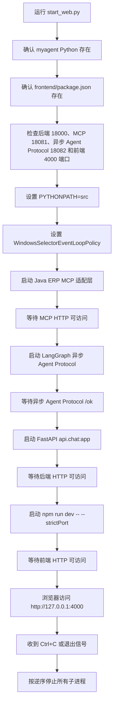

### 3.1 为什么使用 `start_web.py`

`src/agent/config.py` 和 `start_web.py` 都会处理 Windows 的事件循环策略。

项目使用 `psycopg` 异步连接，而 Windows 默认的 Proactor 事件循环可能与异步 PostgreSQL 连接不兼容，因此启动时统一使用 `WindowsSelectorEventLoopPolicy`。

`start_web.py` 还会把 `src` 放入子进程的 `PYTHONPATH`，所以 API 中可以直接使用 `from agent...` 和 `from api...` 的导入方式。

图表异步子 Agent 使用 `langgraph-cli[inmem]` 提供本地 Agent Protocol 服务；该依赖必须安装在
项目规定的 `myagent` Python 环境中。启动器会向所有子进程注入 `MYAGENT_ASYNC_AGENT_PROTOCOL_URL`，使主 Agent 和状态 API 都访问同一个本地服务地址。

端口检查放在创建子进程之前，避免旧服务仍占用端口时，健康检查误命中旧进程。


## 4. FastAPI 生命周期与持久化资源

本节说明 FastAPI 进程内的共享对象和 PostgreSQL 连接如何创建、复用、关闭。

FastAPI 应用在 `src/api/chat.py` 中定义，生命周期函数负责创建和释放数据库资源：

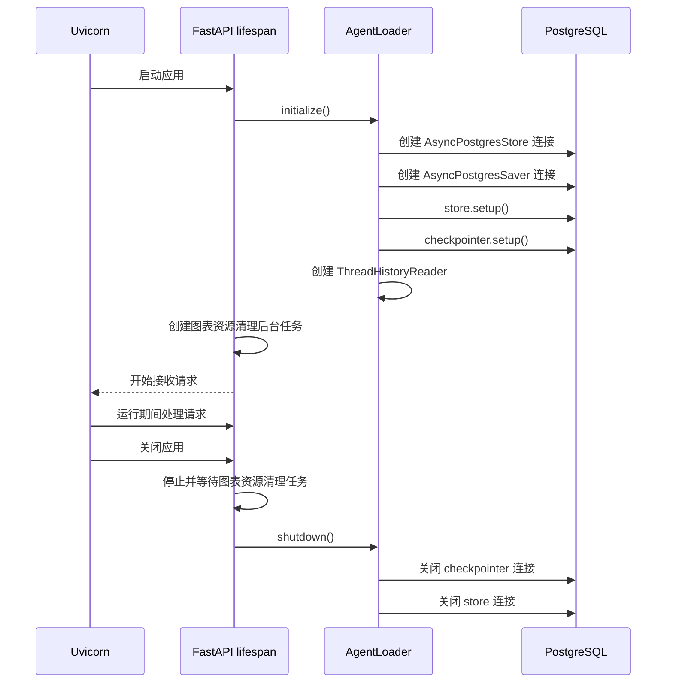

它只负责当前进程内的 Agent 复用，不是持久化数据库。

服务重启后 `_user_groups` 会清空，但 PostgreSQL 中的会话正文和用户记忆仍然存在。

+ 同一用户的多个 `thread_id` 共用一个主 Agent 实例；

+ 真正区分对话的是传给 LangGraph 的 `configurable.thread_id`。

## 5. Agent 架构、子 Agent 与能力模块

本节回答三个问题：主 Agent 如何创建，订单与采购分析能力如何隔离，以及本地技能和图表工具如何进入运行时。

`src/agent/main_agent.py` 中的 `create_main_agent()` 是真正用于对话的 Agent 工厂。它是异步函数，因为加载 MCP 工具需要异步网络操作。

构建步骤：

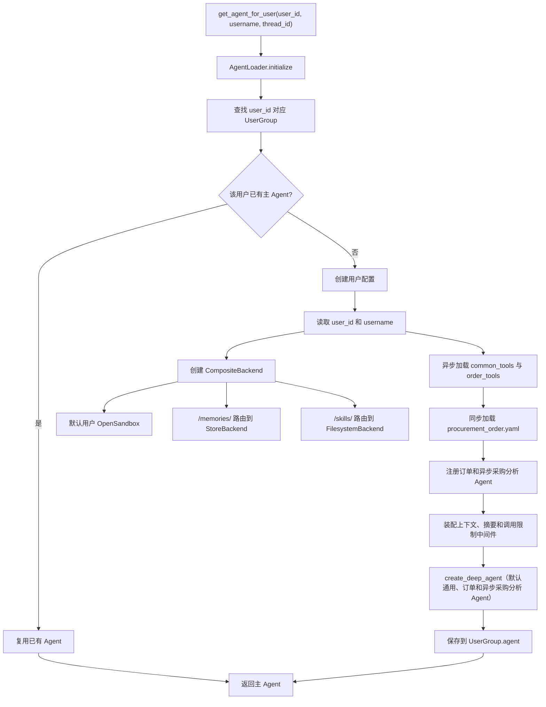

**主 Agent 的组成：**

| 配置             | 当前实现                                          | 作用                                     |
| ---------------- | ------------------------------------------------- | ---------------------------------------- |
| `model`          | `MAIN_MODEL`                                      | DeepSeek 主模型                          |
| `tools`          | `load_mcp_tools()` 返回的 `common_tools` | 给主 Agent 提供通用 MCP 能力；其中 `bing_search` 适配为稳定名称 `web_search` |
| `subagents`      | `procurement_order.yaml` 与 `procurement_analyst` AsyncSubAgent | 显式注册订单和异步采购分析任务；DeepAgents 自动注入默认 `general-purpose` |
| `system_prompt`  | `src/agent/memory/prompts.py` 与异步任务规则       | 让模型理解采购职责、记忆和任务调度规则 |
| `memory`         | `['/AGENTS.md']`                                  | 给主 Agent 加载项目行为指引              |
| `skills`         | `['/skills/main/']`                                | 仅发现主 Agent 自己的本地技能            |
| `middleware`     | 上下文注入、摘要、调用限制、技能可见性和记忆更新   | 在模型调用前提供身份，在长会话和异常循环中保护运行 |
| `backend`        | `CompositeBackend`                                | 将普通文件状态和长期记忆分开处理         |
| `store`          | `AsyncPostgresStore`                              | 持久化 `/memories/` 和会话索引           |
| `checkpointer`   | `AsyncPostgresSaver`                              | 持久化线程级对话状态                     |
| `context_schema` | `ProcurementContext`                              | 传递运行时用户身份                       |

### 5.0 运行时中间件

主 Agent 的 `ContextInjectionMiddleware` 在每次模型调用前从 `runtime.context` 读取
`user_id` 与 `username`，把身份和 `/memories/{user_id}/preferences.md` 写入临时
`SystemMessage`。该消息只进入当前模型请求，不追加到 checkpoint 的对话历史；静态系统提示词
不再拼接某个 Agent 实例创建时的用户身份。

`build_agent_protection_middleware()` 为主 Agent、同步订单子 Agent、显式注册的
订单子 Agent 和远程采购分析图装配相同类别的保护：

+ 自动摘要使用 `SUMMARY_MODEL`，以同名 `SummarizationMiddleware` 替换 DeepAgents 默认摘要器；
  原始压缩消息由后端归档，摘要状态由图状态保存。
+ 主 Agent 额外获得 `compact_conversation`。它与自动摘要共用同一个摘要器，模型在处理完长报告、
  即将进入下一阶段且上下文达到框架允许的压缩门槛时可主动调用。
+ `ModelCallLimitMiddleware` 和 `ToolCallLimitMiddleware` 只限制单次 Agent run，达到上限时以
  `end` 结束运行。限额集中在 `agent.config`；采购分析图的工具预算为 16 次，以容纳 Schema 查询、
  多组订单检索和图表生成。中断恢复会开启新的 run，不会因长期会话累计调用而失效。

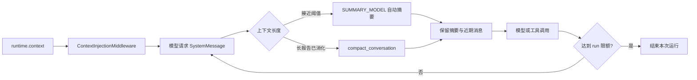

**订单子 Agent：**

+ 订单相关 Java MCP 工具不直接注入主 Agent。`create_main_agent()` 将 `order_tools` 和本地
  `request_additional_info` 交给通用的 `load_subagent()`，再由 YAML 中显式列出的工具名按顺序绑定；
  同时把 `request_additional_info` 保留在主图工具中，以便任意任务都能暂停等待用户补充信息。

+ 当前订单子 Agent 的 `skills` 只指向 `/skills/subagents/procurement_order/`。它显式获得
  `order_create`、`order_update`、`order_search_details`、`web_search` 和 `request_additional_info`，
  不继承主 Agent 技能。

**异步采购分析 Agent：**

+ `procurement_analyst` 是独立 Agent Protocol 图：`start_web.py` 启动本地 `langgraph_cli dev`，由
  `langgraph.json` 注册 `src/agent/subagents/async_entry.py:procurement_analyst_agent`。

+ 主 Agent 的自定义 `start_async_task` 创建远程任务后，同时将任务 ID、运行 ID、子 Agent 名称和
  `running` 状态写入当前 LangGraph 线程的 `async_tasks`。因此框架提供的 `list_async_tasks` 和
  `check_async_task` 可以在同一会话后续请求中查询该任务；任务绑定 Store 仍负责前端跨请求轮询与终态投递。

+ `async_registry.py` 集中声明名称、图 ID、描述、YAML 路径、独立工具加载器和调度规则。它只加载图表 MCP 的压缩工具、订单明细查询工具和公共 `web_search`；主 Agent 通过 `get_async_subagent_specs()` 生成远程规格。

+ 独立图不连接主对话的 PostgreSQL checkpoint，也不读取主 Agent 的会话或长期记忆。

+ 图表 MCP 工具不直接注入主 Agent。独立图中的 `chart_tools.py` 将发现到的 `generate_*` 工具压缩为 `get_chart_spec` 和 `generate_visualization`：前者按需返回真实 JSON Schema 与最小示例，后者按 `chart_type` 路由到底层工具。异步执行器只能查询订单明细，不能创建、更新或删除订单，也不配置人工审批。

+ 生成工具调用时由适配层强制请求 HTML，并原样保存到`runtime/visualizations/`。工具不会把原始 `html_url` 或完整 HTML放进 Agent 消息，而是返回包含 `artifact_id` 的轻量 `chart_artifact` JSON 文本记录。这个`artifact_id` 是图表资源句柄，传递链如下：

  ```markdown
  图表 MCP 返回 HTML
      -> chart_tools.py 保存到 runtime/visualizations/{artifact_id}.html
      -> 图表子 Agent 处理 chart_artifact（只携带 artifact_id）
      -> async_tasks.py 读取终态并提取 artifact_id
      -> agent_loader.py 将 chart_artifact 写入主会话 source=main 的 AIMessage
      -> message_utils.py 将 artifact_id 转换为 /visualizations/{artifact_id}
      -> Vue 显示“打开 HTML 图表”和“下载 HTML”入口
  ```

  因此文本模型可以继续处理工具结果，LangGraph checkpoint 也只保存小型资源记录；HTML 文件本体始终留在本地资源目录。API 层根据该记录生成 `/visualizations/{artifact_id}` 本地链接，实时 SSE 和历史恢复共用同一资源；前端以醒目链接在新窗口打开 HTML 图表，并通过
  `/visualizations/{artifact_id}?download=1` 下载原始 HTML。资源默认保留 7 天，由 `MYAGENT_VISUALIZATION_TTL_DAYS` 配置；FastAPI 启动后台清理任务定期删除过期文件，访问已删除资源时返回“图表已过期”占位 SVG。

  地图类参数若使用嵌套`input`，则在该层设置 `input.format=html`。

+ 异步执行器不读取主会话或长期记忆；它通过当前任务描述获得适用偏好，加载自己的采购分析 skill，并使用调用方共享沙箱。

### 5.1 异步采购分析任务

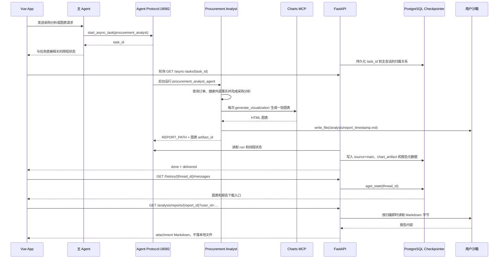

采购分析异步子 Agent 负责订单查询、外部搜索、业务分析、图表和报告。用户要求报告时，它根据自身 skill 的流程将 Markdown 写入共享沙箱并返回 `REPORT_PATH`；API 仅登记该路径并投递下载入口，不会续跑主 Agent。

主聊天流收到`start_async_task` 工具结果后，**`AgentLoader` 将 `task_id` 和所属的 `user_id`、`thread_id` 写入 Store 的`("async_tasks",)` 命名空间**。

终态轮询根据该映射把图表 artifact 与报告元数据作为 `source=main` 的助手消息写入主会话 checkpoint。报告元数据只保存随机 `report_id`、显示标签和用户归属；报告正文及其沙箱路径不写入 checkpoint、PostgreSQL 或项目运行目录。前端保留委派记录以继续轮询，但不向用户渲染子 Agent 名称、任务卡片或任务 ID。

若 Agent Protocol 将模型或工具调用限额以成功终态返回，`async_tasks.py` 会将其识别为未完成的
分析并转换为面向用户的失败说明；已生成的图表 artifact 仍保留入口，但不将框架错误文本写入会话。
异步报告正文中的 artifact 标识和沙箱文件路径也会在投递前移除；用户只通过“打开 HTML 图表”、
“下载 HTML”和“下载采购分析报告”入口访问交付物。下载报告时，`AgentLoader` 从
`("analysis_reports",)` 元数据读取归属和沙箱路径，确认当前 `user_id` 后即时读取用户沙箱并以附件响应返回。
如果沙箱文件已不存在，下载接口返回 404；系统不创建本地副本或恢复副本。历史展示层对旧记录执行相同兼容清理。

异步结果不额外创建第二套消息表，也不保存完整 HTML 到 checkpoint。

异步图的构造分为注册和入口两步：

+ `async_registry.py` 的 `AsyncSubagentRegistration` 保存异步子 Agent 的名称、`graph_id`、描述、配置文件、工具加载器和调度提示；
+ `get_async_subagent_specs()`只向主 Agent 返回名称、描述、图 ID 和 Agent Protocol URL。

`async_entry.py` 根据名称读取注册项，异步加载该 Agent 的工具，再通过 `load_subagent()` 读取 YAML；最终使用共享 OpenSandbox backend、空路由表和 `checkpointer=None` 创建图。图在每次任务开始前经 `SandboxSkillsMiddleware` 将本地技能同步到用户沙箱。该 YAML 只加载 `/skills/subagents/procurement_analyst/`，不配置 `interrupt_on`。`langgraph.json` 指向无参数的 `procurement_analyst_agent` 模块属性。

`load_subagent()` 是同步配置加载器：它校验 YAML 结构、配置工具重名、运行时工具重名和缺失
工具。

本小节只说明本地技能的存储、发现、管理和 Agent 隔离；用户长期记忆的 PostgreSQL 路由见 5.3，技能管理工具如何在模型请求中动态显示见本小节后半部分。

技能文件不属于用户记忆，也不进入 PostgreSQL Store。

主 Agent 的技能管理能力使用项目内`src/agent/skills/` 作为受限根目录，`FilesystemBackend(virtual_mode=True)` 只通过 `/skills/`虚拟路径暴露该目录：

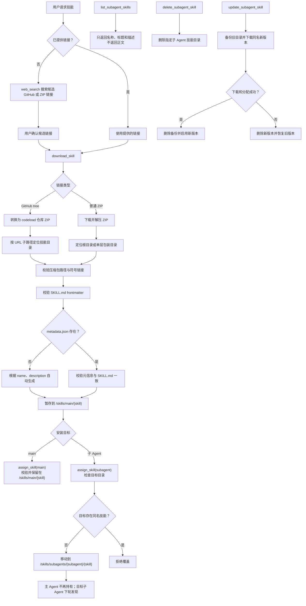

+ `download_skill` 接受 HTTP(S) ZIP 链接及 GitHub `tree` 目录链接。后者会下载目标分支的
  仓库 ZIP 并精确定位 URL 指向的子目录。下载器校验压缩包路径、符号链接和 `SKILL.md` 的
  `name`、`description` frontmatter；外部技能未提供 `metadata.json` 时会在本地生成与其一致的元信息。
  它会清理临时和遗留压缩包。
+ `assign_skill` 是移动而非复制，拒绝覆盖目标已存在的同名技能。`list_subagent_skills` 在读取前会将
+ 本地权威技能树同步到当前用户沙箱，再只返回技能目录名、标题和描述，不读取技能正文。
+ `update_subagent_skill`
  用同名 ZIP 原子替换子 Agent 技能；下载或分配失败时恢复旧版本。

主 Agent 已从公共 MCP 获得 `web_search`。当用户只描述所需技能而未提供链接时，先搜索并让
用户确认候选链接，再调用 `download_skill`；用户直接提供链接时不需要先搜索。

技能管理工具仍注册在 Agent 的工具节点中，以便模型调用后正常执行；

中间件只修改发送给模型的工具列表。**最新用户消息未涉及技能时，模型看不到这些工具的 schema，因此普通对话不会携带技能管理工具定义。**

### 5.2 技能模块职责与运行时边界

技能系统由“说明文件、工具注册、实际文件操作、中间件过滤”四部分组成：

| 模块 | 真实职责 | 不负责的事情 |
| --- | --- | --- |
| `src/agent/skills/main/skill-management/SKILL.md` | 告诉主 Agent 何时调用下载、分配、查询、删除和更新工具，以及技能目录约束 | 不直接执行文件操作 |
| `src/agent/skills/main/skill-management/scripts/skill_management.py` | 实现 ZIP/GitHub 下载、压缩包安全校验、元数据校验、移动、删除和回滚 | 不决定模型本轮是否能看到工具 |
| `src/agent/tools/skill_tools.py` | 使用 `importlib` 加载上述脚本，并把 `create_skill_management_tools()` 暴露给主 Agent 构建流程 | 不复制技能管理实现 |
| `src/agent/middlewares/skill_management_visibility.py` | 根据最近一条用户消息动态过滤技能管理工具 schema | 不拦截工具实际执行，也不修改技能文件 |
| `src/agent/main_agent.py` | 传入 `SKILLS_ROOT` 和已注册的 `procurement_order`、`procurement_analyst` 名称，创建工具和 middleware | 不把子 Agent 技能合并到主 Agent |
| `src/agent/config.py` | 定义 `SKILLS_ROOT`、`/skills/main/` 和 `/skills/subagents/` 的路径常量 | 不持有技能内容副本 |

`create_skill_management_tools()` 当前创建五个工具：`download_skill`、`assign_skill`、
`list_subagent_skills`、`delete_subagent_skill` 和 `update_subagent_skill`。

下载和更新会用`asyncio.to_thread()` 隔离阻塞文件/网络操作；分配、查询和删除在当前工具调用中完成。

`_ensure_skill_directories()` 会创建主 Agent 暂存目录和每个已注册子 Agent 的独立目录。

技能安装路径的安全边界由实现代码强制保证：技能名匹配字母、数字、连字符和下划线；ZIP
成员禁止绝对路径、`..` 路径和符号链接；GitHub `tree` 链接必须指向具体目录；

普通 ZIP必须在根目录或唯一顶层目录中包含 `SKILL.md`。`SKILL.md` 必须有 `name`、`description`
frontmatter；本地技能还必须有 `metadata.json`，且两者的名称和描述完全一致。外部包缺失`metadata.json` 时，安装器依据 frontmatter 生成它。

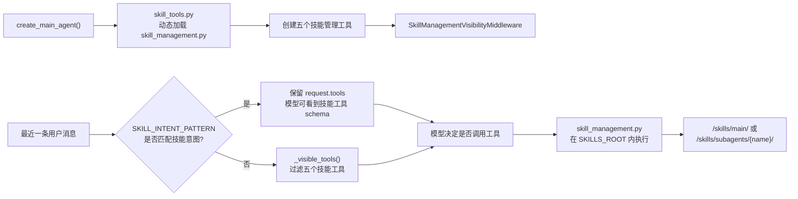

中间件只读取最近一条 `human/user` 消息，并用 `SKILL_INTENT_PATTERN` 匹配“技能”、
`skill`、GitHub `tree` 链接以及安装、下载、分配、删除、移除、更新等意图。

普通对话时，它通过 `request.override(tools=...)` 删除技能管理工具；技能相关消息则原样交给模型。
同步和异步模型调用分别走 `wrap_model_call()` 与 `awrap_model_call()`。工具仍然注册在
Agent 图中，所以该过滤只影响模型看到的 schema，不构成权限边界；真正的路径和目标校验
仍由 `skill_management.py` 执行。

更新子 Agent 技能时，`_update_subagent_skill()` 先将旧目录移动为隐藏备份，再下载并校验
同名新技能，随后通过 `_assign_skill()` 移入目标目录。任一步失败都会删除新版本、恢复旧
备份；成功后才删除备份。分配是移动而不是复制，因此主 Agent 暂存目录不会继续保留子 Agent
已拥有的技能。`list_subagent_skills()` 只返回目录名、标题和描述，不读取正文供模型判断。

### 5.3 用户长期记忆、会话正文与持久化边界

本小节集中说明四类状态的归属，避免把技能文件、用户记忆、会话正文和运行时对象混为同一种持久化数据。

主 Agent 的 `CompositeBackend` 只把 `/memories/` 路径映射到 PostgreSQL Store：

```text
/memories/     -> StoreBackend -> Store namespace(user_id)
/skills/       -> FilesystemBackend -> src/agent/skills/
其他 Agent 文件  -> StateBackend -> 当前运行状态
messages       -> Checkpointer -> thread_id 对话状态
```

这里的 `user_id` 负责用户隔离，`thread_id` 负责会话隔离。两者不能互相替代。

模型使用的 `/memories/{user_id}/preferences.md` 是 CompositeBackend 的虚拟路径；
直接调用原始 Store 的中间件使用去掉路由前缀后的内部 key
`/{user_id}/preferences.md`。两者必须指向同一份 Store 数据，不能把虚拟路径直接作为
`store.aget` 或 `store.aput` 的 key。

用户长期偏好固定保存在当前用户 Store namespace 中的
`/memories/{user_id}/preferences.md`。文件使用 YAML，缺失时等价于：

```yaml
preferred: {}
recent_queries: []
```

`preferred` 是开放对象，不存在固定字段。主 Agent 手动维护、`MemoryUpdateMiddleware` 自动提炼
的内容都只记录稳定且影响后续处理的明确偏好；键名由偏好语义决定，图表类型、币种和语言仅是示例。
当前用户消息中的明确要求优先。
每轮开始前，主 Agent 读取该文件。遇到图表或报告等输出方式不明确的委派时，主 Agent 将适用
偏好写进 `task` 或 `start_async_task` 的 `description`，因为同步和异步子 Agent 均不读取主会话
的 StoreBackend。

`MemoryUpdateMiddleware` 在主 Agent 正常完成有意义的 ERP 回答后运行：它找到最后一条用户消息，
提取最后助手回复摘要，并调用 `SUMMARY_MODEL` 返回查询摘要和开放 `preferred` 增量。查询摘要置顶、
去重且最多保留五条；只有用户明确表达的稳定偏好才会按同名键增量覆盖，模型不得从一次性请求或
业务数据推断偏好。问候、功能咨询和偏好查询不会触发该摘要调用或创建偏好文件。

订单子 Agent 每次由 `task` 创建独立子图执行，不继承主 Agent 的历史消息、长期记忆、
`MemoryMiddleware` 或中间件状态。后端继续订阅子图流以接收缺字段和审批中断；页面不展示子 Agent
的名称、委派任务、逐条思考、内部工具参数或工具进度，只展示主 Agent 的任务结果、补充信息、审批请求和最终交付。异步采购分析任务同样只展示写回主会话的最终交付。
同样，子 Agent 只加载自己目录下的 skills，不能读取或继承主 Agent 的 `/skills/main/`。

### 5.4 图表 MCP 工具与 artifact 资源链路

本节集中说明图表 MCP 工具适配和 artifact 资源边界；主 Agent 如何注册异步子 Agent、独立图
如何构造见 5.1，本节只展开它调用的工具适配和资源保存部分，避免把调度流程与资源流程混在一起。

| 模块 | 真实职责 |
| --- | --- |
| `src/agent/tools/mcp_client.py` | 通过 `MultiServerMCPClient` 连接图表 MCP，发现并返回全部底层工具；图表服务配置使用 `MCP_SERVER_CONFIG_CHART` |
| `src/agent/tools/chart_tools.py` | 将底层 `generate_*` 工具压缩成 `get_chart_spec` 和 `generate_visualization` 两个稳定入口 |
| `src/services/visualization_artifacts.py` | 将 HTML 或历史图片写入 `runtime/visualizations/`，校验 artifact、处理 TTL 和清理 |
| `src/api/message_utils.py` | 从 MCP 文本/结构化结果中识别 `chart_artifact`，按实际暂存文件类型生成前端描述 |
| `src/api/chat.py` | 提供 `/visualizations/{artifact_id}` 资源路由、HTML 安全响应头和下载响应 |
| `src/agent/schema.py` | 用 `Visualization` 表示图片预览或 HTML 链接，HTML 额外提供 `download_src` |

`load_chart_mcp_tools()` 只负责 MCP 连接和工具发现，不把工具直接注入主 Agent。加载失败时
`_load_tools()` 记录服务名并重新抛出 `RuntimeError`，调用方可以明确知道是图表 MCP 发现失败。
`create_chart_tools()` 接收发现到的 `StructuredTool` 列表，并通过 `_build_chart_tool_map()`
只收录名称以 `generate_` 开头的工具；名称末尾的 `_chart` 会被移除作为稳定的 `chart_type`。
非生成工具（例如 guide 工具）不会进入映射，重复的 `chart_type` 或没有任何生成工具会立即报错。

两个压缩入口的职责不同：

- `get_chart_spec(chart_type)` 查找底层工具的 `args_schema`，兼容 Pydantic v1 的 `schema()` 和 v2 的
  `model_json_schema()`，解析本地 `$ref`、`anyOf`/`oneOf`，再生成只包含必要字段的最小示例。
- `generate_visualization(chart_type, chart_config)` 复制输入配置，并在根级或嵌套 `input` 中强制写入
  `format=html`；调用底层工具的 `ainvoke()` 后，从字符串、列表、字典、JSON 封装或 MCP resource
  中递归寻找 HTML。HTML URL 会在适配层用 `httpx.AsyncClient` 下载，Markdown 代码围栏会被移除，
  原始 URL 不会进入 Agent 消息。

生成成功后，工具调用 `services.visualization_artifacts.save_visualization()` 写入本地文件，只返回：

```json
{
  "type": "chart_artifact",
  "status": "generated",
  "chart_type": "bar",
  "artifact_id": "<32 位十六进制标识>",
  "mime_type": "text/html",
  "message": "图表已生成，HTML 图表已暂存。"
}
```

完整 HTML、远程 `html_url`、base64 和图片内容都不进入模型结果或 checkpoint。资源服务按
`artifact_id` 只接受 32 位十六进制标识，并要求暂存目录中恰好存在一个非符号链接文件；文件
超过 `MYAGENT_VISUALIZATION_TTL_DAYS`（默认 7 天）后视为不可用。FastAPI 生命周期启动后台
清理任务，周期由 `MYAGENT_VISUALIZATION_CLEANUP_INTERVAL_SECONDS` 配置。访问不存在或过期
资源时返回“图表已过期”的 SVG 占位图，不泄露已删除文件路径。

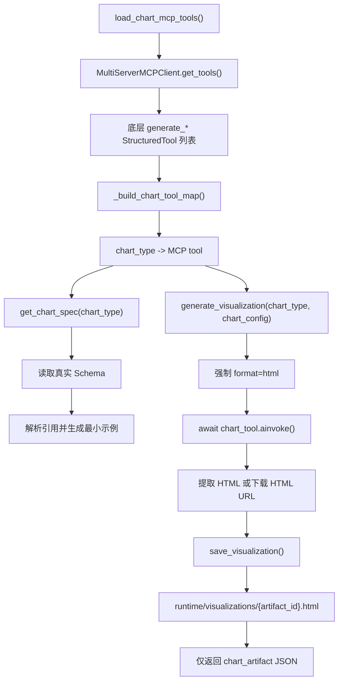

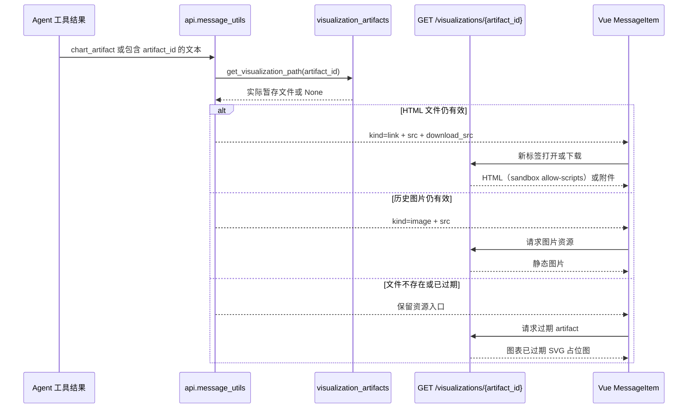

## 6. 非流式请求执行链路

本节只追踪 `POST /chat` 的一次完整调用，从请求校验、Agent 调用到响应和会话索引保存；流式 token、工具状态和中断恢复统一放在第 7 节。

入口是 `POST /chat`，调用链如下：

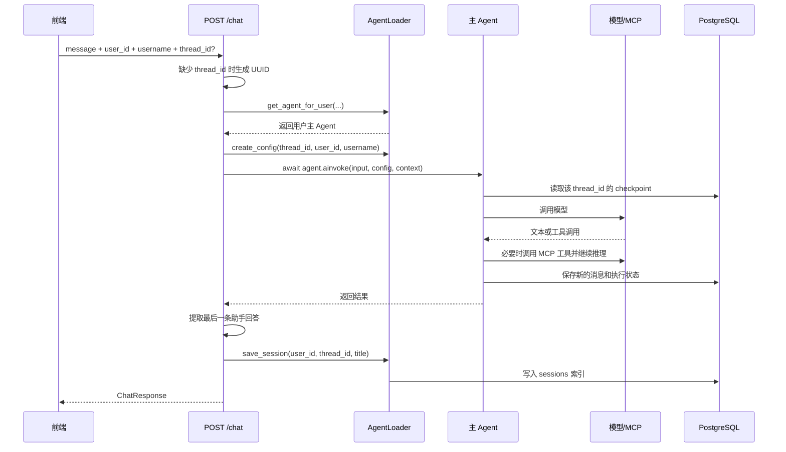

### 6.1 `thread_id` 的创建与传递

- 前端已有当前会话时传入 `thread_id`，Agent 会继续该 checkpoint。
- 新会话尚未发送消息时，前端先调用 `POST /history` 创建索引；第一次消息仍携带该 `thread_id`。
- 如果调用方没有传 `thread_id`，后端生成 UUID，并在响应中返回它。
- 同一个 `thread_id` 决定 LangGraph 恢复哪段对话。

### 6.2 非流式错误处理

`_run_chat()` 会记录异常类型，并将模型连接类异常转换为 HTTP 503；其他 Agent 异常转换为 HTTP 500。日志不会记录认证头、密钥或密码。

如果 Agent 返回空回答，则接口返回 HTTP 502，避免前端把无效响应当成成功消息。

## 7. SSE 流式请求与中断恢复链路

本节说明 `POST /chat/stream` 如何把 LangGraph 流事件转换为前端 SSE，以及工具调用、子 Agent 输出、缺信息中断和人工审批如何共用一条恢复链路。

入口是 `POST /chat/stream`。后端使用 `agent.astream()`，前端使用 `ReadableStream` 逐段读取 SSE。

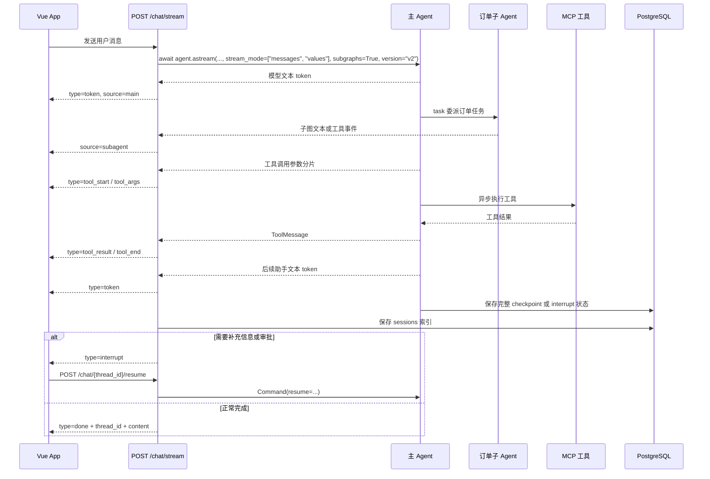

后端输出的主要事件：

| 事件          | 作用             | 前端处理                           |
| :------------ | :--------------- | :--------------------------------- |
| `token`       | 一段助手文本增量 | 按 `message_id` 追加文本，并使用 `source` 标识主/子 Agent |
| `tool_start`  | 工具调用开始     | 创建工具占位消息，状态为 `calling`，保留 `source` |
| `tool_args`   | 工具参数分片     | 按工具调用 ID 聚合参数             |
| `tool_result` | 工具返回文本     | 回填工具结果并标记完成             |
| `tool_end`    | 工具调用结束     | 将工具卡片状态设置为 `done`        |
| `interrupt`   | 缺信息或审批暂停 | 展示补充信息或审批面板，等待恢复请求 |
| `done`        | 本轮完成或暂停   | 保存 `thread_id`；`interrupted=true` 时维持暂停状态 |
| `error`       | 流式调用失败     | 显示错误并结束未完成工具状态       |

异步采购分析任务的 `start_async_task` 仍经 SSE 工具事件建立任务 ID 与主会话的绑定。Vue 在内部识别该工具名并轮询
`GET /async-tasks/{task_id}`，但不渲染委派记录。终态响应包含报告文本和可视化资源；后端将结果投递到主 Agent checkpoint，`delivered=true` 后 Vue 通过历史接口重载主会话，因此用户只会收到 `source=main` 的最终交付。

### 7.1 异步调用与来源标识

MCP 工具使用 `StructuredTool` 的异步调用链。后端因此必须使用 `ainvoke()` / `astream()`，不能退回同步 `invoke()` / `stream()`。

服务端按 LangGraph 流事件的子图命名空间生成 `source: "main"`、`source: "procurement_order"`
或 `source: "procurement_analyst"`，前端不得通过文本内容猜测来源。异步采购分析的远程执行过程不作为用户对话
展示；终态 artifact 会由 API 以 `source: "main"` 写回父会话。图表工具结果先保存为运行时 HTML 资源，
主 checkpoint 只保存 `chart_artifact` 文本记录；历史恢复将其转换为稳定的
`/visualizations/{artifact_id}` 路径，前端据此展示打开和下载入口。资源目录由后台定时清理，历史记录保留但
对应文件被删除后，用户打开或下载链接都会看到过期占位图。不使用第二套持久化消息表。

### 7.2 缺信息与审批恢复

订单子 Agent 缺少必要业务信息时，`request_additional_info` 会调用 LangGraph `interrupt()`，
后端将其转换为 `interrupt_type=information_request`。前端以自由文本提交补充内容：

```json
{"information": "补充后的订单信息"}
```

`procurement_order.yaml` 为 `order_create` 和 `order_update` 配置了 `interrupt_on`。框架
审批中断对应 `interrupt_type=hitl_approval`，批准载荷为：

```json
{"decisions": [{"type": "approve"}]}
```

两类中断都只能调用 `POST /chat/{thread_id}/resume` 恢复，后端使用
`Command(resume=request.resume)` 继续原 checkpoint。不能以重新发送普通聊天消息代替恢复。

## 8. 会话历史读取与 checkpoint 恢复

本节只说明“如何读取已经存在的会话”：先读取 Store 中的索引，再通过 `ThreadHistoryReader` 从编译图状态恢复消息，最后转换为前端模型。创建、命名和删除会话见第 9 节。

会话历史接口有两类操作：先读 Store 中的会话索引，再按需要从 Checkpointer 恢复正文。

### 8.1 历史列表与消息计数

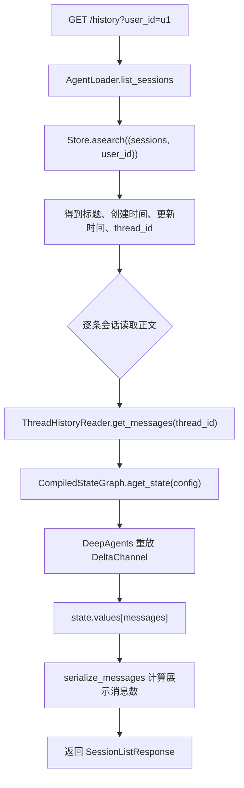

列表中的 `message_count` 不是 Store 直接保存的字段，而是根据恢复后的展示消息计算得到的。

### 8.2 打开会话与所有权校验

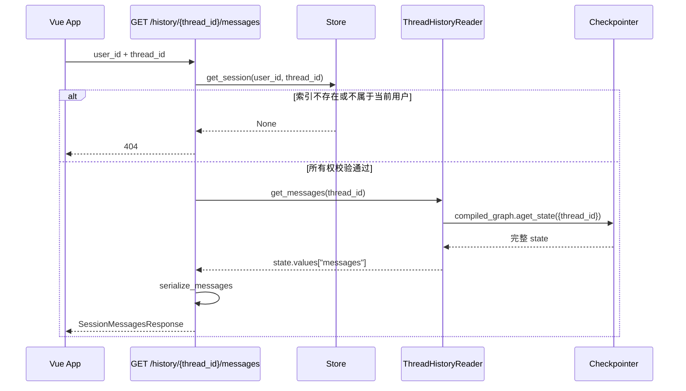

### 8.3 `ThreadHistoryReader` 的职责

`src/agent/history_reader.py` 内部创建了一张最小的 DeepAgents 状态图，但它不是用来回答问题的 Agent：

- 不调用 `ainvoke()`。
- 不调用 `astream()`。
- 不加载 MCP 工具。
- 不加载用户长期记忆。
- 只通过 `aget_state()` 恢复状态。

原因是 `messages` 使用 `DeltaChannel` 增量保存。直接调用 `AsyncPostgresSaver.aget_tuple()` 得到的不是可以直接用于页面展示的完整消息列表。`ThreadHistoryReader` 把这个框架细节封装在一个小接口后面，调用者只需要知道 `get_messages(thread_id)`。

### 8.4 `serialize_messages()` 的展示转换

Checkpoint 中的消息可能是 LangChain 消息对象，也可能是字典。序列化函数统一处理两种形式：

```text
HumanMessage / role=human -> role=user
AIMessage / role=ai       -> role=assistant
ToolMessage / role=tool    -> role=tool
```

助手消息中的 `tool_calls` 先生成工具占位消息；之后遇到带相同 `tool_call_id` 的工具结果时，再回填结果文本并把状态从 `calling` 改成 `done`。这样历史展示和实时 SSE 展示的工具顺序保持一致。

其中主 Agent 发出的 `task` 或 `start_async_task` 调用是子 Agent 的任务委派边界。历史序列化将它们转换为
`role=delegation` 的精简任务状态，仅保留任务摘要；同步 `task` 的 ToolMessage 只保留子 Agent 最终报告，异步任务的终态由主会话消息承载，并在前端恢复到对应委派卡片。普通工具仍保留调用参数和结果。
父 checkpoint 仍保留同步子 Agent
的运行状态以支持审批和恢复，但用户历史只显示任务状态和主 Agent 最终交付；子 Agent 的逐条思考、工具进度与文本
不会通过实时 SSE 或历史接口展示。

## 9. 会话索引生命周期

本节说明侧边栏索引的创建、标题固定、更新时间和删除顺序。它只维护会话索引，不保存完整消息正文；正文仍由 Checkpointer 管理。

### 9.1 创建空会话

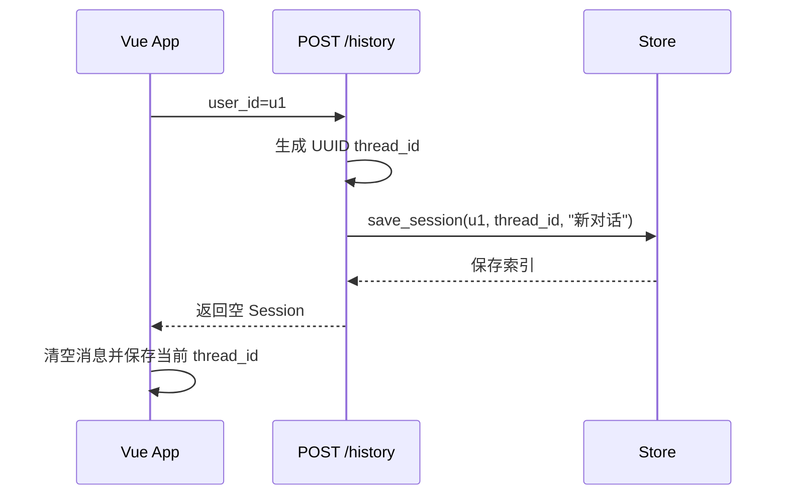

空会话也会进入 Store，因此它可以在用户输入第一条消息前立即出现在侧边栏。

### 9.2 首次标题与后续更新时间

消息成功完成后，后端调用 `save_session()`：

```text
首次保存：title = 首条用户消息截断结果
后续保存：保留已有 title，只更新 updated_at
```

标题由 `make_session_title()` 生成，当前最大长度为 30 个字符，超出时追加 `...`。

### 9.3 删除会话正文与索引

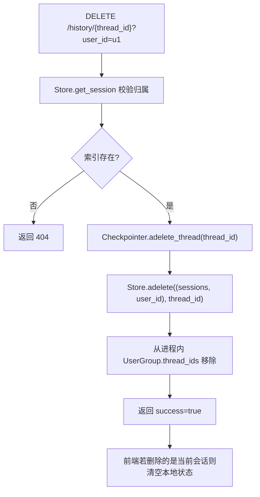

删除顺序是先删对话正文，再删侧边栏索引，避免索引指向已经不存在的 checkpoint。

## 10. 前端状态、SSE 消费与展示

本节从浏览器角度说明会话状态如何恢复、SSE 如何消费以及消息和图表如何展示；后端事件定义仍以第 7 节为准，模型字段仍以第 11 节为准。

### 10.1 首次打开与刷新恢复

`frontend/src/App.vue` 启动时通过 `/auth/me` 用 HttpOnly Cookie 校验 `erp-procurement.current-user`；本地存储只作显示缓存，Cookie 缺失或失效时立即清理并显示 `AuthView.vue`。用户可在登录/注册视图间切换：账号为 6-20 位数字、密码为 8-64 位，验证码仅由注册分支从 `/auth/captcha` 获取。登录或注册成功后，前端保存 `user_id/username`，清理上次用户的当前会话，再按新用户加载历史。

已有登录身份时，`App.vue` 的 `onMounted()` 执行：

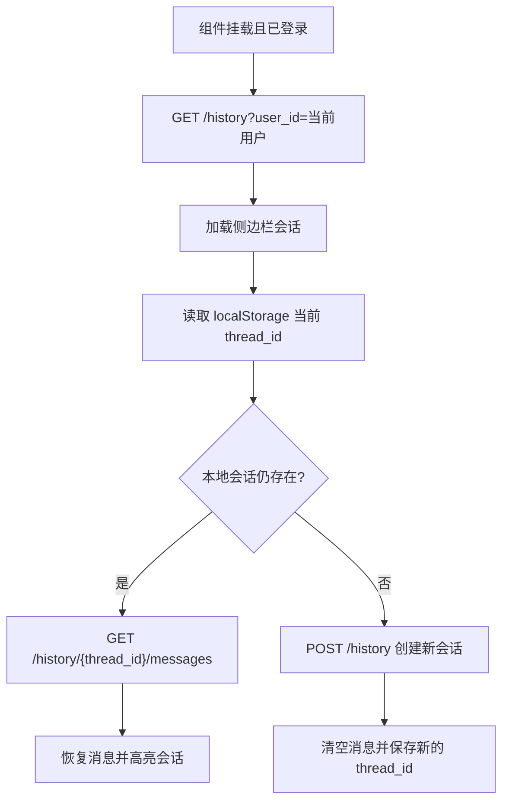

当前会话 ID 同时保存在 Vue 的 `threadId` 状态和浏览器 `localStorage` 中；登录身份的权威来源是 MySQL 持久会话 Cookie，`erp-procurement.current-user` 仅作缓存。退出登录会删除 MySQL 会话、停止当前用户的后台轮询、清理当前对话状态并回到认证视图。认证连接从 `.env` 的 `MYAGENT_AUTH_MYSQL_*` 读取；用户密码使用 PBKDF2 哈希，数据库不保存明文密码或原始会话 Cookie。

### 10.2 发送消息与消费 SSE

`App.vue` 负责用户交互状态，`frontend/src/api/chat.js` 负责 HTTP/SSE 协议：

1. 将用户消息立即加入本地 `messages`。
2. 设置 `isStreaming=true`；切换和删除保持禁用。普通主 Agent 流期间输入框禁用；收到 `start_async_task` 结果后输入框重新可用，新消息进入队列，待当前主 Agent 流结束后顺序发送。
3. 调用 `POST /chat/stream`。
4. `chat.js` 按空行切分 SSE 事件，处理网络分片导致的半条事件。
5. `App.vue` 根据事件更新主/子 Agent 消息、工具消息或中断状态。
6. 收到 `interrupt` 后展示 `InterruptPanel.vue`；补充信息或审批决策通过 `resumeChat()` 续跑。
7. 收到 `done` 后保存服务端返回的 `thread_id`；`interrupted=true` 时保持暂停状态。
8. finally 中刷新侧边栏会话列表，并仅在非暂停状态解除输入限制。

### 10.3 工具、子 Agent 与可视化消息状态

```text
tool_start
    -> 创建 { role: "tool", toolStatus: "calling" }
tool_args
    -> 累加 args
tool_result
    -> 写入 result，状态改为 done
tool_end
    -> 再次确保状态为 done
error / stream end
    -> finishPendingTools 兜底结束未完成工具
```

`MessageItem.vue` 根据角色显示用户消息、采购助手消息、普通工具详情或任务委派。任务委派使用
`procurement_order` 和 `procurement_analyst` 仅作为内部标识，不渲染为用户可见卡片。普通工具卡片默认收起，展开后分区显示参数和结果；新图表显示为“打开 HTML 图表”和“下载 HTML”入口，不嵌入原始 HTML。
历史 PNG 资源仅作为静态图片预览，不能提供悬停交互。用户文本及工具参数 JSON 保持原始文本，不使用 `v-html`。
`ChatArea.vue` 深度监听消息列表，
在流式更新时自动滚动到最新内容。

## 11. 接口契约与数据模型

本节作为接口查阅索引，集中列出请求/响应模型和后端路由；执行顺序、持久化语义和前端处理方式分别在前面的流程章节说明。

所有请求、响应、运行时上下文和进程内分组模型集中在 `src/agent/schema.py`。

### 11.1 主要模型

| 模型                      | 用途                                      |
| ------------------------- | ----------------------------------------- |
| `ProcurementContext`      | Agent 运行时接收 `user_id`、`username`    |
| `UserPreferences`         | 持久化用户的开放偏好对象和近期查询摘要    |
| `ChatRequest`             | 对话请求，兼容 `username` 和旧字段 `name` |
| `ChatResponse`            | 非流式对话响应                            |
| `AsyncTaskStatusResponse` | 异步任务状态、终态报告、图表资源及其是否已投递主会话 |
| `AsyncTaskBinding`        | 远程任务到用户主会话的持久化归属关系       |
| `Message`                 | 前端展示的 user/assistant/tool/delegation 消息 |
| `ResumeChatRequest`       | 缺信息补充或审批决策的恢复请求            |
| `Session`                 | 侧边栏会话索引                            |
| `SessionListResponse`     | 会话列表响应                              |
| `SessionMessagesResponse` | 单个会话正文响应                          |
| `DeleteSessionResponse`   | 删除结果                                  |
| `UserGroup`               | 当前进程的用户 Agent 缓存                 |

### 11.2 后端路由

| 方法     | 路径                            | 作用               |
| -------- | ------------------------------- | ------------------ |
| `POST`   | `/chat`                         | 非流式对话         |
| `POST`   | `/chat/stream`                  | SSE 流式对话       |
| `POST`   | `/chat/{thread_id}/resume`      | 恢复缺信息或审批中断 |
| `GET`    | `/auth/captcha`                | 获取注册时使用的一次性数字验证码图片 |
| `POST`   | `/auth/login`                  | 使用数字账号和密码登录 |
| `POST`   | `/auth/register`               | 使用数字账号、密码和验证码注册 |
| `GET`    | `/auth/me`                     | 校验当前 HttpOnly 会话并返回用户 |
| `POST`   | `/auth/logout`                 | 删除当前会话并清除 Cookie |
| `POST`   | `/history`                      | 创建空会话         |
| `GET`    | `/history`                      | 获取用户会话列表   |
| `GET`    | `/history/{thread_id}/messages` | 校验归属并恢复消息 |
| `DELETE` | `/history/{thread_id}`          | 删除会话正文和索引 |
| `GET`    | `/async-tasks/{task_id}`        | 查询后台任务并将终态结果投递主会话 |
| `GET`    | `/`                             | 返回前端首页       |

## 12. 关键对象关系总览

下面的类图只表示模块之间的职责关系，不表示所有运行时对象都在同一进程内。图表 Agent Protocol、FastAPI 和主 Agent 的进程边界以第 3、5.1 节为准。

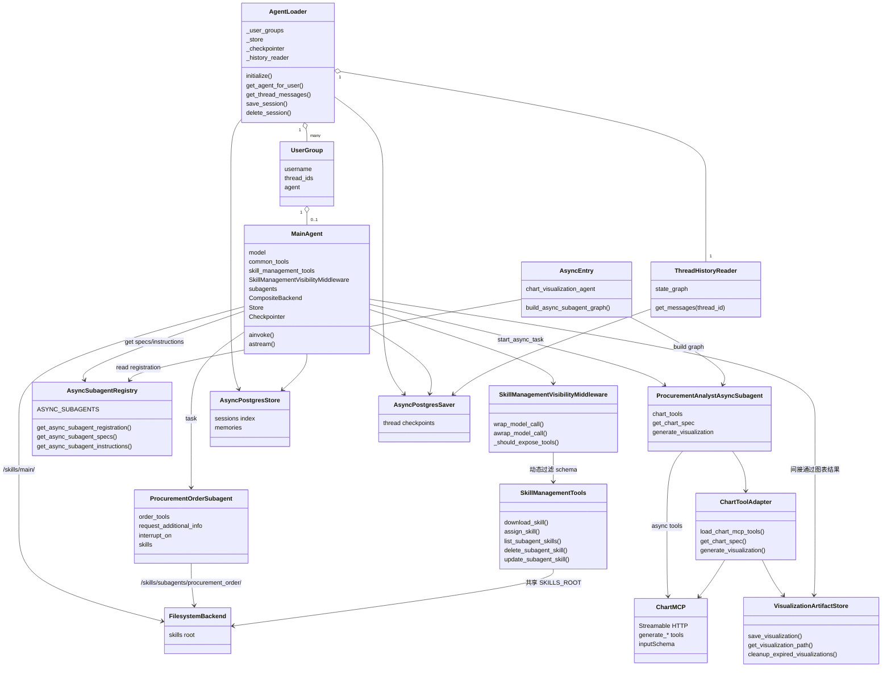
