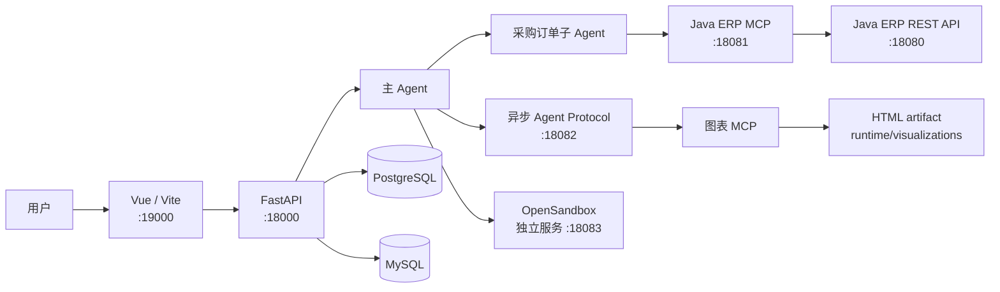

# MotoParts Agent ERP

> 面向摩托车零部件采购场景的全栈 Agent 应用：用自然语言完成采购查询、订单操作、数据分析和可视化。

[](https://www.python.org/)
[](https://fastapi.tiangolo.com/)
[](https://vuejs.org/)
[](https://spring.io/projects/spring-boot)
[](https://langchain-ai.github.io/langgraph/)

语言：**中文** | [English](README_EN.md)

## ✨ 项目简介

MotoParts Agent ERP 将 Vue 前端、FastAPI 对话 API、DeepAgents/LangGraph Agent、Java ERP 采购后端和 MCP 工具连接成一个统一的本地开发系统。

用户可以登录后通过聊天界面提出采购需求。主 Agent 会根据任务选择直接回答、调用公共工具、委派同步采购订单子 Agent，或提交异步采购分析任务。订单写入操作支持人工审批，图表和分析报告以资源链接的形式返回前端。

## 🧩 核心功能

- 🔐 **用户认证**：验证码注册、登录、HttpOnly 会话 Cookie 和会话退出。
- 💬 **对话工作流**：支持流式 SSE、历史会话、会话恢复和中断继续执行。
- 🛒 **采购订单 Agent**：通过 Java ERP MCP 查询零部件、供应商、库存和采购订单，并执行受控的订单创建与修改。
- ✅ **人工审批**：`order_create` 和 `order_update` 在真实写入前暂停，用户确认后才恢复执行。
- 📊 **异步采购分析**：后台执行采购查询、趋势比较、数据分析、图表生成和 Markdown 报告任务。
- 🧰 **工具与技能**：接入公共 MCP、Java ERP MCP、图表 MCP 和项目技能管理能力。
- 🖥️ **隔离执行环境**：通过 OpenSandbox 为每个用户提供文件操作和 shell 执行环境。
- 🗂️ **持久化状态**：MySQL 保存认证数据，PostgreSQL 保存会话索引、长期记忆、LangGraph checkpoint 和沙箱绑定。
- 🧱 **资源管理**：图表 HTML 和历史图片保存在 `runtime/`，前端可打开或下载生成的结果。

## 🏗️ 系统架构



统一启动器 `start_web.py` 按以下顺序管理项目自身的五个进程：

```text
Java ERP 后端 → Java ERP MCP → 异步 Agent Protocol → FastAPI → Vue/Vite
```

OpenSandbox 不由 `start_web.py` 启动或停止，需要单独准备。异步 Agent 首次导入时会发现 MCP 工具，完整启动可能需要等待一段时间。

## 📁 项目结构

```text
MotoParts-AgentERP/
├── data/                    # MySQL 初始化脚本
├── doc/                     # 项目架构与实现说明
├── frontend/                # Vue 3 + Vite 前端
├── java-backend/            # Spring Boot 摩托车零部件采购后端
├── sandbox/                 # OpenSandbox 运行镜像与脚本
├── src/
│   ├── agent/               # 主 Agent、子 Agent、工具、技能和状态模型
│   ├── api/                 # FastAPI 路由、SSE、认证和任务接口
│   ├── mcp_server/          # Java ERP MCP 适配服务
│   └── services/            # artifact 和运行时资源服务
├── tests/                   # Python 测试
├── .env.example             # 环境变量模板
├── langgraph.json           # 异步 Agent Protocol 图配置
└── start_web.py             # 本地统一启动器
```

## 🚀 快速启动

以下步骤以 Windows PowerShell 为例。完整的架构、生命周期、接口和 OpenSandbox 说明见 [`doc/PROJECT_DOCUMENTATION.md`](doc/PROJECT_DOCUMENTATION.md)。

### 1. 准备运行环境

需要准备：

| 依赖 | 用途 |
| --- | --- |
| 项目 `myagent` Python 环境 | 运行 FastAPI、MCP 和 Agent Protocol；启动器强制使用该环境 |
| JDK 17+ 与 Maven | 编译和启动 `java-backend/` |
| Node.js 与 npm | 安装前端依赖并运行 Vite |
| MySQL | 认证数据和 Java ERP 业务数据库 |
| PostgreSQL | LangGraph Store、Checkpointer、会话和长期记忆 |
| OpenSandbox | Agent 的文件和命令执行；需要单独部署 |

项目当前没有统一的 `requirements.txt` 或 `pyproject.toml`，Python 依赖应安装并验证在根目录 `myagent` 环境中。

### 2. 配置环境变量

```powershell
Copy-Item .env.example .env
```

编辑 `.env`，至少配置实际环境中的：

- `MYAGENT_AUTH_MYSQL_PASSWORD`
- `DEEPSEEK_API_KEY` 和模型服务地址
- `DB_HOST`、`DB_PORT`、`DB_NAME`、`DB_USER`、`DB_PASSWORD`
- `OPEN_SANDBOX_API_KEY` 及 OpenSandbox 连接配置

`.env` 已被 Git 忽略，不要提交真实密钥、密码或认证头。

### 3. 初始化数据库

`data/` 中提供了数据库初始化脚本，可按本地 MySQL 权限执行：

```powershell
mysql -u root -p < .\data\myagent_auth.sql
mysql -u root -p < .\data\motorparts_db.sql
```

Java 后端还会根据 `java-backend/src/main/resources/application.yml` 执行业务表初始化。若 MySQL 地址、账号或密码不同，请先修改该配置；不要把真实生产密码保留在版本库中。

### 4. 准备 OpenSandbox

OpenSandbox 是独立服务，不由 `start_web.py` 托管。它可以部署在本机或 WSL 中，确保管理 API 与 `.env` 中的地址、端口和密钥一致。详细示例见 [`doc/PROJECT_DOCUMENTATION.md`](doc/PROJECT_DOCUMENTATION.md) 的 OpenSandbox 章节。

未配置有效的 `OPEN_SANDBOX_API_KEY` 时，页面、认证和部分历史接口仍可能启动，但需要沙箱的 Agent 请求会失败。

### 5. 安装前端依赖

```powershell
Set-Location .\frontend
npm install
Set-Location ..
```

### 6. 启动全部项目服务

必须使用项目虚拟环境中的 Python：

```powershell
.\myagent\Scripts\python.exe .\start_web.py
```

启动成功后访问：

```text
http://127.0.0.1:19000/
```

首次启动异步 Agent Protocol 时会加载多个 MCP 工具，可能需要等待几十秒到数分钟。看到 `Services started. Open: http://127.0.0.1:19000/` 后再访问前端。

停止全部由启动器创建的项目服务：

```text
在启动器终端按 Ctrl+C
```

## 🔌 默认服务地址

| 服务 | 地址 | 启动方式 | 说明 |
| --- | --- | --- | --- |
| Vue / Vite | `127.0.0.1:19000` | `start_web.py` | 开发前端 |
| FastAPI | `127.0.0.1:18000` | `start_web.py` | 对话、SSE、认证、历史和任务接口 |
| Java ERP 后端 | `127.0.0.1:18080` | `start_web.py` + Maven | 采购业务 REST API |
| Java ERP MCP | `127.0.0.1:18081/mcp` | `start_web.py` | Java ERP 工具适配层 |
| 异步 Agent Protocol | `127.0.0.1:18082` | `start_web.py` | 异步采购分析图 |
| OpenSandbox | `127.0.0.1:18083` | 独立部署 | 文件和命令执行环境 |

MCP 普通 GET 可能返回 `406`，这表示端点已响应，不代表服务启动失败。

## ⚙️ 常用命令

```powershell
# 启动全部服务
.\myagent\Scripts\python.exe .\start_web.py

# Python 单元测试
$env:PYTHONPATH="src"
.\myagent\Scripts\python.exe -m unittest discover -s tests -p "test_*.py"

# 前端测试和构建
Set-Location .\frontend
npm test
npm run build
Set-Location ..

# Java 后端编译
mvn.cmd -f .\java-backend\pom.xml -DskipTests compile
```

如果 Maven 不在 `PATH` 中，可设置：

```powershell
$env:MYAGENT_JAVA_MAVEN_COMMAND="D:\java\apache-maven-3.9.16\bin\mvn.cmd"
.\myagent\Scripts\python.exe .\start_web.py
```

## 🔧 主要配置项

| 配置 | 默认值 | 作用 |
| --- | --- | --- |
| `MYAGENT_BACKEND_HOST` / `MYAGENT_BACKEND_PORT` | `127.0.0.1` / `18000` | FastAPI 地址 |
| `MYAGENT_FRONTEND_HOST` / `MYAGENT_FRONTEND_PORT` | `127.0.0.1` / `19000` | Vite 地址 |
| `MYAGENT_JAVA_BACKEND_HOST` / `MYAGENT_JAVA_BACKEND_PORT` | `127.0.0.1` / `18080` | Java ERP 地址 |
| `MYAGENT_JAVA_MAVEN_COMMAND` | Windows 为 `mvn.cmd` | Maven 可执行文件 |
| `MYAGENT_MCP_HOST` / `MYAGENT_MCP_PORT` | `127.0.0.1` / `18081` | Java ERP MCP 地址 |
| `MYAGENT_ASYNC_AGENT_HOST` / `MYAGENT_ASYNC_AGENT_PORT` | `127.0.0.1` / `18082` | 异步 Agent Protocol 地址 |
| `JAVA_API_BASE_URL` | `http://127.0.0.1:18080/api` | MCP 访问 Java REST API 的地址 |

## 🧪 验证与故障排查

- **启动提示端口被占用**：检查 `18000`、`18080`、`18081`、`18082`、`19000`，结束旧的启动器或修改对应环境变量。
- **Java 后端无法启动**：确认 JDK 17+、Maven、MySQL 可用，并核对 `application.yml` 的数据源配置。
- **异步 Agent 启动较慢**：它会在导入阶段加载公共、采购和图表 MCP 工具；等待 `18082/ok` 就绪，不要在工具加载过程中重复启动。
- **MCP GET 返回 406**：这是 Streamable HTTP 端点对普通 GET 的正常响应，启动器会将其视为已就绪。
- **Agent 请求提示沙箱错误**：检查 OpenSandbox 服务、`OPEN_SANDBOX_API_KEY`、端口和镜像配置。
- **FastAPI 数据库初始化失败**：确认 PostgreSQL 已启动，`.env` 中的连接参数和数据库权限正确。

## 📚 深入文档

- [`doc/PROJECT_DOCUMENTATION.md`](doc/PROJECT_DOCUMENTATION.md)：架构、认证、Agent、MCP、沙箱、状态恢复和接口说明。
- [`start_web.py`](start_web.py)：统一启动器和进程清理逻辑。
- [`java-backend/`](java-backend/)：Spring Boot ERP REST API。
- [`src/agent/`](src/agent/)：主 Agent、子 Agent、技能和工具边界。
- [`src/api/`](src/api/)：FastAPI 路由、认证、SSE、历史和异步任务接口。
- [`frontend/`](frontend/)：Vue 页面、会话状态和资源展示。

## 🔒 安全提示

- 不要提交 `.env`、API Key、数据库密码、认证 Cookie 或真实用户数据。
- `java-backend/src/main/resources/application.yml` 中的数据库配置仅适合本地开发，部署前请改为安全的环境变量或外部配置。
- OpenSandbox 隔离的是 Agent 的文件和命令执行环境，不等于整个应用、数据库或 MCP 服务都在沙箱中运行。
- 当前部分兼容接口仍接受请求中的 `user_id`，生产部署前应结合认证会话进一步收紧用户归属校验。
