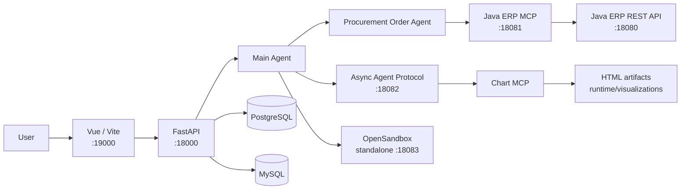

# MotoParts Agent ERP

> A full-stack agent application for motorcycle-parts procurement, turning natural-language requests into procurement queries, controlled order operations, data analysis, and visual reports.

[](https://www.python.org/)
[](https://fastapi.tiangolo.com/)
[](https://vuejs.org/)
[](https://spring.io/projects/spring-boot)
[](https://langchain-ai.github.io/langgraph/)

Languages: [中文](README.md) | **English**

## ✨ Overview

MotoParts Agent ERP connects a Vue frontend, FastAPI APIs, DeepAgents/LangGraph workflows, a Java ERP procurement backend, and MCP tools into one local development system.

After signing in, users can describe procurement tasks in the chat interface. The main agent decides whether to answer directly, call public tools, delegate to the synchronous procurement-order agent, or submit an asynchronous procurement-analysis job. Order writes pause for human approval before execution, while charts and reports are returned as resource links that the frontend can open or download.

## 🧩 Features

- 🔐 **User authentication**: captcha registration, login, HttpOnly session cookies, and logout.
- 💬 **Conversational workflows**: streaming SSE responses, conversation history, resume support, and interrupt recovery.
- 🛒 **Procurement-order agent**: query parts, suppliers, inventory, and purchase orders through the Java ERP MCP layer, with controlled create and update operations.
- ✅ **Human approval**: `order_create` and `order_update` pause before a real write and resume only after approval or rejection.
- 📊 **Asynchronous procurement analysis**: run procurement queries, trend comparisons, analysis, chart generation, and optional Markdown reports in the background.
- 🧰 **Tools and skills**: public MCP, Java ERP MCP, chart MCP, and project skill-management capabilities.
- 🖥️ **Isolated execution**: OpenSandbox provides per-user file and shell execution environments for agent work.
- 🗂️ **Persistent state**: MySQL stores authentication data; PostgreSQL stores session indexes, long-term memory, LangGraph checkpoints, and sandbox bindings.
- 🧱 **Artifact management**: chart HTML and historical images live under `runtime/` and can be opened or downloaded by the frontend.

## 🏗️ Architecture



The unified launcher `start_web.py` manages the five project processes in this order:

```text
Java ERP backend -> Java ERP MCP -> Async Agent Protocol -> FastAPI -> Vue/Vite
```

OpenSandbox is not started or stopped by `start_web.py` and must be prepared separately. The async agent discovers MCP tools during its initial import, so a complete startup may take some time.

## 📁 Project Layout

```text
MotoParts-AgentERP/
├── data/                    # MySQL initialization scripts
├── doc/                     # Architecture and implementation documentation
├── frontend/                # Vue 3 + Vite frontend
├── java-backend/            # Spring Boot motorcycle-parts procurement API
├── sandbox/                 # OpenSandbox image and setup scripts
├── src/
│   ├── agent/               # Main agent, subagents, tools, skills, and schemas
│   ├── api/                 # FastAPI routes, SSE, auth, and task APIs
│   ├── mcp_server/          # Java ERP MCP adapter
│   └── services/            # Artifacts and runtime resource services
├── tests/                   # Python tests
├── requirements.txt         # Python runtime and test dependencies
├── .env.example             # Environment template
├── langgraph.json           # Async Agent Protocol graph configuration
└── start_web.py             # Local unified launcher
```

## 🚀 Quick Start

The commands below target Windows PowerShell. For the complete architecture, lifecycle, API, and OpenSandbox reference, see [`doc/PROJECT_DOCUMENTATION.md`](doc/PROJECT_DOCUMENTATION.md).

### 1. Install prerequisites

Prepare the following services and tools:

| Dependency | Purpose |
| --- | --- |
| `uv` and the project `myagent` Python environment | Install from `requirements.txt` and run FastAPI, MCP, and Agent Protocol |
| JDK 17+ and Maven | Build and run `java-backend/` |
| Node.js and npm | Install frontend dependencies and run Vite |
| MySQL | Authentication and Java ERP business data |
| PostgreSQL | LangGraph Store, Checkpointer, sessions, and long-term memory |
| OpenSandbox | Agent file and shell execution; deployed separately |

Direct Python dependencies are recorded in the root `requirements.txt`. From the repository root, run:

```powershell
uv pip install --python .\myagent\Scripts\python.exe -r requirements.txt
```

The launcher continues to use the root `myagent` Python environment.

### 2. Configure environment variables

```powershell
Copy-Item .env.example .env
```

Edit `.env` and provide values for the services in your environment, especially:

- `MYAGENT_AUTH_MYSQL_PASSWORD`
- `DEEPSEEK_API_KEY` and the model-service endpoint
- `MODELSCOPE_BING_SEARCH_MCP_TOKEN` and `MODELSCOPE_CHARTS_MCP_TOKEN`
- `DB_HOST`, `DB_PORT`, `DB_NAME`, `DB_USER`, and `DB_PASSWORD`
- `OPEN_SANDBOX_API_KEY` and the OpenSandbox connection settings

`.env` is ignored by Git. Never commit real keys, passwords, or authentication headers.

### 3. Initialize MySQL

The `data/` directory contains initialization scripts. Run them according to your local MySQL permissions:

```powershell
mysql -u root -p < .\data\myagent_auth.sql
mysql -u root -p < .\data\motorparts_db.sql
```

The Java backend also initializes business tables according to `java-backend/src/main/resources/application.yml`. If your MySQL host, account, or password differs, update that configuration first and do not keep a real production password in the repository.

### 4. Prepare OpenSandbox

OpenSandbox is a standalone service and is not managed by `start_web.py`. Deploy it locally or through WSL, then make sure its management API, port, and credentials match `.env`. See the OpenSandbox section in [`doc/PROJECT_DOCUMENTATION.md`](doc/PROJECT_DOCUMENTATION.md) for an example deployment.

Without a valid `OPEN_SANDBOX_API_KEY`, authentication, pages, and some history endpoints may still start, but agent requests that require a sandbox will fail.

### 5. Install frontend dependencies

```powershell
Set-Location .\frontend
npm install
Set-Location ..
```

### 6. Start all project services

The launcher must be run with the project Python environment:

```powershell
.\myagent\Scripts\python.exe .\start_web.py
```

Open the development frontend at:

```text
http://127.0.0.1:19000/
```

The first async Agent Protocol startup discovers public, procurement, and chart MCP tools and may take tens of seconds or a few minutes. Wait for `Services started. Open: http://127.0.0.1:19000/` before opening the frontend.

To stop all project services owned by the launcher:

```text
Press Ctrl+C in the launcher terminal.
```

## 🔌 Default Services

| Service | Address | Started by | Purpose |
| --- | --- | --- | --- |
| Vue / Vite | `127.0.0.1:19000` | `start_web.py` | Development frontend |
| FastAPI | `127.0.0.1:18000` | `start_web.py` | Chat, SSE, auth, history, and task APIs |
| Java ERP backend | `127.0.0.1:18080` | `start_web.py` + Maven | Procurement REST API |
| Java ERP MCP | `127.0.0.1:18081/mcp` | `start_web.py` | Java ERP tool adapter |
| Async Agent Protocol | `127.0.0.1:18082` | `start_web.py` | Asynchronous procurement analysis graph |
| OpenSandbox | `127.0.0.1:18083` | Standalone deployment | File and shell execution environment |

The MCP endpoint may return `406` to a plain GET. This is a normal response for the Streamable HTTP endpoint and is treated as readiness by the launcher.

## ⚙️ Common Commands

```powershell
# Start all services
.\myagent\Scripts\python.exe .\start_web.py

# Python unit tests
$env:PYTHONPATH="src"
.\myagent\Scripts\python.exe -m unittest discover -s tests -p "test_*.py"

# Frontend tests and build
Set-Location .\frontend
npm test
npm run build
Set-Location ..

# Java backend compilation
mvn.cmd -f .\java-backend\pom.xml -DskipTests compile
```

If Maven is not on `PATH`, set its executable explicitly:

```powershell
$env:MYAGENT_JAVA_MAVEN_COMMAND="D:\java\apache-maven-3.9.16\bin\mvn.cmd"
.\myagent\Scripts\python.exe .\start_web.py
```

## 🔧 Configuration Reference

| Variable | Default | Purpose |
| --- | --- | --- |
| `MYAGENT_BACKEND_HOST` / `MYAGENT_BACKEND_PORT` | `127.0.0.1` / `18000` | FastAPI address |
| `MYAGENT_FRONTEND_HOST` / `MYAGENT_FRONTEND_PORT` | `127.0.0.1` / `19000` | Vite address |
| `MYAGENT_JAVA_BACKEND_HOST` / `MYAGENT_JAVA_BACKEND_PORT` | `127.0.0.1` / `18080` | Java ERP address |
| `MYAGENT_JAVA_MAVEN_COMMAND` | `mvn.cmd` on Windows | Maven executable |
| `MYAGENT_MCP_HOST` / `MYAGENT_MCP_PORT` | `127.0.0.1` / `18081` | Java ERP MCP address |
| `MYAGENT_ASYNC_AGENT_HOST` / `MYAGENT_ASYNC_AGENT_PORT` | `127.0.0.1` / `18082` | Async Agent Protocol address |
| `JAVA_API_BASE_URL` | `http://127.0.0.1:18080/api` | REST address used by the MCP adapter |

## 🧪 Verification and Troubleshooting

- **A port is already in use**: check `18000`, `18080`, `18081`, `18082`, and `19000`; stop stale launcher processes or change the corresponding environment variable.
- **The Java backend fails**: verify JDK 17+, Maven, MySQL, and the datasource settings in `application.yml`.
- **Async startup is slow**: the async graph loads public, procurement, and chart MCP tools during import; wait for `18082/ok` instead of starting a second copy.
- **MCP returns 406 to GET**: this is expected for a plain GET against a Streamable HTTP endpoint.
- **Agent requests report sandbox errors**: check the OpenSandbox service, `OPEN_SANDBOX_API_KEY`, port, and runtime image.
- **FastAPI database initialization fails**: verify PostgreSQL is running and that the `.env` connection settings and permissions are correct.

## 📚 Further Documentation

- [`doc/PROJECT_DOCUMENTATION.md`](doc/PROJECT_DOCUMENTATION.md): architecture, authentication, agents, MCP, sandboxing, state recovery, and API behavior.
- [`start_web.py`](start_web.py): unified startup and process cleanup.
- [`java-backend/`](java-backend/): Spring Boot ERP REST API.
- [`src/agent/`](src/agent/): main agent, subagents, skills, and tool boundaries.
- [`src/api/`](src/api/): FastAPI routes, authentication, SSE, history, and async task APIs.
- [`frontend/`](frontend/): Vue pages, session state, and artifact presentation.

## 🔒 Security Notes

- Never commit `.env`, API keys, database passwords, authentication cookies, or real user data.
- The datasource in `java-backend/src/main/resources/application.yml` is local-development configuration; replace it with environment-based or external configuration before deployment.
- OpenSandbox isolates agent file and shell execution. It does not place the entire application, database, or MCP services inside the sandbox.
- Some compatibility APIs still accept a request `user_id`; production deployments should further enforce ownership from the authenticated session.
