# 1. 项目总览

**阅读顺序**：项目总览 → 用户认证 → Agent 架构 → 沙箱执行机制 → 中间件生命周期 → 记忆与状态 → 工具系统 → Markdown 与分析产物 → 技能系统 → 请求链路 → 会话历史 → 前端展示 → 关键对象总览。

## 1.1 系统模块介绍

项目由启动编排、前端、API、Agent、工具/MCP 和持久化资源六类模块组成。

**模块职责**

| 模块 | 主要代码 | 主要职责 |
| --- | --- | --- |
| 启动与进程编排 | `start_web.py` | 检查环境和端口，启动并停止 Java ERP 后端、FastAPI、Vite、Java ERP MCP 和异步 Agent Protocol。 |
| Java ERP 后端 | `java-backend/` | 提供摩托车零部件采购 REST API，默认监听 `18080`，由 Java ERP MCP 适配层调用。 |
| 前端交互 | `frontend/src/` | 提供聊天界面、历史会话、SSE 消费、任务卡片、图表入口和人工审批交互。 |
| API 编排 | `src/api/` | 提供 FastAPI 路由，处理对话、SSE、历史会话、中断恢复和异步任务查询。 |
| Agent 编排 | `src/agent/main_agent.py`、`src/agent/subagents/` | 构建主 Agent，并接入默认通用能力、同步采购订单子 Agent 和异步采购分析子 Agent。 |
| 工具与 MCP | `src/agent/tools/`、`src/mcp_server/` | 加载公共 MCP、Java ERP MCP 和图表 MCP，并提供本地业务工具。 |
| 持久化与运行时资源 | `src/api/agent_loader.py`、`src/agent/backends/`、`src/services/`、PostgreSQL、OpenSandbox | 管理 Store、Checkpointer、用户沙箱、会话索引、长期记忆和图表 HTML artifact。 |

**模块总览**

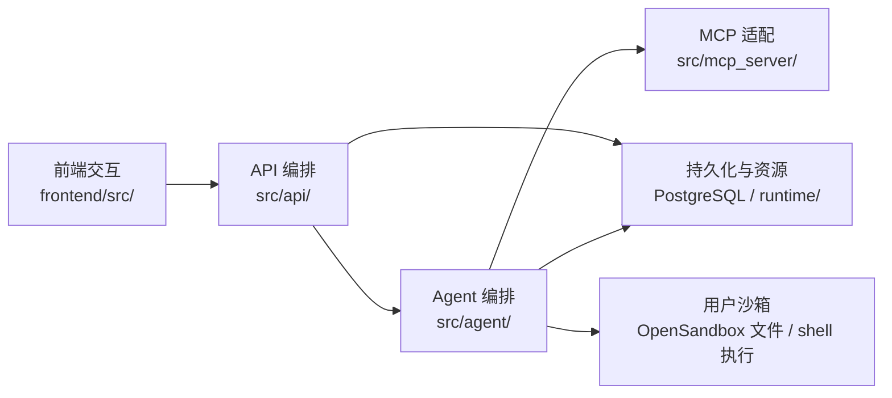

**运行服务**

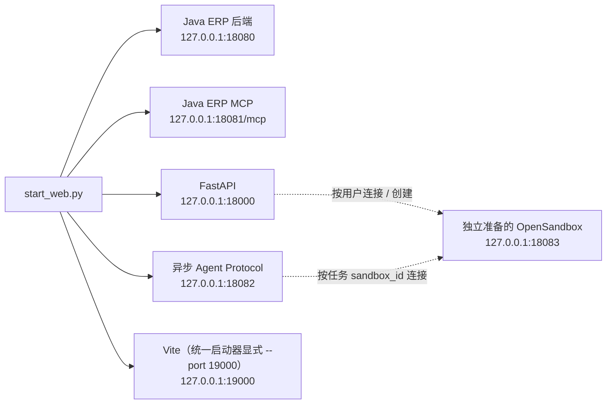

**Agent 分工**

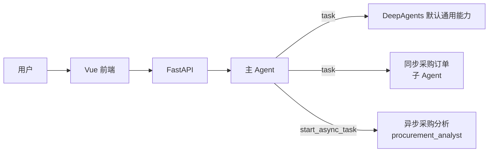

**工具与资源**

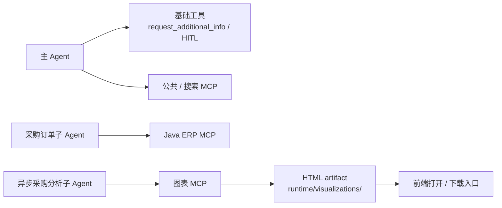

**模块边界**

- `start_web.py` 只负责本地服务的启动、HTTP 响应探测和退出，不参与业务对话；Java ERP 后端由它启动，但业务逻辑仍位于 `java-backend/`。
- 用户请求先进入前端和 FastAPI，再由主 Agent 决定直接回答、调用工具或委派子 Agent。
- 同步采购订单子 Agent 参与主会话的执行和恢复；默认通用能力由 DeepAgents 框架提供；异步采购分析子 Agent 通过独立 Agent Protocol 运行，完成后将结果写回主会话。
- PostgreSQL 保存会话索引、长期记忆、沙箱 ID 绑定和 LangGraph checkpoint；图表 HTML 保存在宿主运行时 artifact 目录，checkpoint 只保存资源标识。
- OpenSandbox 提供按用户复用的文件与命令执行环境；服务启动时默认还会后台预热一个未分配实例。它是独立准备的外部服务，不在统一启动器托管的五个进程之内。MySQL 负责认证用户和登录会话，PostgreSQL 负责 Agent Store、Checkpointer、任务归属和报告元数据。

**推荐阅读入口**

1. `start_web.py`：服务启动和进程边界。
2. `src/api/chat.py`：请求、SSE 和中断恢复入口。
3. `src/agent/main_agent.py`：主 Agent 的组成。
4. `src/agent/subagents/`：同步和异步子 Agent。
5. `frontend/src/App.vue`：前端状态和消息展示。

## 1.2 服务启动

**先准备独立的 OpenSandbox 服务**

Agent 文件操作和命令执行依赖 OpenSandbox。服务端需要单独准备，并确保项目进程可访问配置的管理 API；`start_web.py` 不代为启动或停止它。连接配置、镜像及两类超时统一见 3.6。未配置 `OPEN_SANDBOX_API_KEY` 时，主服务仍可启动并提供页面、历史等非 Agent 接口，但首次需要沙箱的 Agent 请求会明确失败；主服务和异步 Agent Protocol 要执行沙箱任务时都需要有效密钥。

下面保留本机 WSL 部署的操作示例，不表示项目要求所有环境都使用 WSL。服务端安装目录、虚拟环境和配置文件位置应以实际部署为准；这个服务端环境不替代 MotoParts Agent ERP 的 `myagent` Python 环境。

在 PowerShell 中进入 WSL：

```powershell
wsl
```

在 WSL 中启动已安装的服务端（按实际安装位置调整路径）：

```bash
cd ~/opensandbox/OpenSandbox/server
source .venv/bin/activate
opensandbox-server
```

若该部署使用 `~/.sandbox.toml`，可检查其中的 server 配置；服务端地址和认证配置需与项目客户端一致：

```bash
grep -A5 '^\[server\]' ~/.sandbox.toml
```

| 操作 | 本机 WSL 示例 |
| --- | --- |
| 前台启动（调试用） | `opensandbox-server` |
| 后台启动并记录日志 | `nohup opensandbox-server > ~/opensandbox.log 2>&1 &` |
| 停止前台服务 | 在服务端所在终端按 `Ctrl+C` |
| 停止后台服务 | 确认对应服务进程的 PID 后执行 `kill <PID>`，避免按名称误停其他实例。 |
| 查看实时日志 | `tail -f ~/opensandbox.log` |


**启动方式**

项目必须使用虚拟环境中的 Python 启动：

```powershell
.\myagent\Scripts\python.exe .\start_web.py
```

启动成功后，开发环境访问：

```text
http://127.0.0.1:19000/
```

默认服务如下：

| 服务 | 地址 | 说明 |
| --- | --- | --- |
| Vue / Vite | `127.0.0.1:19000` | 前端开发服务器 |
| FastAPI | `127.0.0.1:18000` | 对话、SSE、历史和资源接口 |
| Java ERP 后端 | `127.0.0.1:18080` | 采购业务 REST API |
| Java ERP MCP | `127.0.0.1:18081/mcp` | 采购业务 MCP 服务 |
| 异步 Agent Protocol | `127.0.0.1:18082` | 运行异步子 Agent |
| OpenSandbox 管理 API | `127.0.0.1:18083` | 独立准备的外部依赖，不由启动器托管 |

**启动流程**

`start_web.py` 是本地开发环境的统一启动器，不负责业务处理。它会为各个子进程准备相同的运行环境，并按依赖顺序启动服务。

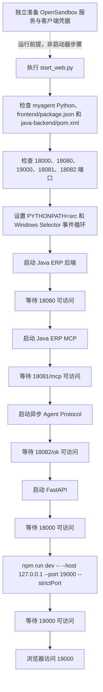

**启动顺序依赖关系：**启动器先启动 Java ERP 后端，再准备 Java ERP MCP 和异步 Agent Protocol，然后启动 FastAPI，最后启动前端。异步入口导入时即发现图表 MCP 工具；FastAPI 启动只初始化持久化资源和工厂，公共/订单 MCP 的发现推迟到首次构建用户 Agent。启动器的 HTTP 响应探测接受 HTTP 200—499（包括 MCP 普通 GET 可能返回的 406），只证明服务入口可响应，不证明真实业务、模型、数据库或沙箱调用成功。

**运行环境与端口检查**

启动器会向子进程注入以下环境：

- `PYTHONPATH=src`：使后端可以直接导入 `api`、`agent` 等项目模块。
- `PYTHONUTF8=1`、`PYTHONIOENCODING=utf-8`：统一 Windows 子进程日志编码。
- `MYAGENT_ASYNC_AGENT_PROTOCOL_URL`：让主 Agent 和异步任务接口访问同一个 `18082` 服务。
- `JAVA_API_BASE_URL`：让 Java ERP MCP 适配层访问同一个 `18080` Java REST API；显式配置时保留现有值。
- `LOG_COLOR=false`：避免 Windows 日志转发依赖终端颜色支持。

启动前会检查五个托管服务端口是否可以绑定。如果端口已被旧进程占用，启动器会直接报错，不会先启动新进程再误判旧服务已就绪。OpenSandbox 不在该端口检查和 HTTP 响应等待列表中；未配置密钥时五个服务仍可启动，但 Agent 执行会在首次请求沙箱时失败；配置密钥后，五个服务启动成功仍不等于已完成真实沙箱创建验证。

端口和主机可以通过环境变量覆盖，例如：

```powershell
$env:MYAGENT_BACKEND_PORT="18001"
$env:MYAGENT_FRONTEND_PORT="4001"
.\myagent\Scripts\python.exe .\start_web.py
```

统一启动器主要监听配置包括：`MYAGENT_BACKEND_HOST`、`MYAGENT_BACKEND_PORT`、`MYAGENT_FRONTEND_HOST`、`MYAGENT_FRONTEND_PORT`、`MYAGENT_JAVA_BACKEND_HOST`、`MYAGENT_JAVA_BACKEND_PORT`、`MYAGENT_JAVA_MAVEN_COMMAND`、`MYAGENT_MCP_HOST`、`MYAGENT_MCP_PORT`、`MYAGENT_MCP_PATH`、`MYAGENT_ASYNC_AGENT_HOST` 和 `MYAGENT_ASYNC_AGENT_PORT`。

Vite 的 API 代理读取后端端口，但目标主机固定为 `127.0.0.1`；若后端只绑定其他主机地址，单独修改 `MYAGENT_BACKEND_HOST` 不会同步更改该代理。FastAPI 可直接服务 `frontend/dist/` 构建产物（包括 `/assets`），未构建时回退到 `src/api` 同级的旧静态目录；这与启动器始终启动 Vite 是两条使用路径。

**停止服务**

在启动器所在终端按 `Ctrl+C`。`start_web.py` 按逆序停止其拥有的 Vite、FastAPI、异步 Agent Protocol、Java ERP MCP 和 Java ERP 后端进程：Windows 使用 `taskkill /PID /T /F` 结束对应进程树；非 Windows 分支先 `terminate()`，等待仍未退出的直接子进程后再 `kill()`。Windows 强制终止不保证每个服务的优雅关闭钩子都能执行，1.3 描述的是正常应用生命周期清理。此操作不停止独立的 OpenSandbox 服务，也不主动销毁远端用户沙箱，具体生命周期见 3.7。

如果启动过程中某个服务未能通过 HTTP 响应探测，启动器会停止已经启动的子进程并退出。常见原因包括：端口被占用、Java 后端或 Java ERP MCP 不可访问、异步 Agent Protocol 启动失败、Maven/JDK 未安装或前端依赖未安装。

**统一启动器与直接 Vite 的区别**

上面的 `19000` 是 `start_web.py` 启动 Vite 时显式传入的端口。若直接在 `frontend/` 目录执行 `npm run dev`，且没有设置 `MYAGENT_FRONTEND_PORT`，Vite 会使用 `frontend/vite.config.js` 中的默认端口 `4000`；设置该环境变量后，直接启动也会使用覆盖后的端口。统一启动器和直接 Vite 的访问地址不能混用。

**依赖与验证**

- 后端使用项目已有的 `myagent` 虚拟环境；Python 直接依赖统一记录在根目录 `requirements.txt`。在项目根目录执行 `uv pip install --python .\myagent\Scripts\python.exe -r requirements.txt` 可安装或校验运行环境中的依赖。
- 前端依赖由 `frontend/package.json` 和 `frontend/package-lock.json` 描述。首次运行前可在 `frontend/` 目录执行 `npm install`，再使用统一启动器；可执行 `npm test` 运行 `frontend/tests/*.test.js` 的 Node 原生测试，并用 `npm run build` 验证构建。
- Java 后端由 `java-backend/pom.xml` 描述，需要 JDK 17 或更高版本以及 Maven；可通过 `MYAGENT_JAVA_MAVEN_COMMAND` 指定 Maven 可执行文件。
- 完整运行还需要 PostgreSQL、Java 后端依赖的 MySQL、异步 Agent Protocol、OpenSandbox 和模型服务，具体地址、密钥和模型配置以当前环境变量及根目录 `.env` 为准；OpenSandbox 客户端配置见 3.6。
- Python 测试使用标准库 `unittest` 组织，可使用项目虚拟环境运行：

  ```powershell
  $env:PYTHONPATH="src"
  .\myagent\Scripts\python.exe -m unittest discover -s tests -p "test_*.py"
  ```

  `test_*.py` 主要使用 mock、内存状态和临时目录隔离外部服务；`tests/e2e_project_review.py` 是单独的集成检查入口，不在此发现模式内，不能把单元测试通过等同于真实服务验证。

## 1.3 应用生命周期与持久化资源

FastAPI 应用在 `src/api/chat.py` 中定义。应用生命周期负责初始化进程级共享资源，并在服务关闭时统一释放；单次请求不会重复创建数据库连接或 Agent 工厂。

**启动阶段**

**FastAPI 启动时执行以下操作：**

1. `agent_loader.initialize()` 创建 PostgreSQL Store 和 Checkpointer。
2. 对 Store 和 Checkpointer 执行 `setup()`，确保 LangGraph 所需的数据表存在。
3. 创建 `SandboxManager` 并调用 `initialize()`；校验凭据，默认后台预热一个未分配实例并同步技能，不等待远端创建完成才启动服务。
4. 创建 `ThreadHistoryReader`，用于从 checkpoint 恢复完整消息。
5. 启动图表 artifact 后台清理任务。
6. 应用开始接收 HTTP 和 SSE 请求。

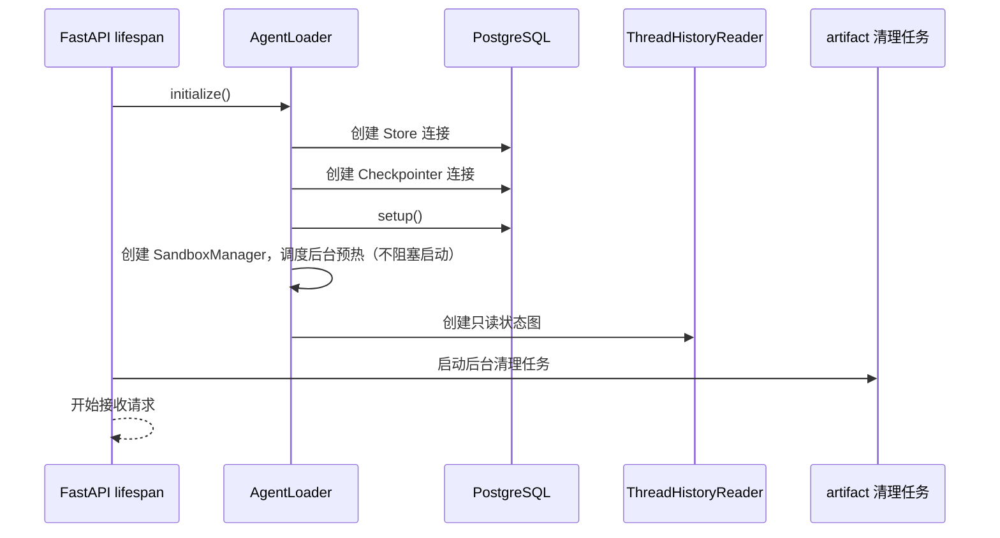

**进程内 Agent 复用**

`AgentLoader` 同时管理持久化资源和当前进程中的 Agent 缓存：

| 状态 | 保存位置 | 作用 |
| --- | --- | --- |
| 用户 Agent 缓存 | FastAPI 进程内存 `_user_groups` | 同一用户在当前进程内复用一个主 Agent，避免重复构建。 |
| 用户沙箱绑定 | PostgreSQL Store `("sandboxes", user_id)` | 保存当前 `sandbox_id`；沙箱文件本身不保存在此绑定中。 |
| 沙箱代理缓存 | `SandboxManager` 进程内存 | 获取用户 Agent 时检查健康状态，必要时复连或替换底层实例。 |
| 会话索引 | PostgreSQL Store | 保存标题、创建时间、更新时间和用户归属，用于历史列表。 |
| 长期记忆 | PostgreSQL Store | 按用户命名空间保存 `/memories/` 内容。 |
| 对话消息和执行状态 | PostgreSQL Checkpointer | 按 `thread_id` 保存和恢复对话状态、中断状态及工具执行状态。 |
| 图表文件 | `runtime/visualizations/` | 保存 HTML 或历史图片 artifact，checkpoint 只保存 artifact 标识。 |
| Markdown 报告 | 用户共享沙箱 `/analysis/` | 保存报告正文；Store 只保存报告元数据和用户归属。 |
| 认证用户与会话 | MySQL | 保存账号、密码哈希和会话 token 摘要。 |

同一用户的多个 `thread_id` 共用进程内的主 Agent，但 `thread_id` 会写入每次调用的 LangGraph 配置，因此不同会话使用不同的 checkpoint。不同 `user_id` 会创建不同的用户分组，长期记忆也使用不同的 Store 命名空间。

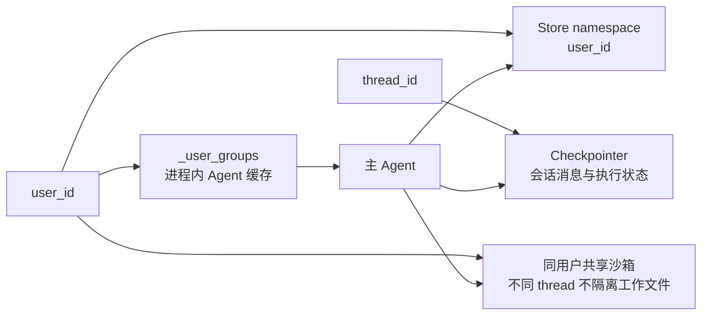

**请求期间与关闭阶段**

初始化由进程锁防止重复执行；数据库建连、setup、manager 或历史图构建失败及取消时清理已获得资源，不发布半初始化状态。用户 Agent 构建由用户级锁防重，同一会话写入另由 `thread_operation()` 协调；当前仅支持单 worker，PostgreSQL 持久化不等于已经实现多 worker 分布式互斥。

请求期间，API 从 `AgentLoader` 获取主 Agent，并通过 `thread_id` 指定要继续的会话。历史接口经 `ThreadHistoryReader.get_state()` 调用已编译图的 `aget_state()` 重建消息增量，再补读同一 checkpoint 的待处理中断；不会把原始 checkpoint 消息字段直接当作完整历史。详细恢复过程见 9.2。

FastAPI 关闭时按以下顺序清理：

1. 停止并等待图表 artifact 清理任务。
2. 清空进程内 Agent 缓存、会话集合及用户构建锁。
3. 沙箱管理器停止接收新操作，等待已接收操作和预热结束；销毁未分配预热实例，关闭用户实例的 SDK 客户端但保留远端用户实例。
4. 关闭 Checkpointer 数据库连接，再关闭 Store 连接；前一个关闭失败也会尝试后一个。

关闭进程不会删除 PostgreSQL 中的会话、长期记忆、沙箱绑定或 checkpoint。服务重新启动后，只要使用相同的 `user_id` 和 `thread_id`，仍可以恢复数据库中的数据；沙箱文件能否继续使用取决于远端实例是否仍然可用。关闭流程不主动销毁已分配的用户沙箱，但会清理未分配预热实例；实例失效后的处理见 3.2。

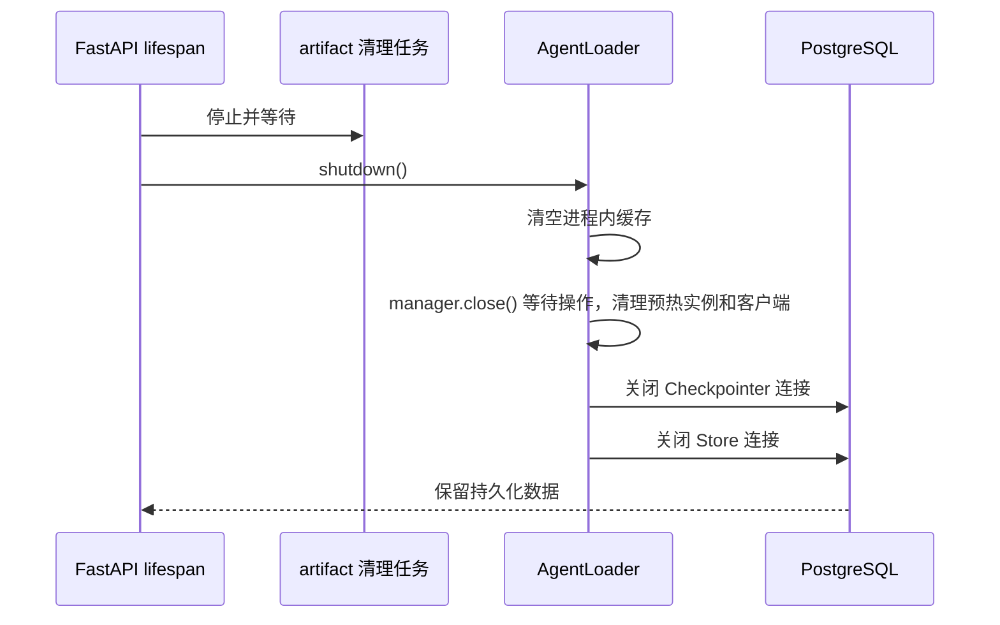


## 1.4 用户认证与登录会话

系统使用 MySQL 保存用户账号和持久化登录会话，前端进入聊天界面前会先验证当前会话。认证接口由 `src/api/auth.py` 提供，认证模型集中定义在 `src/agent/schema.py`。

### 注册与登录

- 账号为 6—20 位数字。
- 密码为 8—64 位。
- 注册需要一次性数字验证码，验证码有效期为 5 分钟，验证后立即消费。
- 登录只校验账号和密码，不要求验证码。
- 密码使用随机盐 PBKDF2-SHA256 保存，当前迭代次数为 `600000`。
- 账号不存在和密码错误使用统一的登录失败提示。

注册成功或登录成功后，服务端创建持久化会话并写入 `myagent_session` Cookie。Cookie 有效期为 7 天，设置 `HttpOnly` 和 `SameSite=Lax`；当前本地 HTTP 环境使用 `secure=False`。数据库只保存会话 token 的 SHA-256 摘要，不保存浏览器实际持有的 Cookie 值。

### 前端登录态

`App.vue` 挂载时调用 `/auth/me` 检查 HttpOnly Cookie。验证成功后恢复用户界面；验证失败时清理 localStorage 中的用户缓存并显示登录页。localStorage 中保存的用户身份只用于缓存和界面恢复，不能替代服务端会话认证。

### 认证接口

| 方法 | 路径 | 作用 |
| --- | --- | --- |
| `GET` | `/auth/captcha` | 获取注册验证码图片和 `captcha_id`。 |
| `POST` | `/auth/register` | 校验验证码、创建用户并建立会话。 |
| `POST` | `/auth/login` | 校验账号密码并建立会话。 |
| `GET` | `/auth/me` | 返回当前 Cookie 对应的用户。 |
| `POST` | `/auth/logout` | 删除持久化会话并清除 Cookie。 |

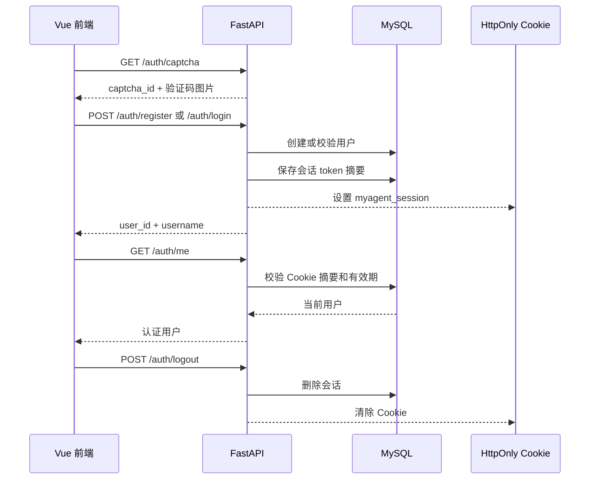

当前前端入口由登录会话保护；聊天、历史、异步任务状态和报告下载接口仍接受请求中的 `user_id` 参数，并据此检查会话、任务或报告归属，但尚未统一从认证 Cookie 解析 API 用户身份。`ChatRequest` / `ResumeChatRequest` 的兼容默认值为 `laoxiao`，历史接口的默认值为 `u1`；这些默认值只是兼容行为，不能视为登录认证或租户隔离。需要严格的生产级用户隔离时，应统一从认证会话取得 API 用户身份。

## 2. Agent 架构

### 2.1 主 Agent

主 Agent 是用户唯一直接对话的 Agent，负责理解用户请求、调用公共工具、委派子 Agent，并生成最终回复。主 Agent 工厂位于 `src/agent/main_agent.py` 的 `create_main_agent()`。

**构建流程**

主 Agent 由 `AgentLoader` 按用户首次访问时异步创建。同一用户在当前 FastAPI 进程内复用同一个 Agent 实例；不同会话通过 `thread_id` 使用不同的 checkpoint。

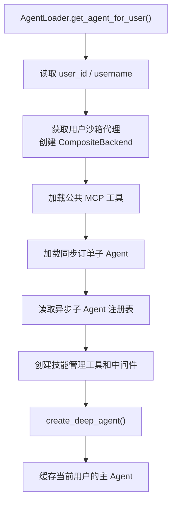

**主要配置**

| 配置项 | 当前实现 | 作用 |
| --- | --- | --- |
| 模型 | `MAIN_MODEL`，当前代码固定为 `deepseek-v4-flash` | 处理主 Agent 的对话和工具决策。API Key、Base URL 从根目录 `.env` 或环境变量读取。 |
| 系统提示词 | `src/agent/memory/prompts.py` 加当前用户身份和异步任务规则 | 规定采购助手行为、长期偏好读取方式和异步采购分析任务的调度方式。 |
| 公共工具 | `load_mcp_tools()` 返回的 `common_tools` | 提供主 Agent 可直接使用的公共/搜索 MCP 工具。 |
| 同步子 Agent | `procurement_order` | 通过 `task` 委派，按 YAML 绑定订单工具并在写操作前触发人工审批。 |
| 默认通用能力 | DeepAgents 默认通用子 Agent | 由框架按默认行为提供通用执行能力。 |
| 异步子 Agent | `procurement_analyst` | 通过 `start_async_task` 提交独立的异步采购分析任务。 |
| 主 Agent 技能 | `/skills/main/` | 主 Agent 只自动发现自己的技能目录；这不是共享沙箱中的文件访问权限限制。 |
| 文件、状态与持久化 | `CompositeBackend`、沙箱代理、Store、Checkpointer | 普通文件和命令进入用户沙箱，`/memories/` 路由 Store，对话状态由 Checkpointer 保存。 |
| 运行时上下文 | `ProcurementContext` | 向 Agent 和工具传递 `user_id`、`username`。 |

**工具与子 Agent 边界**

主 Agent 不直接加载 Java ERP 采购工具和图表底层工具：

- 公共 MCP 工具、异步任务提交工具和 `request_additional_info` 放入主 Agent 的 `main_tools`；`common_tools` 同时传给同步采购订单子 Agent，图表 MCP 不注入主 Agent 或同步子 Agent。
- `request_additional_info` 也作为本地工具显式注入同步采购订单子 Agent，用于触发信息补充中断；未显式注册配置的 DeepAgents 默认通用子 Agent 按框架默认行为使用 `main_tools`，但不会获得订单写入权限。
- Java ERP 采购工具仍只绑定到同步采购订单子 Agent。
- 图表 MCP 工具由异步采购分析子 Agent 独立加载，主 Agent 只获得异步任务的名称、描述、图 ID 和 Agent Protocol 地址。
- `task` 和 `start_async_task` 是主 Agent 与子 Agent 之间的委派边界，子 Agent 的内部执行过程不作为普通用户对话展示。

**后端与记忆边界**

主 Agent 使用 `CompositeBackend` 将不同类型的数据路由到不同位置：

```text
/memories/  -> StoreBackend -> PostgreSQL Store，命名空间为 (user_id,)
/skills/    -> 默认沙箱 backend -> 本地技能源的运行副本
其他文件    -> 默认沙箱 backend -> 当前用户的远端工作文件
execute     -> 默认沙箱 backend -> 远端 shell 执行
messages    -> Checkpointer -> 由 thread_id 区分的会话状态
```

主 Agent 的系统提示词要求每轮读取 `/memories/{user_id}/preferences.md`。`MemoryUpdateMiddleware` 在 ERP 对话完成后，使用摘要模型提取近期查询并更新该用户的偏好文件；`SkillManagementVisibilityMiddleware` 只在用户消息包含技能管理意图时向模型暴露技能管理工具。

主 Agent 创建完成后由 `AgentLoader` 缓存，但缓存不是持久化边界。服务重启后 Agent 实例会重新创建，Store 和 Checkpointer 中的用户记忆及会话状态仍可恢复。

### 2.2 同步子 Agent

主 Agent 通过框架内置 `task` 委派同步订单任务，运行于父图执行链路；通用任务由 DeepAgents 按默认行为提供：

- `procurement_order`：采购订单创建、修改和查询，是本节的业务重点。
- DeepAgents 默认通用子 Agent：使用框架默认的通用执行能力和当前用户 backend，并按框架行为继承 `main_tools`；项目不单独声明其业务配置，也不把它作为项目业务子 Agent 管理。

**配置与接入**

配置文件位于：

```text
src/agent/subagents/configs/procurement_order.yaml
```

主 Agent 创建时，`main_agent.py` 按以下顺序接入采购订单子 Agent：

1. `load_mcp_tools()` 加载公共工具和 Java ERP 采购工具。
2. 读取 `procurement_order.yaml`。
3. 将 Java ERP MCP 工具和本地 `request_additional_info` 传给 `load_subagent()`。
4. 加载器根据 YAML 中的工具名校验并绑定真实工具。
5. 将生成的子 Agent 配置传给 `create_deep_agent(subagents=...)`。

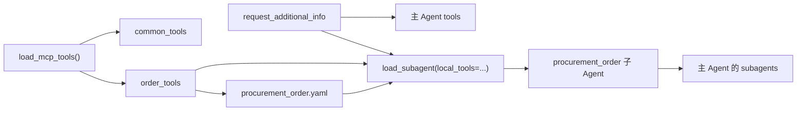

`load_subagent()` 会检查配置是否包含必需字段，校验工具名称是否重复，并确认 YAML 声明的每个工具都能在运行时找到。缺少工具或配置无效时直接抛出错误，不创建不完整的子 Agent。

**工具范围**

采购订单子 Agent 的 YAML 只声明以下业务工具；DeepAgents 的文件、执行等框架能力及保护中间件另行装配，不能把该列表理解为整个执行图仅有四个工具：

| 工具 | 来源 | 作用 |
| --- | --- | --- |
| `order_create` | Java ERP MCP | 创建采购订单。 |
| `order_update` | Java ERP MCP | 修改已有采购订单。 |
| `order_search_details` | Java ERP MCP | 按零部件、日期范围等条件查询订单明细。 |
| `request_additional_info` | 本地工具 | 订单信息不完整时暂停流程，请求用户补充信息。 |

采购订单子 Agent 通过加载器接收 `common_tools`、YAML 声明的订单 MCP 工具和本地 `request_additional_info`；它不会直接使用图表 MCP 工具。YAML 的 `tools` 列表决定订单业务工具，公共工具和框架文件、执行能力属于另外的装配边界。通用子 Agent 的工具和执行边界由 DeepAgents 默认行为决定，不能将其与订单子 Agent 的 YAML 工具列表混写。

**订单处理流程**

子 Agent 的系统提示词要求先校验数据，再执行订单操作：

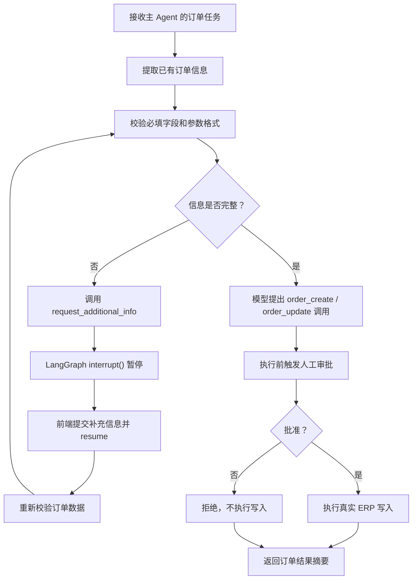

`request_additional_info` 使用 LangGraph `interrupt()` 保存当前图状态。前端补充信息后，后端通过 `Command(resume=...)` 从原中断点继续，而不是重新创建一轮普通对话。该工具显式注册到主 Agent 和 `procurement_order` 子 Agent，并通过 `main_tools` 按 DeepAgents 默认行为对通用子 Agent 可用；订单字段校验与订单操作流程主要由采购订单子 Agent 执行。

**人工审批**

`procurement_order.yaml` 为 `order_create` 和 `order_update` 配置了人工确认：

```yaml
interrupt_on:
  order_create:
    allowed_decisions: ["approve", "reject"]
  order_update:
    allowed_decisions: ["approve", "reject"]
```

因此，订单数据补充完成后，执行写入操作前还会暂停等待审批。用户选择“同意执行”或“拒绝执行”后，后端恢复原 checkpoint。审批拒绝时不执行真实订单写入。

**技能与状态边界**

- 子 Agent 只发现配置中声明的 `/skills/subagents/procurement_order/`；该路径是运行时技能发现目标，当前工作树不保证已有具体技能，不继承主 Agent 的 `/skills/main/`。
- 子 Agent 使用主 Agent 图中的同步执行路径，因此其运行状态会随主 Agent checkpoint 保存；文件和命令使用同一用户沙箱，不作为工作文件快照写入 checkpoint。
- `SandboxSkillsMiddleware` 在 run 前同步本地技能与指引；技能发现目录不同不意味着不同 Agent 之间存在独立沙箱或文件权限隔离。
- 前端不展示子 Agent 的内部思考和逐条工具过程，只展示主 Agent 发出的任务摘要、订单中断面板和最终报告。
- 子 Agent 返回主 Agent 的是精简的订单操作结果，不直接向用户建立独立会话。

### 2.3 异步子 Agent

当前异步子 Agent 是 `procurement_analyst`，负责采购查询、网络搜索、数据分析、趋势比较、图表生成和按需生成 Markdown 报告。它不在主 Agent 的同步执行图中等待完成，而是通过独立的 Agent Protocol 服务后台运行。

**注册与启动**

异步子 Agent 的注册信息集中在：

```text
src/agent/subagents/async_registry.py
```

注册项包含以下内容：

- Agent 名称：`procurement_analyst`
- 图 ID：`procurement_analyst_async`
- YAML 配置：`src/agent/subagents/configs/procurement_analyst.yaml`
- 运行职责：采购查询、网络搜索、分析、图表和按需 Markdown 报告
- 工具加载器：加载图表 MCP 并压缩为稳定工具接口
- 调度说明：要求主 Agent 使用 `start_async_task`

`src/agent/subagents/async_entry.py` 在导入阶段预加载 YAML 和独立工具；异步上下文工厂在执行访问时从 `runtime.execution_runtime.context` 取得 `sandbox_id` 并连接调用方沙箱，在非执行读取时构建相同拓扑但不连接沙箱。两种路径都不接入主会话 Checkpointer，退出时关闭本次客户端，详见 3.5。`langgraph.json` 将图 ID 映射到该入口：

```json
{
  "graphs": {
    "procurement_analyst_async": "./src/agent/subagents/async_entry.py:procurement_analyst_agent"
  }
}
```

启动器使用项目虚拟环境执行 `langgraph_cli dev`，在 `127.0.0.1:18082` 启动 Agent Protocol 服务。主 Agent 只接收异步子 Agent 的名称、描述、图 ID 和服务地址，不直接加载异步图的完整工具。

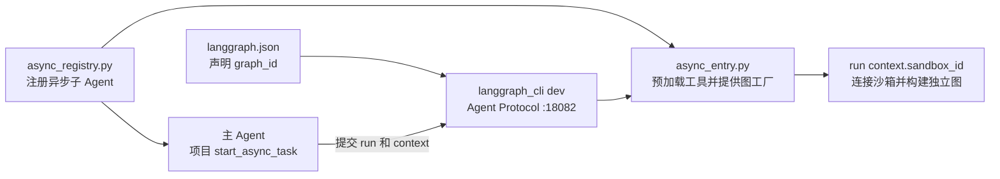

**配置与工具边界**

配置文件 `procurement_analyst.yaml` 声明采购分析 Agent 使用的图表工具：

| 工具 | 作用 |
| --- | --- |
| `get_chart_spec` | 按需读取指定图表类型的真实 JSON Schema 和最小示例。 |
| `generate_visualization` | 根据 `chart_type` 和 `chart_config` 调用图表 MCP，并保存返回的 HTML。 |

图表工具适配器 `src/agent/tools/chart_tools.py` 会：

1. 发现图表 MCP 的 `generate_*` 工具并建立 `chart_type` 映射。
2. 将图表业务接口压缩为 `get_chart_spec` 和 `generate_visualization`，不暴露底层全部图表工具；DeepAgents 的框架工具另行装配。
3. 需要时返回真实 Schema，避免启动时把所有字段定义塞入 Agent 上下文。
4. 强制图表 MCP 使用 `format=html`。
5. 将 HTML 或 HTML URL 下载并保存到 `runtime/visualizations/`。
6. 只返回包含 `artifact_id` 的轻量 `chart_artifact` 记录。

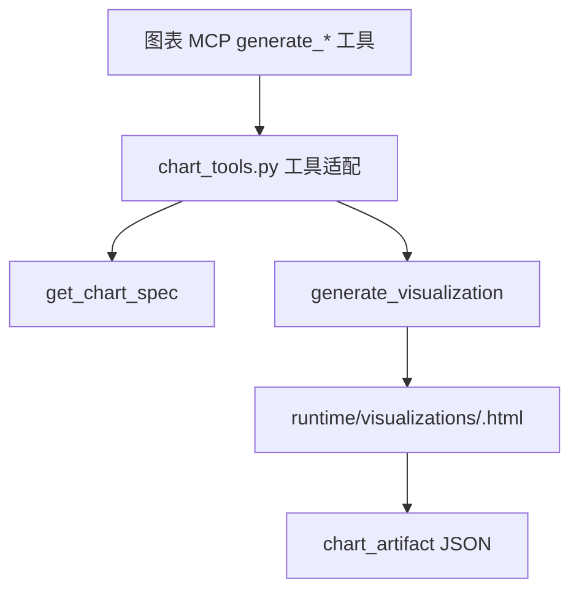

异步子 Agent 只自动发现配置中声明的 `/skills/subagents/procurement_analyst/`；该路径是共享沙箱中的运行时技能发现目标，不保证已有具体技能，也不自动继承主 Agent 的技能。它不独立同步文件，而是使用主流程已同步的副本；不连接主 Agent 的 Store 或 Checkpointer，其 backend 使用空路由表。共享文件环境不等于共享对话状态，详见 3.4—3.5。

**任务提交与结果回写**

主 Agent 使用 `start_async_task` 提交任务后立即获得 `task_id`，不会等待图表生成完成。前端根据任务 ID 轮询：

```text
POST /chat/stream
    -> 主 Agent 调用项目 start_async_task
    -> 创建 Agent Protocol 线程和 run，context 传入 sandbox_id
    -> API 收到工具结果，先持久化 task_id、user_id、username、thread_id 绑定
    -> SSE tool_result 返回 task_id（不等待后台执行完成）
    -> 前端轮询 GET /async-tasks/{task_id}?user_id=...
    -> 任务完成后读取 Agent Protocol 状态
    -> 提取最终文本和 artifact_id
    -> 以 source=main 写回主会话 checkpoint
    -> 前端回填异步任务卡片
```

`src/api/async_tasks.py` 先校验任务绑定和父会话归属，终态成功读取结果后才尝试 `publish_async_task_result()`。主会话忙碌或暂停时返回 `done=true, delivered=false`，前端继续轮询；固定消息 ID 和单进程会话 guard 避免重复写入，详见 5.2。项目没有独立结果投递守护进程，停止轮询不会自动触发回写。

**结果与资源边界**

异步采购分析子 Agent 不直接向用户发送完整会话或 HTML。HTML 图表保存在运行时 artifact 目录，Markdown 报告保存在用户共享沙箱的 `/analysis/` 目录；主会话只保存轻量资源记录，API 再将其转换为前端可打开和下载的链接。

异步任务失败、取消、超时或中断时，API 返回相应终态和错误，并在父会话可写时投递失败说明。当前主 Agent 负责启动任务，状态查询由页面 API 完成；任务终态中的 `cancelled` 表示远程运行状态，不等于前端提供了独立取消按钮或取消接口。图表文件由 FastAPI 生命周期中的后台清理任务按 TTL 清理。

### 2.4 同步与异步子 Agent 的区别

| 项目 | 同步采购订单子 Agent | 异步采购分析子 Agent |
| --- | --- | --- |
| 委派工具 | `task` | `start_async_task` |
| 运行位置 | 主 Agent 执行图内 | 独立 Agent Protocol 服务 `:18082` |
| 主请求是否等待 | 等待子任务完成或中断 | 提交后立即返回任务 ID |
| 首次工具结果 | 子 Agent 的执行结果 | 仅提交回执和 `task_id`，不代表最终图表结果 |
| 最终结果承载 | 同步子 Agent 最终 `ToolMessage` | 主会话中 `source=main` 的助手消息 |
| Checkpointer | 使用主 Agent checkpoint 支持恢复 | 异步图独立运行，终态回写主会话 |
| 工具来源 | Java ERP MCP + `request_additional_info` | 图表 MCP 的压缩工具接口 |
| 技能目录 | `/skills/subagents/procurement_order/`（沙箱运行副本） | `/skills/subagents/procurement_analyst/`（沙箱运行副本） |
| 文件与命令 | 使用主 Agent 的用户沙箱代理 | 按 context 的 `sandbox_id` 连接共享沙箱 |
| 技能同步 | run 前执行同步中间件 | 异步图也在 run 前执行独立的 `SandboxSkillsMiddleware` |
| 前端展示 | 任务摘要、补充信息/审批和最终订单结果 | 任务卡片、分析结果、HTML 图表和按需 Markdown 报告入口 |

## 3. 沙箱执行机制

这一节可以先用一句话理解：**Agent 的工作区在 OpenSandbox 中，项目本地目录只负责维护技能，数据库只负责保存记忆、会话和沙箱 ID。** Agent 要执行命令或读写普通文件时，不会直接操作 Windows 宿主机。

### 3.0 先理解三个概念

| 概念 | 初学者理解 | 在项目中的作用 |
| --- | --- | --- |
| 沙箱 | 一个独立的远程工作目录和命令执行环境 | Agent 在这里运行 Python、Go、Java、Node.js 和技能代码。 |
| 沙箱 ID | 沙箱的唯一编号，类似一间工作室的门牌号 | Store 只保存这个编号，下次可以重新连接同一个沙箱。 |
| 沙箱代理 | Agent 手里拿到的稳定“遥控器” | 即使底层沙箱需要恢复，Agent 仍然使用同一个代理对象。 |

一次普通请求大致经过以下步骤：

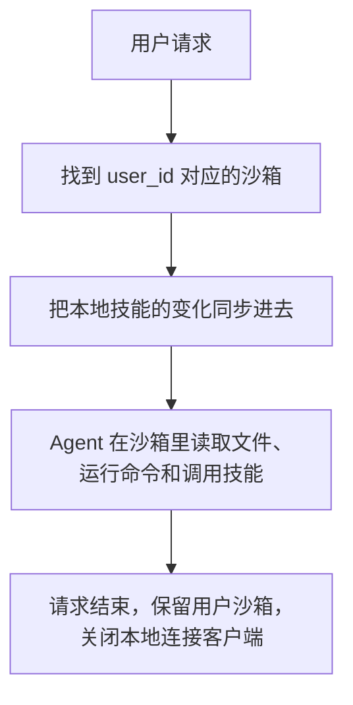

注意：沙箱隔离的是 Agent 的文件和命令执行路径，不是整个项目服务。FastAPI、数据库、MCP 客户端和 artifact 服务仍然运行在宿主服务进程中。

### 3.1 职责与模块边界

项目通过 OpenSandbox 为 Agent 提供远端文件操作和 shell 执行环境。可以把它看成一条“文件操作转发链”：Agent 发出操作，项目 backend 把操作转给 OpenSandbox，OpenSandbox 在隔离环境中执行。

主 Agent 使用 `CompositeBackend`，把两类数据分开：普通文件和命令进入沙箱；用户长期记忆进入 PostgreSQL。历史读取器使用的只读状态图不执行任务，不属于这条文件执行链路。

**主要模块**

| 模块 | 职责 |
| --- | --- |
| `src/agent/backends/sandbox_manager.py` | 管理单个未分配预热实例，按用户复连/分配、访问续期与确认消失后的重建，保存 Store 绑定。 |
| `src/agent/backends/sandbox_proxy.py` | 提供稳定的 backend 引用，通过锁协调操作、底层替换和客户端关闭。 |
| `src/agent/backends/open_sandbox.py` | 将 DeepAgents 的 `execute`、文件上传和下载转换为 OpenSandbox SDK 调用。 |
| `src/agent/backends/skill_sync.py` | 将本地已持久化技能和 Agent 指引增量同步到用户沙箱，最后提交 manifest。 |
| `src/agent/middlewares/skills_sync.py` | run 前同步文件，并为当前会话重新发现技能元数据。 |
| `src/agent/tools/async_sandbox_tools.py` | 创建项目版 `start_async_task`，提交时读取代理的最新沙箱 ID。 |
| `src/agent/tools/sandbox_skill_management.py` | 向沙箱传入可信管理运行包，并校验、持久化技能导出及协调回滚。 |
| `sandbox/Dockerfile`、`sandbox/setup-runtime.sh` | 构建包含 Python、Go、Java、Node.js 和 PyYAML 的沙箱运行环境。 |

`OpenSandboxBackend` 继承 DeepAgents 的 `BaseSandbox`，只实现三个最底层动作：执行命令、上传文件、下载文件。读写、编辑、列目录和搜索等更高级文件能力由框架基于这三个动作自动组合出来。

沙箱隔离的是 Agent 的 backend 执行路径，**不是把整个 FastAPI、Agent Protocol 或所有工具函数放进沙箱**：MCP 客户端、数据库访问和图表 artifact 保存仍在服务进程侧。技能管理工具由宿主负责编排，但下载、解压、创建和测试在沙箱进行；宿主只接收并校验最终要持久化的文件，不执行下载的技能代码。

### 3.2 按用户创建、复连与复用

每个用户拥有自己的沙箱。同一用户的多个 `thread_id` 共享这个沙箱，因此同一用户在不同会话中可以看到相同的工作文件；不同用户使用不同沙箱。

FastAPI 启动时，`AgentLoader.initialize()` 在建立 Store 和 Checkpointer 后创建并初始化 `SandboxManager`。默认会在后台准备一个“还没有分配给任何用户”的预热沙箱。只有沙箱创建成功、技能同步成功、指引文件同步成功后，它才会进入待领取状态。启动不会等待这些 SDK 操作完成；预热失败时记录警告，真正有用户请求时仍可按需创建。

预热实例使用空 metadata，不关联用户，也不写入 Store。同一进程最多保留一个就绪槽位。用户领取时，程序先把它从槽位中取走，再做一次健康检查；领取后后台再补充一个预热实例，但不会让用户等待补充完成。如果没有可用预热实例，就直接按需创建。项目没有周期性保活循环，用户沙箱主要依靠访问时续期。

**获取流程**

1. 先看当前进程里是否已经有这个用户的健康代理，有就直接复用。
2. 如果没有，从 Store 读取这个用户上次保存的 `sandbox_id`。
3. 如果旧沙箱仍然存在，就重新连接它；只有生命周期 API 确认它已经不存在，或实例状态为 `FAILED` / `TERMINATED`，才允许换新沙箱。
4. 如果没有可复用的旧沙箱，就领取预热实例；预热实例不可用时，再按需创建。
5. 沙箱准备好后，尝试续期，把 `sandbox_id` 写入 Store，再交给 Agent 使用。

下面的流程图展示了对应的代码路径：

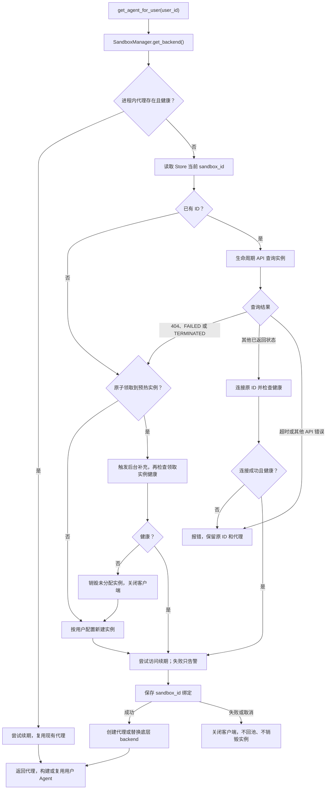

绑定保存在 PostgreSQL Store 的 `("sandboxes", user_id)` 命名空间，key 为 `current`，value 为 `{"sandbox_id": "..."}`。它只记录“应该连接哪个沙箱”，不保存远端文件内容。

- 同一用户在当前进程内复用主 Agent 和沙箱代理；多个 `thread_id` **共享沙箱文件环境**，但使用各自的 checkpoint。不同用户选择各自绑定的实例，前提仍是可信的 `user_id`。
- 缓存探活失败不等于工作区丢失。只有未保存 ID，或生命周期 API 对该实例返回 404、`FAILED` 或 `TERMINATED` 时才领取预热实例或按需创建；普通连接超时、503 或暂时性管理 API 故障会保留原绑定并返回错误。
- 已有持久化 ID 优先于预热槽位。领取、按需创建或复连后尝试续期，再写 Store 并发布代理；替换等待在途操作完成，随后关闭旧 SDK 客户端。绑定写失败或取消时可能已提交数据库，因此只关闭客户端，不把该实例退回预热池或销毁，避免分配给第二个用户。
- 每次 `get_backend()`（包括健康缓存命中）调用 `renew_sandbox()`，使用 `OPEN_SANDBOX_SANDBOX_TIMEOUT_SECONDS` 延长有效期；续期失败只记录告警，不换箱、不改 ID，也不阻断本次返回。长时间不再访问 manager 的任务没有独立心跳续期保障。
- `SandboxManager` 使用用户级 `asyncio.Lock` 协调绑定与恢复，慢用户不会因全局获取锁阻塞其他用户；预热槽位另有短临界区锁。同步 SDK 探活、连接、创建和续期放入 `asyncio.to_thread()`，跟踪在途任务并在取消/关闭时等待其最终资源归属明确。代理使用 `RLock`，同步器和技能发布器可在多步操作期间固定 backend。**这些锁不是跨进程、跨服务的沙箱文件锁。**
- 重建后不会自动恢复旧实例的普通工作文件；已持久化技能源可以再次同步。提交新异步任务时会读取最新代理 ID，已提交任务仍持有当次提交的 ID，详见 3.5。

### 3.3 文件路由与持久化边界

主 Agent 的 `CompositeBackend` 只有 `/memories/` 这一条专用路由，默认 backend 是用户的 `SandboxBackendProxy`；同步子 Agent 使用同一 backend。

因此可以这样判断：

- Agent 操作 `/memories/...`：实际读写 PostgreSQL Store。
- Agent 操作 `/skills/...`、`/AGENTS.md` 或其他路径：实际读写用户沙箱。
- Agent 执行 shell 命令：实际在用户沙箱中执行。
- 图表 HTML artifact：仍保存到宿主机的 `runtime/visualizations/`，不会自动进入沙箱。

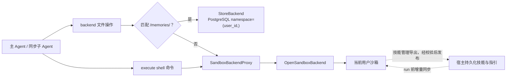

| 数据或操作 | 实际位置 | 保存与恢复边界 |
| --- | --- | --- |
| `/memories/{user_id}/preferences.md` | PostgreSQL Store | 文件 API 经路由访问，内部 key 为 `/{user_id}/preferences.md`。 |
| `/skills/...`、`/AGENTS.md` | 当前用户沙箱 | 已安装技能和指引的运行副本；沙箱还可暂存未持久化的新技能。 |
| `/.myagent/skills-manifest.json` | 当前用户沙箱 | 记录上次成功同步的源文件摘要，不是沙箱全盘清单。 |
| `/skills/.skill-transactions/{token}/` | 当前用户沙箱 | 技能变更期间保存恢复备份与事务记录，不是用户长期记忆。 |
| 其他工作文件、shell 执行 | 当前用户沙箱 | 不自动作为文件快照写入 Store 或 checkpoint；工具消息仍可记录执行结果。 |
| 当前 `sandbox_id` | PostgreSQL Store | 保存实例引用，不保证远端文件永久保留。 |
| 对话消息、工具状态和中断 | PostgreSQL Checkpointer | 按 `thread_id` 保存，与沙箱文件生命周期分离。 |
| 图表 HTML artifact | 宿主 `runtime/visualizations/` | 由图表工具和资源服务管理，不迁移到沙箱。 |

`CompositeBackend.execute()` 始终转给默认沙箱后端。`/memories/` 是 **backend 文件 API 的路由**，不是 shell 中挂载的 PostgreSQL 目录；在 shell 中使用同名路径不会自动访问 Store。异步采购分析图使用 `CompositeBackend(default=沙箱代理, routes={})`，不连接主会话的 Store，也没有该路由。

### 3.4 技能与指引文件同步

本地 `src/agent/skills/` 是开发者维护技能的地方，沙箱 `/skills/` 是 Agent 实际读取和运行技能的地方。`SandboxSkillSynchronizer` 会把本地文件映射到沙箱 `/skills/...`，并把 `src/agent/memory/AGENTS.md` 映射到 `/AGENTS.md`。

它不会简单地每次复制全部文件，而是为每个文件计算 SHA-256 摘要，和沙箱中的 `/.myagent/skills-manifest.json` 比较，只同步新增或修改的文件，并删除本地已经移除的旧文件。扫描会跳过 `__pycache__` 和 `.pyc`，同时拒绝符号链接、Windows 目录联接和越出技能根目录的路径。

**同步顺序**

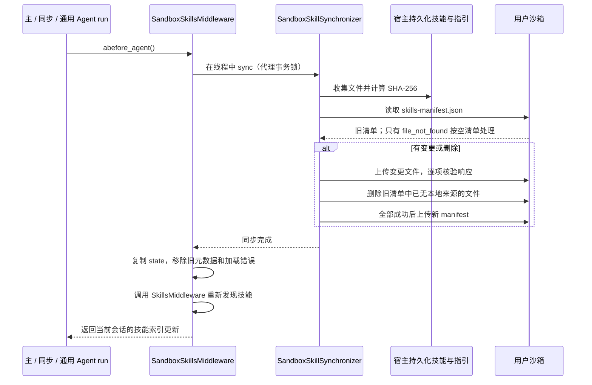

同步器处理整个本地技能源；各 Agent 的 `sources` / `skills` 再限定自己自动发现哪些目录。主 Agent、同步订单子 Agent 和异步采购分析子 Agent 都注册项目的 `SandboxSkillsMiddleware`；DeepAgents 默认通用子 Agent 使用框架默认的技能处理方式，不由项目单独注册该中间件。项目中显式注册的 Agent 会在真正开始工作前执行同步，然后让 DeepAgents 重新发现技能，避免 Agent 继续使用旧的技能索引。

- 只比较“当前本地摘要”和“上次 manifest”，不逐个回读远端文件校验内容。没有源文件变化时，不保证自动修复被其他操作改坏的远端副本。
- manifest 下载失败、内容损坏、响应不匹配或路径非法时停止同步，不当作首次同步，以免丢失旧文件删除记录。
- 顺序为“上传变更 → 删除旧文件 → 提交 manifest”。前两步失败时不提交新清单，后续 run 可重试；已完成的文件操作不会整体回滚，不能称为文件系统原子事务。
- 仅删除旧 manifest 跟踪且本地已移除的文件，不清空整个 `/skills/`。沙箱新建、尚未进入清单的暂存技能不会仅因宿主没有副本就被同步器删除。
- 即使 `sync()` 返回无变更，中间件也会刷新当前会话技能元数据，避免同用户其他线程已同步后，本线程继续使用旧缓存。
- 技能管理成功发布后，当前沙箱和宿主已有新内容；其他用户沙箱在各自后续同步时获得更新。**宿主技能源是全项目共享的，不按用户命名空间隔离。**
- 异步采购分析 Agent 在独立异步图中注册自己的 `SandboxSkillsMiddleware`，使用当前任务共享沙箱并按配置目录同步；技能发现范围不等于共享沙箱内的强制文件访问权限隔离。

技能创建、下载、分配与两端持久化契约见第 7 章；这里仅描述 run 前的源文件同步。

### 3.5 异步任务如何共享沙箱

异步任务也使用父 Agent 当前用户的沙箱。`create_main_agent()` 传给异步工具的是代理对象，而不是写死的 ID。每次调用 `start_async_task(description, subagent_type)` 时，工具都会先读取代理当前的 `id`，再通过 LangGraph SDK 创建异步任务，并传入 `context={"sandbox_id": sandbox_id}`。

这样设计的好处是：如果用户沙箱发生恢复，代理内部已经换成了新 ID，之后新提交的异步任务会自动读取最新 ID。已经提交的任务不会自动迁移到新沙箱。成功返回的 `task_id` 是 Agent Protocol 线程 ID，与父会话的 `thread_id` 和 `run_id` 不同。

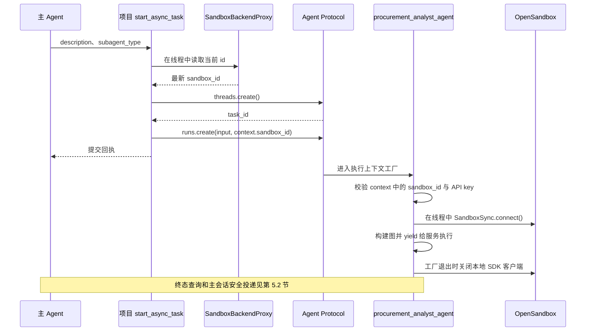

`procurement_analyst_agent()` 是异步上下文管理器：

- 执行请求从 `runtime.execution_runtime.context` 取 ID，连接共享沙箱；构图失败、执行结束或取消时释放客户端，不销毁沙箱。
- `threads.read`、`threads.update`、`assistants.read` 等非执行访问使用未连接的代理构建相同拓扑，不要求 `sandbox_id`，不连接沙箱；若实际调用其执行接口则拒绝。这使服务读取任务状态时不依赖远端工作区仍然存活。
- 图表 MCP 调用与 HTML artifact 保存仍在 Agent Protocol 服务侧进行；异步图不接入父会话 Store 或 Checkpointer。图工厂传入 `checkpointer=None` 不等于服务没有独立的任务状态存储。

新提交会使用已替换的代理 ID，但已创建的 run 不会自动迁移到新实例，也不重放失败任务。当前 context 只传 `sandbox_id`；入口不独立验证该 ID 与用户 Store 绑定的归属，Agent Protocol 仍需要部署侧访问控制。

### 3.6 配置与运行准备

客户端配置集中在 `src/agent/config.py`，主服务和异步 Agent Protocol 必须使用一致的连接配置。OpenSandbox 服务端独立部署；`start_web.py` 只启动项目自己的服务，不负责启动 OpenSandbox，也不保证 OpenSandbox 一定可用。FastAPI 的 manager 初始化时默认在后台准备一个无用户绑定的预热实例。

| 环境变量 | 默认值 | 含义 |
| --- | --- | --- |
| `OPEN_SANDBOX_HOST` | `127.0.0.1` | OpenSandbox 管理 API 主机。 |
| `OPEN_SANDBOX_PORT` | `18083` | 管理 API 端口，需与服务端一致。 |
| `OPEN_SANDBOX_API_KEY` | 无 | 连接凭据；缺失时 manager 初始化或异步执行图构建失败。 |
| `OPEN_SANDBOX_IMAGE` | `myagent-sandbox:1` | 新建实例镜像，需要预先在服务端使用的容器运行环境中准备。 |
| `OPEN_SANDBOX_DEFAULT_TIMEOUT_SECONDS` | `120` | backend 未收到显式 timeout 时的命令超时。 |
| `OPEN_SANDBOX_SANDBOX_TIMEOUT_SECONDS` | `86400` | 创建和每次访问续期共用的有效期，默认 24 小时，不是单条命令超时。 |
| `OPEN_SANDBOX_PREWARM_ENABLED` | `true` | 启用单槽位后台预热；`1`、`true`、`yes`、`on`（忽略大小写）为真，其他值为假。 |

**沙箱运行镜像**

项目的 `sandbox/Dockerfile` 以 `python:3.12` 为基础，调用 `setup-runtime.sh` 安装 Go、无界面的 JDK、Node.js / npm；Python 缺少 `yaml` 时安装 `PyYAML==6.0.3`，最后检查各语言版本和模块导入。从项目根目录构建：

```bash
docker build -t myagent-sandbox:1 sandbox
```

此命令应在 OpenSandbox 服务端实际使用的 Docker 环境执行；在另一个 Docker daemon 构建同名镜像不会自动让服务端可见。脚本需要 root 和 Debian 包管理环境；默认联网安装，也支持在构建上下文的 `sandbox/offline/` 放入已验证且依赖完整的 `.deb`、`.whl`，离线包不完整时失败而不是静默联网补齐。镜像构建不属于统一启动器流程。

调整镜像配置只影响以后创建的实例，不升级已复用沙箱，也不会因为镜像变更主动换箱。需要维护已有实例时，必须明确选定目标并单独操作。宿主 Python 依赖仍使用 `myagent` uv 环境，沙箱镜像内的 Python 是独立的远端运行环境。

密钥应安全提供，不写入 README、命令示例或日志。配置模块使用 `load_dotenv(..., override=True)` 加载根目录 `.env`，因此该文件中的同名值会覆盖已有环境变量；排查配置时应核对最终生效值，但不要输出密钥。

### 3.7 生命周期、故障与验证边界

**资源释放**

- 会话结束、中断或删除不会主动销毁已分配的用户沙箱，也不删除 `("sandboxes", user_id)` 绑定；未分配的预热实例由管理器关闭流程销毁。
- `AgentLoader.shutdown()` 调用 `SandboxManager.close()`：先禁止新请求，等待已接收操作和预热线程结束，销毁从未分配的预热实例并关闭所有客户端，最后释放 Checkpointer / Store 连接。已分配用户实例只关闭客户端，不远端销毁；预热实例使用 `kill_sandbox()` 清理，不能再统称项目完全不调用销毁操作。
- 异步图工厂只管理该次图生命周期的客户端；取消时会接管同步连接线程最终返回的资源并关闭，避免连接泄漏。
- 用户实例过期取决于创建/访问续期和服务端策略；空闲预热实例在失败、失效或服务正常关闭时由 manager 清理。它们与图表 artifact 的 7 天 TTL 分离；强制杀进程可能绕过这些关闭钩子。

**故障处理**

| 场景 | 当前处理 |
| --- | --- |
| 缺少 API key | manager 初始化或异步执行图构建失败，不降级为宿主执行。 |
| 生命周期 API 确认 404、`FAILED` / `TERMINATED` | 领取健康预热实例或按需新建，保存 ID 后更新代理；不恢复普通工作文件。 |
| 预热创建或技能播种失败 | 不发布槽位，清理取得的未分配实例并告警，后续请求按需创建。 |
| 访问续期失败 | 记录异常类型并保留现有实例和 ID，不因此触发重建。 |
| 临时探活、连接或管理 API 故障 | 报错并保留原绑定，不把连接失败当作实例已丢失。 |
| 保存新绑定失败 | 关闭取得的 backend 客户端，不发布半初始化代理；不自动销毁远端实例。 |
| shell 执行异常 | adapter 返回 `exit_code=1`，不自动重放命令；正常返回保留 SDK 的退出码。 |
| 文件上传或下载失败 | 各文件独立返回错误；下载仅将 SDK 404 归一化为 `file_not_found`，403 为 `permission_denied`。 |
| 同步清单损坏、上传/删除失败 | 停止当前同步，不跳过错误继续技能发现。 |
| 技能持久化失败 | 尝试恢复沙箱与宿主旧版本；回滚未确认时返回事务错误，见 7.2。 |
| 异步执行缺少 `sandbox_id` | 拒绝构造执行图；非执行读取不要求 ID。 |

创建实例显式传入镜像、生存期、连接配置和 metadata（按需用户实例包含用户 ID，预热实例为空），**没有显式设置网络策略、卷挂载规则或自定义资源配额**。不能据此宣称已实现网络封锁、租户认证或完整容器安全加固。图表响应的 `Content-Security-Policy: sandbox allow-scripts` 只约束浏览器文档，与 OpenSandbox 不是同一种沙箱。

**现有测试依据**

| 测试文件 | 已有断言覆盖 |
| --- | --- |
| `tests/test_sandbox_prewarm.py` | 非阻塞预热、领取唯一性、持久绑定优先、失效槽位清理、访问续期失败、取消接管和关闭只销毁未分配实例。 |
| `tests/test_sandbox_recovery.py` | 执行与二进制传输、下载错误映射、代理替换、技能增量同步、确认消失后重建、临时故障保留绑定、取消清理、manifest 失败重试、路径校验和跨会话索引刷新。 |
| `tests/test_sandbox_skill_management.py` | 沙箱创建/下载、分配持久化、摘要与路径校验、两端回滚及删除/更新。 |
| `tests/test_async_chart_configuration.py` | 执行/只读图拓扑一致、执行上下文必需 ID、读取不连沙箱、客户端关闭。 |
| `tests/test_agent_loader_lifecycle.py` | 并发初始化、初始化失败清理、关闭异常与数据库连接释放。 |
| `tests/test_procurement_order_subagent.py` | 主/同步/通用 Agent 的工具和技能同步中间件注册。 |

这些测试主要使用 SDK mock、内存状态和临时目录，覆盖应用侧逻辑，不证明真实 OpenSandbox 服务可用、镜像构建成功、远端实例正确回收或服务端安全策略生效。真实部署仍需验证创建、复连、技能执行、多语言运行环境以及网络和资源策略。

## 4. 中间件体系与 Agent 执行生命周期

主 Agent 与子 Agent 通过中间件处理运行时身份注入、上下文压缩、调用次数保护、技能工具可见性和用户长期偏好更新。主 Agent 的注册入口是 `src/agent/main_agent.py:create_main_agent()`；同步订单、通用和异步采购分析子 Agent 使用各自的保护配置，并不共享主 Agent 的完整中间件实例、上下文或消息历史。

**注册顺序与生命周期**

主 Agent 传给 `create_deep_agent()` 的中间件注册顺序如下：

1. `ContextInjectionMiddleware`：模型调用前注入运行时用户身份。
2. `SandboxSkillsMiddleware`：在 run 前同步本地技能和指引到用户沙箱，再执行技能发现。
3. `build_agent_protection_middleware(...)`：装配自动摘要、可选的 `compact_conversation`、模型调用次数限制和工具调用次数限制。
4. `SkillManagementVisibilityMiddleware`：按最近一条用户消息过滤技能管理工具 schema。
5. `MemoryUpdateMiddleware`：在 Agent 完成一轮处理后更新用户长期偏好。

这里的“注册顺序”不是所有中间件严格线性执行的顺序：技能同步通过 `abefore_agent` 在 run 前执行，身份注入和技能可见性通过模型调用包装钩子执行，长期记忆更新通过 `after_agent` 钩子执行，摘要和调用次数保护由 Agent 框架按各自生命周期处理。

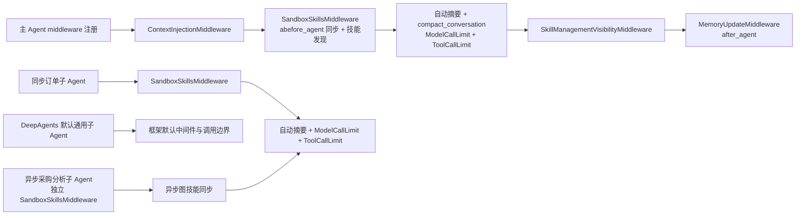

以上列的是项目传入列表，不是最终完整 middleware 栈。当前 DeepAgents 源码会装配文件、同步委派、工具调用修补等内置中间件，再按名称替换自定义项；主 Agent 的 `memory=["/AGENTS.md"]` 还会引入 `MemoryMiddleware`，它负责读取沙箱指引，与更新用户 Store 的 `MemoryUpdateMiddleware` 不是同一职责。同步订单的 `interrupt_on` 引入工具执行前的 HITL。

**中间件职责与边界**

| 中间件或构建器 | 注册对象 | 主要职责 | 状态、权限与展示边界 |
| --- | --- | --- | --- |
| `ContextInjectionMiddleware` | 主 Agent | 从 `ProcurementContext` 读取 `user_id`、`username`，把身份和 `/memories/{user_id}/preferences.md` 注入每次模型调用的系统提示。 | 不修改持久化消息历史；身份来自运行时上下文。 |
| `build_agent_protection_middleware()` | 主 Agent、同步订单子 Agent、异步采购分析子 Agent | 创建自动摘要和模型/工具调用限制；主 Agent 额外提供 `compact_conversation` 主动压缩工具；计数按 run，而非会话累计。 | 主 Agent 的模型/工具上限为 `50/50`；同步订单子 Agent 为 `50/50`；异步采购分析子 Agent 为 `50/32`；超限以 `end` 结束当前 run。DeepAgents 默认通用子 Agent 使用框架默认调用边界。 |
| `SandboxSkillsMiddleware` | 主 Agent、同步订单子 Agent、异步采购分析子 Agent | run 前增量同步技能与指引，每次刷新当前会话的元数据和加载错误，再调用框架发现流程。 | 框架名称为 `SkillsMiddleware`，用于替换内置技能中间件；DeepAgents 默认通用子 Agent 不由项目注册该中间件，详细流程见 3.4。 |
| `SkillManagementVisibilityMiddleware` | 主 Agent | 仅在最近用户消息包含技能管理意图时保留技能管理工具 schema。 | 只控制模型本轮可见性，不替代工具的路径、目标和文件校验。 |
| `MemoryUpdateMiddleware` | 主 Agent | 在 `after_agent` 阶段筛选 ERP 相关请求，调用摘要模型提取近期查询和明确偏好，并写回用户 Store。 | 写入 `/memories/{user_id}/preferences.md`；摘要异常只记录警告，不阻断主回答；内部过程不展示给用户。 |

主 Agent 的保护中间件共享同一个摘要实例，使自动摘要和 `compact_conversation` 使用相同的摘要状态；子 Agent 不提供主动压缩工具，但仍使用自动摘要及两类调用限制。异步采购分析子 Agent 在 `src/agent/subagents/async_entry.py` 中按运行时 `sandbox_id` 独立构建，使用共享沙箱 backend，不连接主会话 Store 或 Checkpointer。

## 5. 记忆与状态管理

### 5.1 用户长期记忆

主 Agent 的长期记忆通过 `CompositeBackend` 路由到 PostgreSQL Store，不写入本地技能目录，也不混入当前会话的普通运行状态。当前主要保存用户偏好和近期 ERP 查询摘要。

**存储位置与路由**

```text
Agent 访问 /memories/{user_id}/preferences.md
    -> CompositeBackend 的 /memories/ 路由
    -> StoreBackend
    -> PostgreSQL Store namespace=(user_id,)
```

主 Agent 创建时，在 `src/agent/main_agent.py` 中为 `/memories/` 配置 `StoreBackend`：

```python
StoreBackend(
    namespace=lambda runtime: (user_id,),
    store=store,
)
```

因此，不同用户使用不同的 Store 命名空间：

| 标识 | 作用 | 存储位置 |
| --- | --- | --- |
| `user_id` | 区分用户及其长期记忆 | Store namespace `(user_id,)` |
| `preferences.md` | 保存偏好和近期查询 | `/memories/{user_id}/preferences.md` |
| `thread_id` | 区分同一用户的不同会话 | PostgreSQL Checkpointer |

`user_id` 和 `thread_id` 的职责不同：同一用户可以拥有多个相互独立的会话；这些会话可以共享该用户的长期偏好，但不会共享对话消息和中断状态。

**读取与更新流程**

主 Agent 的系统提示词要求每轮处理用户消息前读取当前用户的偏好文件：

```text
/memories/{user_id}/preferences.md
    -> 读取 preferred 和 recent_queries
    -> 参与当前请求的判断
```

`MemoryUpdateMiddleware` 在 Agent 完成一轮 ERP 相关处理后执行：

1. 从本轮用户消息和助手摘要中判断是否属于 ERP 查询。
2. 使用摘要模型提取简短的近期查询，并识别用户明确表达的长期偏好。
3. 读取已有 `preferences.md`，解析 YAML 内容。
4. 合并 `preferred`，并将新的查询加入 `recent_queries`。
5. 将新查询置顶、按忽略大小写去重，最多保留 5 条，每条最多 160 字符，写回当前用户的 Store 命名空间。

筛选实际依据为最近用户消息命中 ERP 关键词，或传入消息状态中存在 `task` / `start_async_task` 委派；并非严格的业务意图分类器。摘要为空、格式异常或模型调用失败时，会回退使用截断后的用户原话记录查询，而不是一定跳过更新。`preferred` 按顶层同名键覆盖，不做任意深度合并；Store 写失败记录警告，不阻断主回答。提示词要求“每轮读取偏好”是模型行为约定，并非 middleware 自动读取后注入全部文件内容。

```mermaid
sequenceDiagram
    participant A as 主 Agent
    participant M as MemoryUpdateMiddleware
    participant S as PostgreSQL Store
    participant F as preferences.md

    A->>A: 读取 /memories/{user_id}/preferences.md
    A->>M: 完成本轮 ERP 对话
    M->>M: 提取查询摘要和明确偏好
    M->>S: 读取用户命名空间
    S-->>M: 返回已有偏好
    M->>S: 写回合并后的偏好
    S-->>F: 保存用户记忆
```

**与会话状态的边界**

- 长期记忆属于用户，由同一 `user_id` 的多个会话共享。
- 会话消息、工具调用、中断和恢复状态属于单个 `thread_id`，由 Checkpointer 保存。
- 当前进程的 `_user_groups` 只缓存用户 Agent 实例和已访问的会话 ID，不是长期记忆的持久化位置。
- 沙箱 ID 另存于 Store 的 `("sandboxes", user_id)`；同用户多个会话共享沙箱文件，但不共享 checkpoint。该绑定不保存文件快照，详见第 3 章。
- 服务重启后，内存缓存会重新创建，但 Store 中的用户偏好仍可继续读取。

```mermaid
flowchart LR
    USER["user_id"] --> MEMORY["长期记忆<br/>Store namespace=(user_id)"]
    USER --> GROUP["进程内 UserGroup<br/>Agent 缓存"]
    THREAD1["thread_id A"] --> CP1["Checkpointer<br/>会话 A"]
    THREAD2["thread_id B"] --> CP2["Checkpointer<br/>会话 B"]
    MEMORY -. 同一用户共享 .-> THREAD1
    MEMORY -. 同一用户共享 .-> THREAD2
```

当前前端入口由登录会话保护，但部分聊天、历史和异步任务接口仍兼容请求中的 `user_id`；严格的生产级隔离应统一从认证上下文取得用户 ID，而不是信任客户端任意提交的值。

### 5.2 子 Agent 的状态与交互记录

子 Agent 的记录策略取决于执行方式：同步采购订单子 Agent 使用主 Agent 的执行图和 checkpoint；异步采购分析子 Agent 使用独立 Agent Protocol 任务运行，终态结果再写回主会话。两者都不单独创建面向用户的消息表。

**同步子 Agent：随主会话保存**

同步采购订单子 Agent 通过主 Agent 的 `task` 工具启动，运行状态属于父线程：

```text
主 Agent checkpoint（thread_id）
    ├─ 主 Agent 消息
    ├─ task 委派调用
    ├─ 子 Agent 执行状态和中断状态
    └─ 子 Agent 最终 ToolMessage
```

- 缺少订单信息时，`request_additional_info` 使用 `interrupt()` 保存当前状态。
- 人工补充信息或审批决定通过 `Command(resume=...)` 恢复同一个 checkpoint。
- 子 Agent 的内部文本和工具过程可以存在于执行状态中，但不作为普通用户消息实时展示。
- 历史恢复时，`history.py` 将 `task` 序列化为 `role=delegation`，只显示任务摘要；同步子 Agent 的最终 `ToolMessage` 作为任务结果展示。

**异步子 Agent：独立运行，结果回写**

异步采购分析子 Agent 不连接主会话的 Store 或 Checkpointer。提交任务时，主 Agent 只返回任务 ID；FastAPI 将任务归属写入 Store 的 `("async_tasks",)` 命名空间：

```text
async_tasks namespace
    task_id -> user_id + username + thread_id
```

任务状态由 `GET /async-tasks/{task_id}?user_id=...` 查询；未提供 `user_id` 不满足接口参数校验，绑定不存在、用户不符或父会话已删除时返回 404。查询接口从 Agent Protocol 状态提取文本和 `artifact_id`，然后调用 `AgentLoader.publish_async_task_result()`：

1. 找到任务绑定，尝试取得父会话 guard，并再次检查父会话仍存在；忙碌或已删除时不写入。
2. 恢复完整状态；若固定 ID `async-task-result:{task_id}` 已存在，直接确认已投递。
3. 若 `state.next` 或 `state.interrupts` 非空，延迟投递，避免 `aupdate_state()` 覆盖待恢复的执行调度。
4. 可写时更新 `source=main`、`async_task_id=task_id` 的助手消息，并刷新会话索引时间；正文只含文本和资源记录。
5. 前端先展示任务终态，再等 `delivered=true` 后停止轮询；读取历史时按精确任务 ID 关联卡片。

任务执行状态和结果投递状态互相独立。远程 run 查询失败、state 读取失败、成功状态却没有文本/资源，或写回异常时返回 502 供重试，不写入伪造的成功占位消息。单进程 guard 不能保证多 worker 并发安全；已删除会话不会被迟到任务结果重建。

固定消息 ID 使重复轮询、重试或多个浏览器标签页查询同一任务时保持幂等，不会重复写入主会话。

```mermaid
sequenceDiagram
    participant MAIN as 主 Agent
    participant STORE as PostgreSQL Store
    participant WEB as 前端
    participant API as FastAPI 聊天 / 异步任务 API
    participant PROTOCOL as Agent Protocol
    participant CHECKPOINT as 主会话 Checkpointer

    MAIN->>PROTOCOL: start_async_task
    PROTOCOL-->>MAIN: task_id
    API->>STORE: 主请求 API 在发出回执前保存任务绑定
    MAIN-->>API: 工具提交结果
    API-->>WEB: tool_result（提交回执，不是最终结果）
    WEB->>API: 轮询 GET /async-tasks/{task_id}?user_id=...
    API->>PROTOCOL: 查询任务状态和终态 state
    PROTOCOL-->>API: 最终文本与 artifact
    API->>CHECKPOINT: 取得会话 guard 并恢复状态
    alt 主会话忙碌或暂停
        API-->>WEB: done=true、delivered=false、终态结果
        WEB->>API: 后续轮询重试投递
    else 允许写入或结果已存在
        CHECKPOINT->>CHECKPOINT: 按固定 ID 幂等保存 source=main 消息
        API-->>WEB: delivered=true、终态结果
        WEB->>WEB: 按任务 ID 回填卡片，安全时刷新历史
    end
```

**历史展示转换**

`src/api/history.py` 的 `serialize_messages()` 将 checkpoint 中的内部消息转换为前端模型：

| checkpoint 内容 | 前端展示 |
| --- | --- |
| 主 Agent 普通助手消息 | `role=assistant` |
| `task` / `start_async_task` 调用 | `role=delegation`，只保留任务摘要 |
| 同步子 Agent 的最终结果 | 委派卡片的最终报告 |
| 异步终态 `source=main` 消息 | 对应异步委派卡片的结果和图表入口 |
| 普通工具调用 | `role=tool`，展开后显示参数和结果 |
| 子 Agent 内部文本和工具过程 | 不向用户历史展示 |

前端 `MessageItem.vue` 默认收起委派卡片，显示子 Agent 名称和状态；展开后显示任务摘要、最终结果和图表入口。异步任务完成后可以显示打开和下载 HTML 图表的入口。

**隔离边界**

- 业务子 Agent 不自动继承主 Agent 的完整对话上下文或技能发现目录；这不等于 backend 权限隔离。同步订单子 Agent 复用主 backend，异步图则没有主会话 Store 路由，文件共享边界见第 3 章。
- 同步子 Agent 使用父会话 checkpoint 支持中断和恢复，但不因此成为独立用户会话。
- 异步子 Agent 的完整运行状态留在 Agent Protocol 任务中，主会话只接收终态交付。
- 业务对话和任务展示统一通过主会话 checkpoint 恢复，不额外创建子 Agent 消息表。


## 6. 工具系统

### 6.1 工具配置与分配

项目中的工具按来源和执行边界分为三类：公共 MCP 工具、采购业务工具和图表工具；此外还有直接写在项目中的本地工具与框架委派工具。工具不是全部注入主 Agent，而是根据职责分配给主 Agent、同步子 Agent 或异步子 Agent。

**工具接入流程**

MCP 工具由 `src/agent/tools/mcp_client.py` 统一发现。不同业务使用独立配置：

| 工具组 | 配置常量 | 当前服务 | 默认接收者 |
| --- | --- | --- | --- |
| 公共工具 | `MCP_SERVER_CONFIG_COMMON` | 公共 / 搜索 MCP | 主 Agent |
| 采购工具 | `MCP_SERVER_CONFIG_ORDER` | `http://127.0.0.1:18081/mcp` | `procurement_order` 子 Agent |
| 图表工具 | `MCP_SERVER_CONFIG_CHART` | 图表 MCP | `procurement_analyst` 异步子 Agent |

`MultiServerMCPClient` 通过 Streamable HTTP 连接 MCP Server 并异步发现工具。加载失败时记录服务名称并抛出 `RuntimeError`，不会静默创建工具不完整的 Agent。

```mermaid
flowchart LR
    A["MCP Server 配置"] --> B["MultiServerMCPClient"]
    B --> C["异步发现 StructuredTool"]
    C --> D{"按业务分组"}
    D --> E["common_tools<br/>主 Agent"]
    D --> F["order_tools<br/>同步采购订单子 Agent"]
    D --> G["chart_tools<br/>图表适配器"]
```

**工具分配原则**

主 Agent 创建时，`create_main_agent()` 执行以下分配：

```python
common_tools, order_tools = await load_mcp_tools()
procurement_order_subagent = load_subagent(
    PROCUREMENT_ORDER_CONFIG_PATH,
    order_tools,
    local_tools=[request_additional_info],
)
async_subagents = get_async_subagent_specs(ASYNC_AGENT_PROTOCOL_URL)
```

最终边界如下：

- `common_tools`、异步任务提交工具和本地补充信息工具进入 `main_tools`，供主 Agent 使用；DeepAgents 默认通用能力不作为项目显式配置单独装配，但按框架行为使用 `main_tools`。
- `order_tools` 不直接传入主 Agent，而是与 `common_tools` 一起按 YAML 工具列表绑定到同步采购订单子 Agent。
- `request_additional_info` 同时作为主 Agent 的本地工具和订单子 Agent 的 `local_tools` 注入；它只负责触发信息补充中断，不提供订单写入权限。
- 图表 MCP 不进入主 Agent 或同步子 Agent；异步入口独立发现后，经过 `chart_tools.py` 压缩为两个稳定工具。
- `task` 是框架提供的同步委派入口；`start_async_task` 由项目 `create_async_sandbox_tools()` 创建，通过 LangGraph SDK 提交携带 `sandbox_id` 的异步任务。主 Agent 根据任务类型选择。
- 技能管理工具虽然注册在主 Agent 图中，但由中间件根据用户消息动态控制是否向模型暴露。

```mermaid
flowchart TD
    MAIN["主 Agent"]
    COMMON["common_tools"]
    ORDER["order_tools"]
    LOCAL["request_additional_info"]
    CHART["图表 MCP"]
    DELEGATE["task / start_async_task"]
    SKILL["技能管理工具"]

    COMMON --> MAIN
    ORDER --> ORDER_AGENT["procurement_order 子 Agent"]
    LOCAL --> MAIN
    LOCAL --> ORDER_AGENT
    MAIN_TOOLS["main_tools<br/>公共 MCP / 补充 / 异步启动"] --> GENERAL["DeepAgents 默认通用子 Agent"]
    CHART --> CHART_AGENT["procurement_analyst 异步子 Agent"]
    MAIN --> DELEGATE
    SKILL --> FILTER["SkillManagementVisibilityMiddleware"] --> MAIN
```

**配置校验与可见性**

同步子 Agent 的 YAML 由 `load_subagent()` 加载，并校验：

- `name`、`description`、`system_prompt` 和 `tools` 等必需字段；
- 工具列表必须是非空字符串，不能重复；
- 每个声明的工具都必须在运行时已发现或由 `local_tools` 提供。

**技能管理工具使用 `SkillManagementVisibilityMiddleware` 动态过滤。**普通对话时模型看不到这些工具的 schema；用户消息涉及技能下载、安装、分配、删除或更新时，才向模型暴露它们。该过滤只控制模型可见性，实际路径和目标校验仍由技能管理实现负责。

### 6.2 基础工具

基础工具是不依赖外部 MCP Server、由框架或项目代码提供的工具。它们负责文件与命令执行、子 Agent 委派、人工中断和技能管理，不直接代替 Java ERP 或图表 MCP 完成业务调用；其中执行工具仍依赖外部 OpenSandbox 服务。

**文件与命令工具**

DeepAgents 的文件工具经 `CompositeBackend` 路由：主 backend 的 `/memories/` 操作进入 Store，其他文件操作和 `execute` 进入用户沙箱。项目 Python 工具不因注册到 Agent 就自动在沙箱中执行，详细边界见 3.1—3.3。

**子 Agent 委派工具**

主 Agent 使用一个框架入口和一个项目封装入口：

| 工具 | 用途 | 执行方式 |
| --- | --- | --- |
| `task` | 委派同步子 Agent，例如 `procurement_order` | 在主 Agent 执行图中运行，等待子任务完成或进入中断。 |
| `start_async_task` | 提交异步子 Agent，例如 `procurement_analyst` | 项目封装通过 Agent Protocol 创建线程/run，传入 `context.sandbox_id`，返回 `task_id` 提交回执。 |

这两个工具是主 Agent 与子 Agent 的边界。主 Agent 不直接拼接子 Agent 的内部工具调用，而是根据子 Agent 的名称、描述和系统提示词选择合适的委派方式。

```mermaid
flowchart LR
    USER["用户请求"] --> MAIN["主 Agent"]
    MAIN -->|"task"| SYNC["同步子 Agent"]
    MAIN -->|"start_async_task"| ASYNC["异步子 Agent"]
    SYNC --> RESULT1["最终报告或中断"]
    ASYNC --> RESULT2["task_id，后台结果"]
```

**`request_additional_info`：订单信息补充工具**

`request_additional_info` 位于 `src/agent/tools/hitl_tools.py`，显式注册到主 Agent 和同步采购订单子 Agent，并按 DeepAgents 默认行为对通用子 Agent 可用。它不是 MCP 工具；订单字段补充流程主要由采购订单子 Agent 触发：

```python
request_additional_info(information_needed, context="")
```

当订单创建或修改所需的信息不完整或不明确时，它会：

1. 接收需要用户补充、确认或选择的内容；
2. 可选地接收当前已知上下文；
3. 调用 LangGraph `interrupt()` 保存当前执行状态；
4. 让后端向前端发送 `information_request` 中断事件；
5. 等待用户以自由文本补充信息；
6. 后端通过 `Command(resume=...)` 恢复原来的执行点，并将补充结果返回给订单子 Agent。

```mermaid
sequenceDiagram
    participant ORDER as 采购订单子 Agent
    participant TOOL as request_additional_info
    participant GRAPH as LangGraph checkpoint
    participant WEB as 前端

    ORDER->>TOOL: information_needed + context
    TOOL->>GRAPH: interrupt()
    GRAPH-->>WEB: information_request
    WEB->>GRAPH: 用户补充信息 + Command(resume)
    GRAPH-->>TOOL: 恢复工具调用
    TOOL-->>ORDER: JSON 编码的补充结果
```

`request_additional_info` 只负责暂停和接收补充信息，不负责查询供应商、零部件或写入订单；实际业务查询和订单操作仍由采购 MCP 工具完成。

**技能管理工具**

技能管理工具由 `src/agent/tools/skill_tools.py` 导出工厂；主 Agent 传入沙箱代理后，创建沙箱版下载、分配、查询、删除和更新工具。它们注册在主 Agent 的工具节点中，但由 `SkillManagementVisibilityMiddleware` 控制模型是否能看到这些工具的 schema：

- 普通对话：隐藏技能管理工具；
- 用户表达技能下载、安装、分配、删除或更新意图：暴露技能管理工具；
- 实际文件路径、压缩包和目标目录校验：由技能管理脚本负责。

因此，“工具不可见”只是减少普通对话中的工具干扰，不是权限边界；真正的安全校验仍在工具实现中完成。

### 6.3 MCP 工具

MCP 工具由独立 MCP Server 提供，主 Agent 或子 Agent 通过 `MultiServerMCPClient` 使用 Streamable HTTP 发现工具。项目当前按用途连接三类 MCP：公共/搜索 MCP、Java ERP MCP 和图表 MCP。

**MCP 客户端接入**

客户端配置和加载逻辑位于 `src/agent/tools/mcp_client.py`：

```mermaid
flowchart TD
    A["MCP_SERVER_CONFIG_*"]
    B["MultiServerMCPClient"]
    C["get_tools(server_name)"]
    D["LangChain StructuredTool 列表"]
    E["分配给对应 Agent"]

    A --> B --> C --> D --> E
```

`load_mcp_tools()` 分别返回 `common_tools` 和 `order_tools`；`load_chart_mcp_tools()` 专门为异步采购分析子 Agent 加载图表 MCP。工具发现是异步网络操作，连接失败时记录服务名并抛出 `RuntimeError`，由启动或 Agent 构建流程报告错误。

**Java ERP MCP**

Java ERP MCP 是项目内的适配服务，入口为 `src/mcp_server/server_main.py`，默认监听：

```text
http://127.0.0.1:18081/mcp
```

它本身不保存业务数据，而是通过共享的 `httpx.AsyncClient` 调用 Java ERP REST API，默认后端地址为：

```text
http://127.0.0.1:18080/api
```

服务注册以下业务工具组：

| 工具组 | 主要能力 |
| --- | --- |
| `suppliers_tools.py` | 供应商查询 |
| `parts_tools.py` | 零部件查询 |
| `inventory_tools.py` | 库存查询 |
| `order_tools.py` | 采购订单创建、修改和查询 |

MCP 服务通过 `mcp_lifespan` 创建共享 HTTP 客户端，并在服务关闭时释放连接。工具函数从 lifespan context 获取该客户端，再调用 Java ERP REST API。

```mermaid
sequenceDiagram
    participant AGENT as Agent / 子 Agent
    participant MCP as Java ERP MCP :18081
    participant JAVA as Java ERP REST API :18080

    AGENT->>MCP: 调用 StructuredTool
    MCP->>JAVA: HTTP 请求
    JAVA-->>MCP: 业务数据或错误
    MCP-->>AGENT: 工具结果
```

MCP 服务注册的全部工具不等于 Agent 实际可调用的全部工具：`procurement_order` 通过 YAML 绑定三个订单 MCP 工具，同时接收公共 `common_tools`；供应商、零部件和库存工具虽然由服务注册，目前没有直接分配给主 Agent、DeepAgents 默认通用子 Agent 或订单子 Agent。图表 MCP 仅由异步采购分析子 Agent 独立加载，主 Agent 通过 `task` 委派订单任务。

`request_erp()` 使用共享 `httpx.AsyncClient`（15 秒超时）统一解包响应：HTTP 请求成功且 JSON 对象的业务 `code == 200` 才返回 `data`；业务失败、无效 JSON、HTTP 错误和连接失败通过 `ToolError` 返回，空查询数据与错误区分。写请求超时不会在 HTTP 层自动重试，需先查询确认结果，避免重复创建订单。

**公共 / 搜索 MCP**

公共 MCP 配置为 `MCP_SERVER_CONFIG_COMMON`，当前使用名为 `bing-search` 的 Streamable HTTP 服务。发现到的公共工具作为 `common_tools` 直接注入主 Agent，可用于搜索等通用能力。

公共工具不属于采购订单子 Agent 的工具列表；订单子 Agent 只使用 YAML 声明的 Java ERP 工具和 `request_additional_info`。

**工具分配边界**

| MCP 来源 | 加载函数 | 接收 Agent | 是否直接进入主 Agent |
| --- | --- | --- | --- |
| 公共 / 搜索 MCP | `load_mcp_tools()` | 主 Agent | 是 |
| Java ERP MCP | `load_mcp_tools()` | `procurement_order` | 否 |
| 图表 MCP | `load_chart_mcp_tools()` | `procurement_analyst` | 否 |

图表 MCP 的工具适配和渐进式 Schema 暴露属于 `6.4 图表工具`，本节只说明 MCP Server 的连接、发现和业务工具分配。

### 6.4 图表工具

图表工具只提供给 `procurement_analyst` 异步子 Agent，不直接注入主 Agent。它们位于 `src/agent/tools/chart_tools.py`，作用是把图表 MCP 的多个底层 `generate_*` 工具压缩为两个稳定入口，并把完整 HTML 隔离在运行时 artifact 目录。采购分析任务按需生成图表，不要求每次任务都生成报告。

**工具渐进式披露**

图表 MCP 工具数量较多、不同图表类型的参数 Schema 也不同，因此不在 Agent 初始化时把所有底层工具和字段全部暴露给模型，而是分两步使用：

1. 图表工具适配器发现所有名称以 `generate_` 开头的 MCP 工具，并转换为稳定的 `chart_type`。
2. Agent 根据任务选择图表类型；只有字段结构不确定时，才调用 `get_chart_spec(chart_type)` 获取该类型的真实 Schema 和最小示例。
3. Agent 根据 Schema 组织 `chart_config`，再调用 `generate_visualization(chart_type, chart_config)`。
4. 适配器将结果保存为 artifact，只把简短的 `chart_artifact` 记录返回给 Agent。

```mermaid
flowchart TD
    A["图表 MCP generate_* 工具"]
    B["建立 chart_type 映射"]
    C["主 Agent 提交异步任务"]
    D["选择 chart_type"]
    E{"字段是否明确？"}
    F["get_chart_spec(chart_type)"]
    G["生成 chart_config"]
    H["generate_visualization(chart_type, chart_config)"]
    I["返回 chart_artifact"]

    A --> B
    C --> D --> E
    E -- "否" --> F --> G
    E -- "是" --> G
    G --> H --> I
```

**两个稳定工具**

| 工具 | 作用 |
| --- | --- |
| `get_chart_spec` | 获取指定 `chart_type` 对应底层 MCP 工具的真实 JSON Schema、描述和最小示例。 |
| `generate_visualization` | 强制请求 HTML，调用底层 MCP 工具，提取 HTML 并保存为本地 artifact。 |

`get_chart_spec` 会兼容 Pydantic v1/v2 的 Schema 接口，并解析本地 `$ref`、`anyOf` 和 `oneOf`，生成只包含必要字段的最小示例。未知图表类型时返回可用类型列表。

`generate_visualization` 会复制传入配置，并在根级或嵌套 `input` 中写入 `format=html`。它可以处理 MCP 直接返回的 HTML、JSON 嵌套 HTML、资源内容或 HTML URL；远程 HTML URL 会由适配器下载，原始 URL 和完整 HTML 不会进入 Agent 消息。

**artifact 保存与返回格式**

HTML 保存到：

```text
runtime/visualizations/<artifact_id>.html
```

工具只返回轻量记录：

```json
{
  "type": "chart_artifact",
  "status": "generated",
  "chart_type": "bar",
  "artifact_id": "<32 位十六进制标识>",
  "mime_type": "text/html",
  "message": "图表已生成，HTML 图表已暂存。"
}
```

checkpoint 只保存这条资源记录，不保存完整 HTML、远程 `html_url` 或 base64 内容，避免消息体膨胀并避免模型处理大段 HTML。

```mermaid
sequenceDiagram
    participant MCP as 图表 MCP
    participant TOOL as chart_tools.py
    participant STORE as artifact 目录
    participant API as FastAPI
    participant WEB as Vue 前端

    MCP-->>TOOL: HTML / HTML URL
    TOOL->>TOOL: 提取并必要时下载 HTML
    TOOL->>STORE: 保存 artifact_id.html
    TOOL-->>API: chart_artifact
    API-->>WEB: /visualizations/{artifact_id}
    WEB->>API: 打开或下载图表
    API-->>WEB: 带浏览器 CSP 的 HTML 或下载附件
```

**资源访问与生命周期**

`src/services/visualization_artifacts.py` 负责资源保存、定位和清理；`src/api/chat.py` 提供 `/visualizations/{artifact_id}` 路由：

- 只接受 32 位十六进制 `artifact_id`，拒绝路径穿越输入；
- 要求资源目录中存在唯一的非符号链接文件；
- HTML 响应设置 `Content-Security-Policy: sandbox allow-scripts`；
- `?download=1` 只对 HTML 资源提供下载；
- 文件按修改时间默认保留 7 天，可通过 `MYAGENT_VISUALIZATION_TTL_DAYS` 配置；
- FastAPI 启动后台任务时先清理一轮，随后按 `MYAGENT_VISUALIZATION_CLEANUP_INTERVAL_SECONDS`（默认 3600 秒）定期清理；非正数或无法解析的配置回退默认值；
- 资源不存在或过期时返回“图表已过期”占位 SVG。

历史 PNG 等图片资源仍可由消息转换逻辑兼容展示，但当前新图表统一保存为 HTML artifact。资源路由只按 artifact ID 查文件，目前没有用户归属校验；随机 ID 不是授权机制。HTML 下载后的本地打开也不继承服务器响应的 CSP。Agent Protocol 写文件与 FastAPI 提供文件依赖同一宿主 artifact 目录，拆分部署时需另行提供共享存储。


### 6.5 Markdown 消息渲染与采购分析报告

聊天消息的 Markdown 渲染和采购分析报告生成是两条独立流程。

**聊天消息渲染**

前端使用 `marked` 解析 Agent 文本，再由 `DOMPurify` 按标签和属性白名单清洗，最后交给消息组件展示。渲染配置启用 GFM 和换行，禁止 `style` 属性。工具结果和委派结果也可以沿用这条渲染流程；图表 HTML 通过独立资源接口打开，不直接注入聊天 DOM。

```mermaid
flowchart LR
    TEXT[Agent Markdown 文本]
    MARKED[marked.parse<br/>GFM + breaks]
    PURIFY[DOMPurify.sanitize<br/>白名单清洗]
    VIEW[消息组件 v-html]
    CHART[独立图表资源入口]

    TEXT --> MARKED --> PURIFY --> VIEW
    VIEW -. 图表入口 .-> CHART
```

**Markdown 报告生成**

只有用户明确要求报告、报表、分析报告或 Markdown 报告时，`procurement_analyst` 才生成报告文件。报告写入当前用户共享沙箱：

```text
/analysis/report_YYYYMMDD_HHMMSS.md
```

报告至少包含标题、生成时间、分析目标和范围、数据来源、数据质量、统计口径、核心指标、关键发现、图表说明、风险限制和行动建议。报告成功后，系统登记报告路径、文件名和用户归属等元数据；正文仍保留在沙箱中，项目目录和 PostgreSQL 不保存报告正文。

用户通过 `GET /analysis/reports/{report_id}` 下载报告。下载接口根据报告归属读取对应用户沙箱中的文件，并返回 Markdown 附件。图表和报告分别登记、分别访问，单纯的图表请求不会自动生成报告。

```mermaid
flowchart TD
    REQUEST[采购分析请求]
    ANALYSIS[procurement_analyst 分析]
    CHART_DECISION{需要图表？}
    REPORT_DECISION{明确要求报告？}
    CHART_TOOL[get_chart_spec / generate_visualization]
    CHART_FILE[runtime/visualizations/{artifact_id}.html]
    CHART_API[/visualizations/{artifact_id}]
    REPORT_FILE[沙箱 /analysis/report_*.md]
    REPORT_META[(Store 报告元数据)]
    REPORT_API[/analysis/reports/{report_id}]

    REQUEST --> ANALYSIS
    ANALYSIS --> CHART_DECISION
    CHART_DECISION -->|是| CHART_TOOL --> CHART_FILE --> CHART_API
    ANALYSIS --> REPORT_DECISION
    REPORT_DECISION -->|是| REPORT_FILE --> REPORT_META --> REPORT_API
```

图表 HTML 默认保存 7 天，由后台清理任务按小时检查；资源响应设置 `Content-Security-Policy: sandbox allow-scripts`，过期资源返回统一占位 SVG。checkpoint 只保存轻量 `chart_artifact` 记录和 `artifact_id`，不保存完整 HTML。


## 7. 技能系统

### 7.1 技能接入与分配

技能是 Agent 的能力说明和辅助文件，不是 MCP 工具，也不写入 PostgreSQL Store。当前机制区分两层：**创建、下载和测试在用户沙箱进行；分配成功后，将校验过的技能发布到宿主 `SKILLS_ROOT`，作为后续同步的持久来源。** 单纯下载成功不等于已经持久化安装。

**目录结构**

`src/agent/config.py` 的 `SKILLS_ROOT` 指向 `src/agent/skills/`。当前工作树包含主 Agent 的 `skill-management`：

```text
宿主持久来源：
src/agent/skills/
└── main/
    └── skill-management/
        ├── SKILL.md
        ├── metadata.json
        └── scripts/
            ├── skill_management.py
            └── sandbox_runtime.py

沙箱工作与发现目录：
/skills/main/{skill}/
/skills/subagents/procurement_order/{skill}/
/skills/subagents/procurement_analyst/{skill}/
```

子 Agent 路径来自 YAML，是分配后的技能发现目标，不代表当前工作树已有业务技能。持久化后的技能包含 `SKILL.md` 和 `metadata.json`：前者的 YAML frontmatter 需要非空 `name`、`description`，后者必须是合法 JSON 对象且对应字段一致。下载或分配自建技能时，可以根据 frontmatter 补齐缺失的 `metadata.json`。

**Agent 接入方式**

| Agent | 自动发现目录 | run 前同步 |
| --- | --- | --- |
| 主 Agent | `/skills/main/` | `SandboxSkillsMiddleware` |
| DeepAgents 默认通用子 Agent | 由框架默认行为决定 | 由框架运行时管理 |
| `procurement_order` | YAML 中的 `/skills/subagents/procurement_order/` | `SandboxSkillsMiddleware` |
| `procurement_analyst` | YAML 中的 `/skills/subagents/procurement_analyst/` | 异步图独立执行 `SandboxSkillsMiddleware` |

业务子 Agent 不自动继承主 Agent 的发现目录；DeepAgents 默认通用能力的技能发现范围由框架运行时决定，项目不将其作为独立技能管理目标。默认通用能力不接收项目注册的五个技能管理工具，仅能使用运行时提供的技能说明。发现目录不构成文件权限隔离，运行前同步和元数据刷新详见 3.4。

```mermaid
flowchart TD
    ROOT["SKILLS_ROOT<br/>宿主持久来源"] --> SYNC["run 前增量同步"]
    SYNC --> MAIN["/skills/main/<br/>主 Agent 发现"]
    SYNC --> ORDER["/skills/subagents/procurement_order/"]
    SYNC --> CHART["/skills/subagents/procurement_analyst/<br/>异步图使用已同步副本"]
    STAGING["沙箱创建或下载的暂存技能"] --> ASSIGN["assign_skill<br/>校验、分配和持久化"]
    ASSIGN --> ROOT
```

宿主技能源没有 `user_id` 命名空间：一个用户成功发布的技能可在其他用户下一次同步时出现。用户沙箱、用户长期记忆、会话 checkpoint 和全项目技能源是不同隔离边界，不能把“按用户建沙箱”解释成“技能安装也按用户独立”。技能内容不会自动授予其他 Agent 的 MCP 工具能力。

**技能分配概览**

1. 用户提供 ZIP 或 GitHub `tree` 链接时，调用 `download_skill` 在沙箱下载、解压和校验，暂存到 `/skills/main/{skill}/`。
2. 仅描述能力时，提示词要求先使用公共搜索工具寻找候选并由用户确认；要求编写技能时，通过 `execute` 在沙箱主目录创建说明和资源。
3. 按技能说明在沙箱检查、测试后，调用 `assign_skill`。测试是 Agent 的工作流程要求，分配工具本身不自动执行任意技能测试脚本。
4. 目标为 `main` 时保留原目录；目标为已注册业务子 Agent 时移动到对应目录，目标已存在同名技能则拒绝分配。
5. 工具导出文件清单，经宿主校验内容与路径后持久化；只有成功返回才报告安装完成。未分配的暂存技能仍随远端沙箱生命周期变化。

```mermaid
flowchart LR
    URL["ZIP / GitHub tree"] --> DOWNLOAD["沙箱 download_skill"]
    CREATE["execute 创建技能"] --> STAGE["/skills/main/{skill}/<br/>尚未持久化"]
    DOWNLOAD --> STAGE
    STAGE --> TEST["沙箱检查与测试"] --> ASSIGN["assign_skill"]
    ASSIGN --> TARGET{"分配目标"}
    TARGET -->|main| KEEP["保留主目录"]
    TARGET -->|业务子 Agent| MOVE["移动到子目录"]
    KEEP --> PUBLISH["受限导出、校验、宿主持久化"]
    MOVE --> PUBLISH
```

下载、查询、删除、更新与回滚契约见 7.2。

### 7.2 `skill-management`：技能管理工具与运行时边界

**模块职责**

| 模块 | 当前职责 | 不负责的内容 |
| --- | --- | --- |
| `src/agent/skills/main/skill-management/SKILL.md` | 规定创建、下载、测试、分配和恢复的使用流程。 | 不直接执行工具操作。 |
| `scripts/skill_management.py` | 提供下载、ZIP / 元数据校验、移动、查询、删除和更新的共用实现；工厂按是否传入沙箱代理选择工具路径。 | 不负责模型工具可见性。 |
| `scripts/sandbox_runtime.py` | 沙箱可信事务入口，校验文件树、保留备份，处理分配、更新、删除及 finish / rollback / release。 | 不执行下载技能中的代码。 |
| `src/agent/tools/sandbox_skill_management.py` | 打包可信运行器并上传，调用沙箱操作，校验导出，发布到宿主并协调两端回滚。 | 不在宿主下载、测试或导入不可信技能。 |
| `src/agent/tools/skill_tools.py` | 通过 `importlib` 导出技能脚本的工具工厂。 | 不复制技能实现。 |
| `src/agent/middlewares/skill_management_visibility.py` | 注册五个工具并按最近用户消息过滤 schema。 | 不构成授权或文件访问控制。 |
| `src/agent/main_agent.py` | 向工厂传入沙箱代理和业务子 Agent 名称，再注册可见性中间件。 | 不把管理工具注入业务或通用子 Agent。 |

实际 Agent 路径会传 `sandbox_backend`，因此使用 `create_sandbox_skill_tools()`；不传代理的本地工具路径仍保留给已有调用和隔离测试，不能据此把生产调用描述为宿主下载。

**五个管理工具**

| 工具 | 作用和边界 |
| --- | --- |
| `download_skill(skill_url)` | 在沙箱下载 HTTP(S) ZIP / GitHub `tree` 技能到 `/skills/main/{skill}/`，不发布宿主副本。 |
| `assign_skill(skill_name, subagent_name)` | 校验已下载或自建技能，保留在 `main` 或移动到业务子 Agent，再持久化到宿主。 |
| `list_subagent_skills(subagent_name=None)` | 从沙箱查询元信息；省略目标查询全部已注册业务子 Agent，`main` 查询主 Agent。 |
| `delete_subagent_skill(skill_name, subagent_name)` | 删除指定业务子 Agent 技能和宿主持久副本，失败时尝试恢复。 |
| `update_subagent_skill(skill_url, subagent_name)` | 在沙箱用同名新版本替换已分配技能，并同步宿主持久副本；失败时尝试两端回滚。 |

当前可分配目标为 `main`、`procurement_order`、`procurement_analyst`；通用子 Agent 不在技能管理目标集合内。没有单独的 `create_skill` 工具，但可以使用 `execute` 创建技能，再走同一分配流程。`skill-management` 名称不区分大小写地受保护，不能通过这些生命周期工具改动自身。

**下载与元数据校验**

```mermaid
flowchart TD
    INPUT["用户链接或确认后的候选"] --> PARSE["解析 HTTP(S) 链接与技能名"]
    PARSE --> KIND{"链接类型"}
    KIND -->|GitHub tree| ZIP["沙箱下载仓库 ZIP"]
    KIND -->|普通 ZIP| ZIP
    ZIP --> CHECK["先校验成员路径、链接、数量和总大小"]
    CHECK --> EXTRACT["解压到临时目录"]
    EXTRACT --> LOCATE["定位指定子路径、根目录或唯一顶层候选"]
    LOCATE --> META["校验 SKILL.md，补齐或校验 metadata.json"]
    META --> STAGE["移动到沙箱 /skills/main/{skill}"]
    STAGE --> RESULT["返回暂存结果，清理压缩包"]
```

- GitHub `tree` 链接按 URL 中的单个分支段和后续目录生成 `codeload.github.com` 的分支 ZIP 地址；当前解析不能泛化为支持任意含 `/` 的分支或所有 tag / commit 链接。
- 普通 ZIP 在根目录或唯一包含 `SKILL.md` 的顶层候选目录定位技能；无法唯一定位时拒绝。
- 单次下载最多 32 MiB，ZIP 成员不超过 2048，声明的解压总大小不超过 32 MiB；拒绝绝对路径、`..`、反斜杠、冒号及符号链接。
- 已有同名主目录暂存技能时拒绝下载；临时目录和压缩包在操作结束后清理。
- 下载返回成功只代表暂存和格式校验成功，不代表技能行为安全、测试通过或已经持久化。

**渐进式披露：只在相关请求中显示工具**

```mermaid
flowchart LR
    A["最近一条 human/user 消息"] --> B{"匹配技能意图？"}
    B -->|是| C["保留五个管理工具 schema"]
    B -->|否| D["request.override 过滤 schema"]
    C --> E["模型决定调用"]
    E --> F["宿主编排可信运行器"] --> G["沙箱操作与受限持久化"]
```

`SKILL_INTENT_PATTERN` 匹配中文“技能”、英文 `skill` / `skills`、GitHub `tree` 链接，以及安装、下载、分配、删除、移除、更新与技能组合的请求。同步与异步模型包装分别使用 `wrap_model_call()`、`awrap_model_call()`；只看最近用户消息，不根据模型自行声称的意图放开工具。过滤减少无关 schema，不替代路径校验，也不是用户权限系统。

**分配、删除、更新的持久化事务**

```mermaid
sequenceDiagram
    participant TOOL as SandboxSkillManager
    participant SB as 沙箱可信运行器
    participant HOST as 宿主 SKILLS_ROOT
    TOOL->>TOOL: 获取进程持久化锁和代理事务锁
    TOOL->>SB: 上传可信运行包，提交操作和 token
    SB->>SB: 备份相关目录并记录事务，执行变更
    SB-->>TOOL: 返回目标目录及文件大小 / SHA-256 清单
    opt 非删除操作
        TOOL->>SB: 下载导出文件
        TOOL->>TOOL: 复核路径、数量、大小、摘要和元数据
    end
    TOOL->>HOST: 在技能根外暂存，备份旧目录并发布新版本
    TOOL->>SB: finish 确认事务仍可提交
    alt 发布及确认成功
        TOOL->>HOST: 清理本地恢复副本
        TOOL->>SB: release 清理远端备份
        TOOL-->>TOOL: 返回成功，清理可信运行包
    else 发布或确认失败
        TOOL->>HOST: 尝试恢复旧副本
        TOOL->>SB: rollback 恢复旧目录
        TOOL-->>TOOL: 报告失败；回滚未确认时保留事务标识
    end
```

- 可信运行包由宿主当前的 `skill_management.py` 和 `sandbox_runtime.py` 打包，上传到随机 `/tmp/myagent-skill-{token}.zip`；以 `python3 -I` 执行固定运行器，外部参数通过 shell 引用后的 JSON 传递。沙箱需有 Python 3 和 PyYAML。
- `assign_skill` 的沙箱转移是移动而非复制；分配给子 Agent 后会清理宿主对应的主目录旧副本。校验的是沙箱目标是否已有同名技能；宿主发布层会备份并替换其对应副本，不能泛称“两端任何同名文件都拒绝覆盖”。
- `list_subagent_skills` 返回目录名、标题和描述，不返回正文；实现仍会读取元数据、校验文件树，不能表述为底层完全不读取技能文件。
- 删除和更新只接受已注册业务子 Agent，不接受 `main`。更新要求链接解析出同名技能、目标已有旧版本、主目录无同名暂存；沙箱先备份并下载替换，再导出发布。
- 宿主导出路径同时按 POSIX / Windows 规则校验，拒绝链接、目录联接、越界、保留名和大小写重复项；每个下载文件复核长度与 SHA-256，总量上限 32 MiB、文件数上限 2048。远端文件树还限制目录项数量，并只允许普通文件与目录。
- 发布失败会尝试两端回滚；若远端回滚未确认，会报告需要恢复的事务 token。成功提交后的备份清理失败只记录警告，不反向撤销一端。它是带恢复材料的多步骤协议，**不是跨宿主和沙箱的分布式原子事务，也不保证进程崩溃后自动恢复**。

宿主暂存/备份目录位于技能源根目录之外，避免被同步器当作已安装技能上传。进程锁只能协调当前进程内的工具发布；其他进程或直接 shell 修改不受该锁约束。共享技能源与后续同步边界见 3.4。

## 8. 端到端请求链路

### 8.1 SSE 流式请求与中断恢复

前端发送消息后，FastAPI 通过 SSE 持续返回主 Agent 的文本、工具状态和中断信息。用户需要补充订单信息或确认订单操作时，当前请求会暂停；前端提交补充内容或审批决定后，后端从原会话继续执行。

**请求入口**

前端接口位于 `frontend/src/api/chat.js`，后端路由位于 `src/api/chat.py`：

| 接口 | 用途 |
| --- | --- |
| `POST /chat` | 非流式调用，返回 `ChatResponse` 的回答、身份、会话 ID 和可选中断；Vue 默认不使用此接口。 |
| `POST /chat/stream` | 发送用户消息并启动流式对话。 |
| `POST /chat/{thread_id}/resume` | 提交补充信息或审批决定，恢复已暂停的会话。 |

初始请求使用 `ChatRequest`，前端实际发送的主要字段如下：

| 请求 | 前端实际发送 | 后端归一化 |
| --- | --- | --- |
| `POST /chat/stream` | `message`、`user_id`、`name`、`thread_id` | `ChatRequest` 兼容 `name` 和 `username`，优先使用 `username`，其次使用 `name`，最后回退到 `user_id`。 |
| `POST /chat/{thread_id}/resume` | `user_id`、`username`、`resume` | 恢复流程使用归一化后的 `username` 和原 checkpoint。 |

`thread_id` 可选；没有传入时，后端生成新的 ID。显式指定时必须已有属于当前用户的会话索引，不能提交任意陌生 ID 当作新会话。当前 `App.vue` 在加载时通过 `/auth/me` 校验 HttpOnly Cookie；无效或缺失时会清理本地身份并显示登录页。认证用户与会话保存在 MySQL 的 `myagent_auth` 库中，连接参数从 `.env` 的 `MYAGENT_AUTH_MYSQL_*` 读取；`.env.example` 只提供不含凭据的模板。账号为 6-20 位数字，密码为 8-64 位；注册需要一次性数字验证码，登录仅校验账号密码。密码以随机盐 PBKDF2 哈希保存，会话数据库中仅保存 Cookie 的 SHA-256 摘要。

恢复请求使用 `ResumeChatRequest`，携带 `resume` 对象。恢复前，后端会检查 `thread_id` 是否属于当前用户；会话不存在或无权访问时返回 404。

**流式请求流程**

```mermaid
sequenceDiagram
    participant WEB as Vue 前端
    participant API as FastAPI
    participant LOADER as AgentLoader / SandboxManager
    participant AGENT as 主 Agent
    participant CP as PostgreSQL Checkpointer

    WEB->>API: POST /chat/stream
    API->>API: 确定 thread_id，已有会话先校验归属
    API->>API: 获取会话 guard，再次校验并保存索引
    API->>LOADER: 按用户获取 Agent，检查 / 复连 / 创建沙箱
    LOADER-->>API: 返回持有沙箱代理的 Agent
    API->>AGENT: 启动 astream()
    AGENT->>AGENT: run 前同步技能，再执行发现流程
    AGENT->>CP: 读取或更新会话状态
    AGENT-->>API: 文本、工具和中断事件
    API-->>WEB: SSE JSON 事件
    WEB->>WEB: 更新消息和工具卡片
```

后端由 `_stream_response()` 统一处理初始请求和恢复请求，在整个 SSE 生命周期持有会话 guard；内部以 `astream(stream_mode=["messages", "values"], subgraphs=True, version="v2")` 订阅文本与状态。首次请求先创建索引，即使随后进入中断也能用同一 `thread_id` 恢复。异常、取消或消费者关闭时，先关闭底层 Agent 流，再释放 guard。

同一 `thread_id` 的普通对话、恢复、删除和异步结果写回共用单进程协调。普通写操作冲突返回 409；SSE 已开始后发生的冲突以 `error` 事件携带 `status_code=409`，不再改变 HTTP 状态。归属校验在响应创建前及 guard 内分别执行，防止等待期间会话已被删除。异步投递采用延后重试而不是覆盖当前 run，详见 5.2。

API 会过滤子 Agent 的内部文本和工具过程，只向前端发送主 Agent 的回答、委派信息、工具状态和中断面板需要的数据。记忆更新模型产生的内部消息也不会展示给用户。

**SSE 事件**

后端将每个事件编码为 `data: JSON`，前端在 `frontend/src/api/chat.js` 中读取并按 `type` 分发：

| 事件 | 作用 |
| --- | --- |
| `token` | 增量返回主 Agent 文本。 |
| `tool_start` | 开始显示工具或子 Agent 任务。 |
| `tool_args` | 更新工具调用参数。 |
| `tool_result` | 显示工具结果或异步任务 ID。 |
| `tool_end` | 标记该次工具事件段结束；是否成功依据 `tool_result`，没有结果不能推断成功。 |
| `interrupt` | 显示信息补充或人工审批面板。 |
| `done` | 表示本轮流结束，并返回 `thread_id`。 |
| `error` | 表示本轮调用失败。 |

工具参数可能分成多个网络分片返回。后端保留 LangChain 原始 `tool_call_id`，用消息 ID 与 chunk index 关联后续缺少 ID 的参数分片；恢复与历史使用同一 ID，避免并行工具、后续模型轮次或中断恢复时串卡片。前端保留参数增量，JSON 完整后再提取委派名称和摘要。

SSE 读取器缓冲跨网络分片内容，兼容 CRLF、多行 `data:` 及结尾未带空行的事件；EOF 前未收到 `done` 或 `interrupt` 视为意外断流，`error` 事件会抛出错误。`finally` 取消 reader 并释放锁，请求支持 `AbortSignal`。

**中断与恢复**

当前有两类面向用户的中断：

| 中断类型 | 触发场景 | 前端操作 |
| --- | --- | --- |
| `information_request` | 订单信息不完整或不明确，需要用户补充、确认或选择。 | 在 `InterruptPanel.vue` 中提交补充信息。 |
| `hitl_approval` | 创建或修改订单前需要人工确认。 | 对本次所有待审批 action 选择全部批准或全部拒绝。 |

中断发生时，后端先收集事件并按 `interrupt_id` 去重，继续耗尽 Agent 流，等待子图中断冒泡到父图且 checkpoint 完成保存，才发出 `interrupt` 和 `done(interrupted=true)`。不能在收到第一个子图中断时提前关闭流，否则页面刷新可能找不到对应暂停状态。面板在本轮 SSE 或恢复请求仍进行时禁止提交。

```mermaid
sequenceDiagram
    participant AGENT as 主 Agent / 订单子 Agent
    participant API as FastAPI
    participant WEB as Vue 前端
    participant CP as Checkpointer

    AGENT-->>API: 子图 values 发出中断
    API->>API: 按 interrupt_id 收集去重，继续消费流
    AGENT->>CP: 中断冒泡并保存父图暂停状态
    AGENT-->>API: 流结束
    API-->>WEB: interrupt + done(interrupted=true)
    WEB->>WEB: 显示补充或审批面板
    WEB->>API: POST /chat/{thread_id}/resume
    API->>AGENT: Command(resume={interrupt_id: payload})
    CP-->>AGENT: 从暂停位置继续
    AGENT-->>API: 后续 SSE 事件
    API-->>WEB: token、tool_*、下一次中断或 done
```

恢复请求使用 `Command(resume=...)`，不会重新创建一轮普通消息。面板生成信息补充 payload `{"information":"..."}` 或审批 payload `{"decisions":[{"type":"approve"}, ...]}`（也可为 `reject`），决策数量与 action 列表顺序一致。`App.vue` 在有 `interrupt_id` 时封装为 `resume={"<interrupt_id>": payload}`，只恢复当前显示的中断，避免误答另一个并行任务；旧事件没有 ID 时才直接提交 payload。补充信息会返回订单子 Agent 并重新校验；审批拒绝时不会执行真实订单写入。恢复后如果仍缺少信息，流程可以再次发送中断事件。

**前端状态与错误处理**

`App.vue` 使用以下状态控制流式交互：

- `isStreaming`：普通请求正在执行；
- `interruptData`：当前等待用户处理的中断；
- `isResuming`：正在提交恢复请求；
- `messages`：按事件顺序保存用户、助手和工具消息；
- `threadId`：当前会话 ID，并保存到 `localStorage`。

收到正常 `done` 后，本轮请求结束；收到中断后的 `done` 时，前端保留中断面板等待恢复。发生错误或流提前结束时，前端会结束仍在执行的工具卡片并显示错误信息。后端向浏览器返回通用错误，详细异常只记录在服务端日志中。

### 8.2 异步任务状态与结果投递

异步采购分析任务由主 Agent 立即提交到 Agent Protocol 服务。提交回执只表示任务已经创建，最终结果还需要经过远程执行和父会话投递两个阶段。

```mermaid
sequenceDiagram
    participant WEB as 前端
    participant MAIN as 主 Agent
    participant TOOL as start_async_task
    participant AP as Agent Protocol
    participant STORE as PostgreSQL Store
    participant PARENT as 父会话 Checkpointer

    WEB->>MAIN: 提交采购分析请求
    MAIN->>TOOL: start_async_task(description, procurement_analyst)
    TOOL->>AP: 创建 thread/run
    TOOL->>STORE: 保存 user_id、thread_id 和任务归属
    TOOL-->>WEB: 返回 task_id
    WEB->>AP: 轮询任务状态
    AP->>AP: 执行采购查询、搜索、分析和产物生成
    AP-->>WEB: done=true，返回终态结果
    AP->>PARENT: 尝试写入固定消息 ID
    PARENT-->>AP: 可写或暂缓投递
    AP-->>WEB: delivered=true
```

任务状态同时包含远程执行状态和父会话投递状态：

- `done=true` 表示 Agent Protocol 的远程 run 已经结束；
- `delivered=true` 表示最终结果已经写入父会话；
- 父会话忙碌、处于中断状态或已被删除时，结果不会覆盖当前状态；
- 前端在 `delivered=false` 时继续轮询；
- 固定消息 ID `async-task-result:{task_id}` 保证重复轮询、重试和多个页面标签的写回幂等；
- 终态包括 `success`、`error`、`interrupted`、`cancelled` 和 `timeout`；
- 超出模型或工具调用限制时，任务以业务失败返回，不伪装成完整成功报告。

前端异步委派卡片保存 `asyncTaskId`，使用定时轮询获取状态。任务启动后仍可输入后续消息，消息先进入当前会话队列；退出登录、切换会话或组件卸载时，前端取消相应请求和定时器。轮询重试只恢复状态查询，不会重新启动已经创建的后台任务。


## 9. 会话历史管理

### 9.1 历史列表与消息计数

历史列表用于显示当前用户的会话标题、时间和消息数量。前端启动或完成一轮对话后调用 `GET /history?user_id=...`，后端先读取会话索引，再为每个会话恢复可展示消息并计算数量。

**历史列表接口**

接口实现在 `src/api/history.py`：

```text
GET /history?user_id={user_id}
    -> AgentLoader.list_sessions(user_id)
    -> 读取 Store 中的会话索引
    -> 恢复每个 thread_id 的消息
    -> serialize_messages()
    -> 返回 SessionListResponse
```

`Session` 返回以下信息：

| 字段 | 说明 |
| --- | --- |
| `thread_id` | 会话唯一标识，用于打开和恢复会话。 |
| `title` | 会话标题，通常由首条用户消息生成。空会话使用“新对话”。 |
| `created_at` | 会话创建时间。 |
| `updated_at` | 最近一次更新会话索引的时间。 |
| `message_count` | 当前会话中可展示消息的数量。 |

会话索引保存在 PostgreSQL Store 的 `("sessions", user_id)` 命名空间中。索引只保存侧边栏所需的标题、时间和 `thread_id`，不保存完整消息正文；消息正文和执行状态仍保存在 PostgreSQL Checkpointer 中。

**消息数量的计算**

`message_count` 不是 Store 中预先保存的字段。`list_sessions()` 返回索引后，历史接口逐条调用 `agent_loader.get_thread_messages(thread_id)` 恢复消息，再将结果交给 `serialize_messages()`，最后使用序列化后的消息数量作为 `message_count`。

这样计算的是 API 序列化后的展示记录数量，而不是 checkpoint 原始记录数，也不保证等于前端最终卡片数（异步助手结果还会关联回委派卡片）。序列化过程会：

- 将用户和助手消息转换为前端使用的 `user` 和 `assistant` 角色；
- 将工具调用和工具结果合并为前端工具消息；
- 将 `task`、`start_async_task` 转换为委派消息；
- 隐藏子 Agent 的内部文本和工具过程；
- 保留图表等可展示资源信息。

因此，内部 Agent 执行记录不会直接计入侧边栏的展示消息数。

```mermaid
sequenceDiagram
    participant WEB as Vue 前端
    participant API as GET /history
    participant STORE as PostgreSQL Store
    participant READER as ThreadHistoryReader
    participant CP as PostgreSQL Checkpointer

    WEB->>API: 请求当前用户的会话列表
    API->>STORE: 读取 (sessions, user_id) 索引
    STORE-->>API: 返回 thread_id、标题和时间
    loop 每个会话
        API->>READER: 恢复 thread_id 消息
        READER->>CP: 读取并重建 checkpoint 状态
        CP-->>READER: 完整 messages 状态
        READER-->>API: 返回会话消息
        API->>API: serialize_messages 并计算 message_count
    end
    API-->>WEB: SessionListResponse
```

空会话也会出现在列表中。调用 `POST /history` 创建空会话时，后端先写入“新对话”索引；此时没有 checkpoint 消息，因此返回的 `message_count` 为 `0`。用户发送首条消息后，后端再更新标题和更新时间。

`AgentLoader.list_sessions()` 当前最多取 1000 条 Store 记录后在内存按时间倒序排列，没有分页接口；不能视为任意规模的完整列表。

前端将返回结果转换为侧边栏使用的 `threadId`、`title` 和 `updatedAt`，并支持按标题搜索。选择会话时使用其 `threadId` 请求完整消息，具体恢复流程见 9.2。

### 9.2 打开会话与所有权校验

用户在侧边栏选择会话时，前端使用 `thread_id` 请求该会话的完整展示消息。后端不会只根据 `thread_id` 读取 checkpoint，而是先检查会话索引中的用户归属，确认当前用户有权访问后才恢复消息。

**读取接口**

接口实现在 `src/api/history.py`：

```text
GET /history/{thread_id}/messages?user_id={user_id}
    -> AgentLoader.get_session(user_id, thread_id)
    -> AgentLoader.get_thread_state(thread_id)
    -> ThreadHistoryReader.get_state(thread_id)
    -> serialize_messages(state.values["messages"])
    -> 序列化首个待处理中断
    -> 返回 SessionMessagesResponse(messages, interrupt)
```

如果 Store 中不存在 `(sessions, user_id)` 命名空间下的该 `thread_id`，接口返回 `404 会话不存在或无权访问`。不存在和无权访问使用相同响应，避免通过接口探测其他用户的会话。

**消息恢复流程**

```mermaid
sequenceDiagram
    participant WEB as Vue 前端
    participant API as GET /history/{thread_id}/messages
    participant STORE as PostgreSQL Store
    participant READER as ThreadHistoryReader
    participant CP as PostgreSQL Checkpointer

    WEB->>API: user_id + thread_id
    API->>STORE: 检查会话索引和用户归属
    alt 会话不存在或不属于当前用户
        STORE-->>API: None
        API-->>WEB: 404
    else 校验通过
        API->>READER: get_state(thread_id)
        READER->>CP: aget_state(thread_id)
        CP-->>READER: 返回消息和已知节点的任务状态
        READER->>CP: 补读同一 checkpoint 的 pending writes 中断
        READER-->>API: messages、next、interrupts
        API->>API: serialize_messages + serialize_interrupt
        API-->>WEB: SessionMessagesResponse
    end
```

`ThreadHistoryReader` 位于 `src/agent/history_reader.py`。它使用最小 DeepAgents 状态图调用 `aget_state()`，重建 `DeltaChannel` 保存的消息增量；再通过 `checkpointer.aget_tuple(state.config)` 读取同一 checkpoint 的 `pending_writes`，按中断 ID 补齐最小读图没有对应 middleware 节点时遗漏的中断。消息仍由图重建，不直接把原始 checkpoint 的消息字段当作完整历史。它只访问持久化数据库，不调用模型、MCP 或沙箱，也不重新执行原会话。

**展示转换**

`serialize_messages()` 将恢复出的 LangChain 消息转换为前端的 `Message` 模型：

- `HumanMessage` 和 `AIMessage` 分别转换为 `user` 和 `assistant`；
- 主 Agent 的文本消息保留，子 Agent 的内部文本不直接展示；
- 工具调用先生成占位消息，再根据 `tool_call_id` 回填工具结果；
- `task` 和 `start_async_task` 转换为委派消息，只展示任务摘要；同步 `task` 的最终 ToolMessage 作为委派卡片的最终报告；异步 `start_async_task` 的首次工具结果只是提交回执和 `task_id`。
- 异步任务进入终态后，后端以 `source=main` 的助手消息写回主会话，再由前端补充委派卡片结果。
- 图表 artifact 转换为前端可以打开或下载的资源信息。

恢复后的消息顺序与实时 SSE 展示保持一致。异步采购分析任务的终态结果写回主会话后，重新打开会话时也会通过同一接口恢复。

**前端处理**

`App.vue` 的 `selectSession()` 在切换会话时调用 `getSessionMessages()`，成功后更新当前 `threadId` 和 `messages`，并将会话 ID 保存到 `localStorage`。页面刷新时，前端优先恢复保存的会话；如果该会话已经不存在，则创建新的空会话。

加载历史后，`restoreSessionState()` 从响应 `interrupt` 恢复中断面板，并按 `async_task_id` 恢复任务卡片及轮询，而不是一律清除中断。已有任务在当前页面未确认投递时，即使历史启动工具显示 done，也重新查询后台真实终态。**初始化、切换会话、流式请求、恢复中断或等待人工处理时，会话操作受限；有待发送队列时也禁止切换或删除。**

### 9.3 会话索引生命周期

会话索引只保存侧边栏需要的元数据，不保存完整对话消息。索引位于 PostgreSQL Store 的 `("sessions", user_id)` 命名空间中，以 `thread_id` 作为 key；对话正文和执行状态仍由 Checkpointer 保存。

**创建空会话**

用户点击前端“新会话”时，`App.vue` 调用 `POST /history`。后端生成新的 `thread_id`，使用默认标题“新对话”写入 Store，并立即返回一个 `message_count=0` 的 `Session`。前端保存该 ID，之后发送的第一条消息会继续使用它。

```mermaid
sequenceDiagram
    participant WEB as Vue 前端
    participant API as POST /history
    participant LOADER as AgentLoader
    participant STORE as PostgreSQL Store

    WEB->>API: 创建新会话
    API->>API: 生成 thread_id
    API->>LOADER: save_session(user_id, thread_id, "新对话")
    LOADER->>STORE: 写入 sessions 索引
    API-->>WEB: 返回空 Session
    WEB->>WEB: 保存当前 thread_id
```

空会话也会出现在历史列表中，因此用户可以在发送首条消息前切换或删除它。

**标题和时间更新**

`AgentLoader.save_session()` 负责创建或更新索引：

- 首次保存时记录 `created_at` 和 `updated_at`；
- 空会话收到首条消息后，标题从“新对话”更新为首条用户消息生成的标题；
- 已有明确标题的会话不会因为后续消息反复改名；
- 每次保存都会更新 `updated_at`，历史列表按该字段倒序排列。

流式普通请求开始前、非流式请求开始前及成功完成后都会保存会话索引；恢复请求不直接更新时间。异步采购分析任务完成并以 `source=main` 写回主会话后，也会调用 `save_session(..., "新对话")` 更新对应会话的 `updated_at`。如果会话已有明确标题，保存逻辑只更新时间，不会重新覆盖标题。

**删除会话**

前端在用户确认后调用：

```text
DELETE /history/{thread_id}?user_id={user_id}
```

后端先检查归属，再获取会话 guard 并复查；正在执行的会话返回 409。随后按以下顺序删除：

1. 删除该 `thread_id` 的 Checkpointer 数据；
2. 删除 Store 中的会话索引；
3. 清理当前进程用户缓存中的 `thread_id`；
4. 返回 `{"success": true}`。

先删除正文再删除索引，使正文删除失败时仍保留索引供重试；两步不是数据库原子事务，若索引删除失败，仍可能暂时留下指向空消息的索引。删除当前打开的会话后，前端清空消息、移除 `localStorage` 中的当前会话 ID，并刷新历史列表。

```mermaid
flowchart LR
    A["用户确认删除"] --> B["校验归属，获取 guard 后复查"]
    B --> C["删除 Checkpointer 数据"]
    C --> D["删除 Store 会话索引"]
    D --> E["清理进程内 thread_ids"]
    E --> F["刷新前端历史列表"]
```

删除会话不取消 Agent Protocol 中的任务，也不清除已有异步绑定、图表文件、用户长期记忆或沙箱。迟到投递会再次检查父索引，不重建已删除会话。

会话索引按用户命名空间隔离；Checkpointer 本身按 `thread_id` 定位，用户授权依赖 API 的索引检查。服务重启时，进程内的用户缓存会清空，但 PostgreSQL 中未删除的会话索引和 checkpoint 仍然可以通过相同的 `user_id`、`thread_id` 恢复。

## 10. 前端状态与消息展示

前端使用 Vue 3 管理当前会话、消息列表、流式请求、人工中断和异步任务。主要状态集中在 `frontend/src/App.vue`，展示组件只负责渲染已经转换好的消息数据。

### 10.1 页面状态与会话操作

`App.vue` 维护以下核心状态：

| 状态 | 作用 |
| --- | --- |
| `threadId` | 当前会话 ID，并保存到 `localStorage`。 |
| `messages` | 当前会话的用户、助手、工具和委派消息。 |
| `sessions` | 侧边栏会话索引列表。 |
| `isStreaming` | 普通 SSE 请求是否正在执行。 |
| `interruptData` | 当前是否等待用户补充信息或审批。 |
| `isResuming` | 是否正在提交中断恢复请求。 |
| `errorMessage` | 当前页面需要显示的错误。 |
| `asyncTaskPollers` / `completedAsyncTasks` | 当前轮询器与本页已确认投递的任务终态。 |
| `queuedMessages` | 异步任务提交后，在当前 SSE 尚未结束时追加的待发送消息。 |
| `isInitializing` / `initializationError` | 初始化锁与可重试的加载错误。 |
| `isChangingSession` | 创建、选择、删除会话期间的操作锁。 |
| `sessionRevision` / `conversationRevision` / `sessionsRevision` | 拒绝过期请求结果覆盖较新的会话、对话或列表状态。 |

页面加载时锁定输入，先读取会话列表，再从 `localStorage` 恢复已登记会话；没有可恢复 ID 时创建空会话。读取或恢复失败保持锁定并提供重试，不静默提前创建新会话。存储被禁用时读写异常被隔离，不阻止当前会话使用；初始化完成后才开放输入。

```mermaid
flowchart TD
    A["页面加载，锁定输入"] --> B["GET /history"]
    B -->|成功| C{"localStorage 中的会话仍存在？"}
    B -->|失败| ERR["保留初始化锁，显示重试"]
    C -- "是" --> D["GET /history/{thread_id}/messages"]
    C -- "否" --> E["POST /history 创建空会话"]
    D -->|成功| F["恢复消息、中断和任务轮询"]
    E -->|成功| G["清空 messages"]
    D -->|失败| ERR
    E -->|失败| ERR
    ERR -->|用户重试| B
    F --> H["显示会话，解除初始化锁"]
    G --> H
```

普通 SSE 执行期间默认锁定输入；收到 `start_async_task` 工具结果后，可以提前输入下一条消息，但先进入 `queuedMessages`，不会并发向同一会话再发请求。当前轮成功结束且无中断时顺序发送；中断时保留队列，队列消息失败时放回队首，不自动继续后续消息。会话切换和删除在会话忙碌或有队列时仍被限制。

异步投递后的历史重载只有在会话空闲且无队列时应用；请求版本号及 thread 检查阻止迟到历史覆盖流式新消息。卸载时取消共享生命周期请求与各轮询请求，禁止迟到结果继续写状态。

### 10.2 消息接收与展示

`frontend/src/api/chat.js` 负责读取 SSE，将事件按 `type` 分发给 `App.vue` 的处理器。`App.vue` 再将事件转换为统一的前端消息对象：

- `token` 追加到对应的助手消息；
- `tool_start` 创建工具或委派占位消息；
- `tool_args` 累积工具参数，委派消息则提取任务摘要和子 Agent 名称；
- `tool_result` 写入普通工具结果；同步 `task` 可对应最终委派报告，异步 `start_async_task` 仅写入提交回执和 `task_id`；
- `tool_end` 不宣称成功：缺少结果的普通工具转为 `pending`，工具结果明确失败则为 `failed`，后台委派由轮询完成；
- `interrupt` 显示中断面板；
- `done` 保存会话 ID 并结束当前流；
- `error` 显示错误并清理未完成的工具状态。

`ChatArea.vue` 接收消息数组并循环渲染 `MessageItem.vue`。消息列表采用深度监听，在流式文本变化时滚动到最新位置。

`MessageItem.vue` 根据 `role` 使用不同展示方式：

| 消息角色 | 展示方式 |
| --- | --- |
| `user` | 显示用户消息。 |
| `assistant` | 显示主 Agent 的 Markdown 回复和图表入口。 |
| `tool` | 显示工具状态；展开后查看参数和结果。 |
| `delegation` | 显示子 Agent 任务摘要和状态；展开后查看最终报告和图表。 |

子 Agent 的内部文本不直接进入用户界面。同步任务只展示任务摘要和最终 `ToolMessage` 报告；异步采购分析任务记录提交 ID 并保持运行状态，不把提交回执当成最终报告，终态后再补充报告和图表入口。

Markdown 经 `marked` 解析后使用 DOMPurify 白名单清洗；图表链接只允许 HTTP(S)（含相对地址解析），图片另兼容严格 Base64 的 PNG/JPEG/GIF/WebP，不接受 SVG data URL 或可执行协议。图表 HTML 通过独立资源入口打开，不直接插入聊天 DOM。

### 10.3 中断面板与异步任务

`InterruptPanel.vue` 根据 `interrupt_type` 显示不同交互：

- `information_request`：显示需要补充的内容和上下文，用户提交自由文本；
- `hitl_approval`：显示全部待确认工具及参数，用户选择“同意全部执行”或“拒绝全部执行”，按 action 顺序生成等长 decisions；
- 其他类型：显示通用的暂停信息。

用户提交后，组件向 `App.vue` 发送恢复事件，由 `resumeChat()` 调用后端接口。只有无中断的 done 才清除面板；恢复请求失败保留原面板以便重试，新中断替换当前面板。普通输入框和补充输入均避免中文输入法组合期间误把 Enter 当作发送。

异步委派卡片保存 `asyncTaskId`，通过带 `user_id` 的 API 查询。每次请求完成后用 `setTimeout` 等待 3 秒再查，避免固定 interval 叠加请求；最多尝试 240 次，连续 3 次查询错误或次数耗尽后标记 `retryable`，可点击卡片重试。重试只是恢复状态查询，不是重新启动后台任务。

任务 `done=true` 时即可显示成功/失败结果，但 `delivered=false` 时继续轮询，等待父会话退出忙碌或中断状态。`delivered=true` 后缓存终态并停止轮询，空闲时重载历史、刷新列表。切换会话或组件卸载会取消轮询中的请求和定时器；恢复会话后从历史任务 ID 重新开始查询。

### 10.4 前端组件关系

```mermaid
flowchart LR
    APP["App.vue<br/>会话与请求状态"] --> CHAT_API["chat.js<br/>SSE 和历史 API"]
    APP --> ASYNC_API["asyncTasks.js<br/>异步任务状态"]
    APP --> AREA["ChatArea.vue"]
    APP --> INTERRUPT["InterruptPanel.vue"]
    APP --> INPUT["InputArea.vue"]
    AREA --> ITEM["MessageItem.vue"]
    ITEM --> MARKDOWN["markdown.js"]
```

`InputArea.vue` 只负责收集用户输入并触发发送事件；`ChatArea.vue` 只负责消息列表和滚动；`InterruptPanel.vue` 只负责收集中断恢复数据。请求、状态和消息关联逻辑集中在 `App.vue`，避免多个组件重复解析 SSE 或拼接 API 请求。

## 11. 关键对象关系总览

第 11 章将项目中的主要对象按“请求入口、Agent、持久化、历史恢复和前端展示”归纳，帮助读者在前面各章节的局部说明之间建立整体关系。

### 11.1 核心对象关系

```mermaid
flowchart TD
    USER["用户"] --> WEB["Vue App.vue"]
    WEB --> CHAT["FastAPI chat.py"]
    CHAT --> LOADER["AgentLoader"]
    LOADER --> MAIN["主 Agent"]
    MAIN --> GENERAL["DeepAgents 默认通用子 Agent"]
    MAIN --> ORDER["同步采购订单子 Agent"]
    MAIN --> CHART["异步采购分析子 Agent"]
    MAIN --> STORE["PostgreSQL Store"]
    MAIN --> CHECKPOINT["PostgreSQL Checkpointer"]
    LOADER --> MANAGER["SandboxManager"]
    MANAGER --> STORE
    MANAGER --> PROXY["SandboxBackendProxy"]
    MAIN --> PROXY
    PROXY --> SANDBOX["OpenSandbox 用户文件与执行环境"]
    CHART -. 按 sandbox_id 连接 .-> SANDBOX
    CHAT --> HISTORY["history.py"]
    HISTORY --> STORE
    HISTORY --> READER["ThreadHistoryReader"]
    READER --> CHECKPOINT
    HISTORY --> WEB
```

### 11.2 主要对象职责

| 对象 | 主要职责 |
| --- | --- |
| `App.vue` | 管理认证状态、当前会话、SSE、消息展示、中断恢复和异步任务轮询。 |
| `chat.py` | 提供对话、SSE、中断恢复、图表 artifact 和 Markdown 报告接口，转换 Agent 事件为前端响应。 |
| `auth.py` | 提供验证码、注册、登录、当前用户查询和退出登录接口，使用 MySQL 持久化认证用户与会话。 |
| `AgentLoader` | 初始化 Store/Checkpointer 和沙箱管理器，按用户获取沙箱与缓存主 Agent，并维护会话和异步任务索引。 |
| `SandboxManager` | 单槽位预热，按用户复用/复连及访问续期，确认消失后重新分配；关闭仅销毁未分配预热实例。 |
| `SandboxBackendProxy` / `OpenSandboxBackend` | 保持图中 backend 引用稳定，转发文件传输与命令执行到远端实例。 |
| 主 Agent | 处理用户请求，调用公共工具并委派同步或异步子 Agent。 |
| DeepAgents 默认通用子 Agent | 由 DeepAgents 默认行为处理通用委派，不包含项目注册的技能管理工具。 |
| 同步订单子 Agent | 执行订单查询、创建和修改，处理信息补充与人工审批。 |
| 异步采购分析子 Agent | 在独立 Agent Protocol 图中执行采购分析，按需生成图表和 Markdown 报告，并返回异步任务结果。 |
| PostgreSQL Store | 保存用户记忆、会话索引、异步任务归属、沙箱 ID 绑定和报告元数据。 |
| PostgreSQL Checkpointer | 保存会话消息、工具执行状态和中断恢复状态。 |
| `ThreadHistoryReader` | 用 `aget_state()` 重建消息，补读 pending writes 中断，不调用模型或沙箱。 |
| `history.py` | 校验会话归属，恢复消息并转换为前端模型。 |
| `MessageItem.vue` | 按消息角色显示助手、工具、委派、图表和报告入口。 |

### 11.3 持久化边界

```text
用户长期记忆       -> PostgreSQL Store，namespace=(user_id,)
会话索引           -> PostgreSQL Store，namespace=("sessions", user_id)
异步任务归属       -> PostgreSQL Store，namespace=("async_tasks",)
会话消息和执行状态 -> PostgreSQL Checkpointer，key=thread_id
用户沙箱绑定       -> PostgreSQL Store，namespace=("sandboxes", user_id)，key="current"
已安装技能源       -> 宿主 src/agent/skills/，沙箱分配经校验后发布，全项目共享
未分配技能         -> 用户沙箱 /skills/main/，不因下载成功自动持久化
技能与指引副本     -> 用户沙箱 /skills/、/AGENTS.md，由同步中间件更新
普通工作文件与命令 -> 用户 OpenSandbox，不作为文件快照写入 checkpoint
图表 HTML artifact  -> 宿主 runtime/visualizations/，由资源接口提供访问
Markdown 报告正文   -> 用户共享沙箱 /analysis/，Store 仅保存报告元数据和用户归属
认证用户与会话     -> MySQL，保存账号、密码哈希和会话 token 摘要
前端临时状态       -> App.vue 内存；localStorage 保存当前 thread_id 和侧边栏状态
```

这些对象共同组成从用户请求到 Agent 执行、状态持久化、历史恢复和前端展示的完整链路。Store 与 Checkpointer 不互相替代：Store 保存索引和归属信息，Checkpointer 保存会话正文和执行状态。沙箱 ID 绑定也不等于沙箱文件备份，具体执行与生命周期边界见第 3 章。
